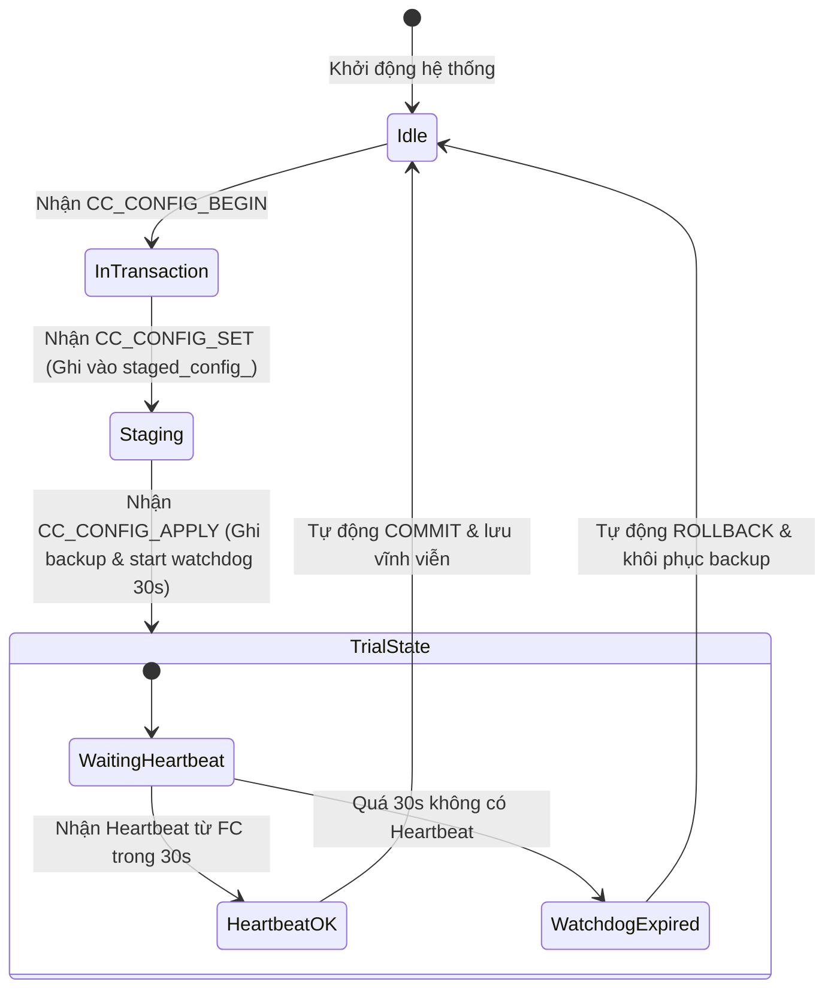

# PROJECT CONTEXT DEEP LEDGER (ĐẠI NGỮ CẢNH TOÀN DIỆN)

> **MỤC ĐÍCH**: Đây là file ngữ cảnh Tầng 2 (Deep Ledger) lưu trữ toàn bộ lịch sử tiến hóa kiến trúc, phân tích nguyên nhân gốc rễ (Root Cause Analysis) các sự cố kinh điển, chi tiết giao thức MAVLink byte-level, thiết kế máy trạng thái (State Machine), và cẩm nang xử lý sự cố nâng cao. Sử dụng khi AI Assistant cần thực hiện các tác vụ tái cấu trúc lớn, debug lỗi phức tạp, hoặc khi người dùng yêu cầu đọc đại ngữ cảnh.

---

## MỤC LỤC
1. [Lịch sử Tiến hóa & Tái cấu trúc Kiến trúc](#1-lịch-sử-tiến-hóa--tái-cấu-trúc-kiến-trúc)
2. [Root Cause Analysis: Các Sự Cố Kinh Điển & Giải Pháp Triệt Để](#2-root-cause-analysis-các-sự-cố-kinh-điển--giải-pháp-triệt-để)
3. [Chi tiết Giao thức IPC UDS (Newline-Delimited JSON)](#3-chi-tiết-giao-thức-ipc-uds-newline-delimited-json)
4. [Đặc tả MAVLink THACO Dialect & Máy Trạng Thái Giao Dịch](#4-đặc-tả-mavlink-thaco-dialect--máy-trạng-thái-giao-dịch)
5. [Chi tiết 33 Bài Kiểm Thử CTest (Test Matrix & Coverage)](#5-chi-tiết-33-bài-kiểm-thử-ctest-test-matrix--coverage)
6. [Cẩm nang Khắc Phục Sự Cố & Vận Hành Thực Địa (Field Playbook)](#6-cẩm-nang-khắc-phục-sự-cố--vận-hành-thực-địa-field-playbook)

---

## 1. LỊCH SỬ TIẾN HÓA & TÁI CẤU TRÚC KIẾN TRÚC

### Giai đoạn Monorepo Cũ (Python & Script rời rạc):
- Ban đầu dự án gồm các thư mục `src/mavlink`, `src/networking`, `src/camera-rtsp`, `src/vision`, `src/autopilot-telemetry`, và `src/companion-gcs-api`.
- Các daemon cấu hình chạy bằng Python (`asyncio`, `wifi_manager.py`, `detect-lan.py`, `app/server.py`).
- Xảy ra hiện tượng phân mảnh logic: Mỗi service tự ý mở socket hoặc cổng serial, không có cơ chế khóa (locking) dẫn đến lỗi xung đột tài nguyên phần cứng `EBUSY / Device or resource busy`.

### Giai đoạn C++ Native Hóa Toàn Diện (Kiến trúc Hiện Tại):
1. **Loại bỏ hoàn toàn Python ở tầng điều phối**:
   - `src/hardware-manager`: Viết mới 100% bằng C++20, trở thành Single Authority quản lý cổng serial.
   - `src/cc-agent`: Thay thế hoàn toàn `companion-gcs-api` và `autopilot-telemetry` bằng binary C++ Native `drone-companion-agent`.
   - `src/mavlink-router-controller`: Thay thế entrypoint script cũ bằng `RouterSupervisor` C++, quản lý tiến trình con `mavlink-routerd`.
   - `src/camera-stream-controller`: Tích hợp vi xử lý ARM NEON SIMD và MediaMTX chung 1 container.
2. **Hệ thống Kiểm thử Native**:
   - Chuyển toàn bộ sang C++ GoogleTest/CTest, loại bỏ pytest. Biên dịch đồng thời cả bản Native x86_64/WSL và Docker ARM64 với zero workflow drift.

---

## 2. ROOT CAUSE ANALYSIS: CÁC SỰ CỐ KINH ĐIỂN & GIẢI PHÁP TRIỆT ĐỂ

### Sự cố 1: `mavlink-router` không hoạt động / crash liên tục
- **Nguyên nhân gốc rễ**: File cấu hình `main.conf` sinh ra mặc định có `[UartEndpoint FlightController]` trỏ cứng vào `/dev/ttyAMA4`. Khi chạy trong môi trường test, WSL2, hoặc trên Pi khi chưa cắm Flight Controller, `mavlink-routerd` cố mở cổng UART thất bại và thoát ngay lập tức với mã lỗi `1`. Entrypoint script chết theo làm container khởi động lại vô tận.
- **Giải pháp triệt để**: Triển khai **Graceful Standby Mode** trong [`router_supervisor.cpp`](src/mavlink-router-controller/src/router_supervisor.cpp):
  - Trước khi khởi động `mavlink-routerd`, supervisor kiểm tra tính hợp lệ của cổng qua `hardware-manager`.
  - Nếu cổng UART vắng mặt, supervisor tự động loại bỏ khối `[UartEndpoint]` và khởi động `mavlink-routerd` ở chế độ UDP Standby (`:14550`, `:14600`, `:14541`).
  - Container luôn luôn sống sót và sẵn sàng nhận kết nối mạng hoặc reload lại khi FC được cắm vào.

### Sự cố 2: `dnsmasq` và `avahi-daemon` không hoạt động
- **Nguyên nhân gốc rễ**:
  1. Container `drone-networking` dùng `network_mode: host`. Host OS Ubuntu đã có `systemd-resolved` lắng nghe trên `127.0.0.53:53`. Tùy chọn `bind-interfaces` trong `dnsmasq.conf` cố mở wildcard socket trên cổng 53 nên bị lỗi `Address already in use`.
  2. Host OS đã chạy sẵn `avahi-daemon`, làm avahi trong container bị từ chối socket 5353.
  3. Lỗi cú pháp Bash tại dòng 186 `entrypoint.sh`: `if [ -n ... && [ ... ]` làm gãy watcher loop.
- **Giải pháp triệt để**:
  1. Đổi `bind-interfaces` thành `bind-dynamic` trong `dnsmasq.conf` để chỉ bind động trên `uap0`.
  2. Bổ sung bản ghi tĩnh `address=/thong.local/192.168.10.1` trong `dnsmasq.conf`.
  3. Kiểm tra tiến trình Avahi trên host trước khi start; sửa cú pháp bash thành `[ ... ] && [ ... ]`.

### Sự cố 3: Vòng lặp khuếch đại gói tin Telemetry (UDP Loop)
- **Nguyên nhân gốc rễ**: Cấu hình endpoint broadcast trên cổng 14550 (`192.168.10.255:14550` hoặc `LAN_wlan0`) khi `mavlink-routerd` lắng nghe `0.0.0.0:14550` trên cùng host network. Gói broadcast được router phát ra lại tự chui ngược vào server của chính nó, tạo vòng lặp vô tận làm nghẽn CPU và mạng.
- **Giải pháp triệt để**: **Cấm tuyệt đối broadcast 14550**. Sử dụng cơ chế auto-learning: QGC gửi gói đầu tiên tới router, router tự động ghi nhớ IP/port và gửi trả unicast. Đối với trạm GCS thụ động, chỉ dùng direct unicast qua biến `GCS_IP`.

---

## 3. CHI TIẾT GIAO THỨC IPC UDS (NEWLINE-DELIMITED JSON)

Các phân hệ giao tiếp qua Unix Domain Socket bằng định dạng **Newline-Delimited JSON (NDJSON)**: Mỗi request/response phải là 1 dòng JSON duy nhất, kết thúc bằng `\n`. Không được gửi JSON nhiều dòng có ký tự xuống dòng ở giữa payload.

### A. Socket `/run/drone/hw_manager.sock` (`hardware-manager`)
1. **Lệnh HEALTH**:
   - Request: `{"cmd":"HEALTH","id":"req-1"}\n`
   - Response: `{"id":"req-1","service":"hardware-manager","status":"OK"}\n`
2. **Lệnh LIST_PORTS**:
   - Request: `{"cmd":"LIST_PORTS","id":"req-2"}\n`
   - Response: `{"id":"req-2","status":"OK","devices":[{"path":"/dev/ttyAMA4","character":true,"busy":false}]}\n`
3. **Lệnh VALIDATE_PORT**:
   - Request: `{"cmd":"VALIDATE_PORT","id":"req-3","port":"/dev/ttyAMA4"}\n`
   - Response: `{"id":"req-3","status":"OK","port":"/dev/ttyAMA4","valid":true}\n`
4. **Lệnh RESERVE_PORT & RELEASE_PORT**:
   - Request: `{"cmd":"RESERVE_PORT","id":"req-4","port":"/dev/ttyAMA4","consumer":"mavlink-router"}\n`
   - Response: `{"id":"req-4","status":"OK","port":"/dev/ttyAMA4","reserved":true}\n`

### B. Socket `/run/drone/router.sock` (`mavlink-router-controller`)
1. **Lệnh GET_STATUS / HEALTH**:
   - Request: `{"cmd":"HEALTH","id":"r-1"}\n`
   - Response: `{"id":"r-1","service":"mavlink-router-controller","router_running":true,"status":"OK"}\n`
2. **Lệnh APPLY_CONFIG**:
   - Request: `{"cmd":"APPLY_CONFIG","id":"r-2","fc_baud":921600,"gcs_ip":"192.168.10.50"}\n`
   - Response: `{"id":"r-2","status":"OK","message":"Router configuration applied and process reloaded"}\n`

---

## 4. ĐẶC TẢ MAVLINK THACO DIALECT & MÁY TRẠNG THÁI GIAO DỊCH

Toàn bộ gói tin được định nghĩa tại `$HOME/Mavlink/custom/thaco_common.xml`.
- **Target Component ID của Companion Agent**: `191` (CompID `MAV_COMP_ID_ONBOARD_COMPUTER`).
- **Target System ID**: `1`.

### A. Danh mục Messages:
| ID | Tên Message | Mục đích |
|---|---|---|
| `42010` | `CC_CONFIG_BEGIN` | Mở phiên transaction (mang theo `uint32_t tid`) |
| `42011` | `CC_CONFIG_SET` | Đặt tham số cấu hình dạng key-value vào bộ đệm tạm thời (Staged) |
| `42012` | `CC_CONFIG_APPLY` | Áp dụng cấu hình ra file thực và kích hoạt watchdog thử nghiệm (Trial) |
| `42013` | `CC_CONFIG_CONFIRM` | Xác nhận lưu vĩnh viễn cấu hình (Commit) |
| `42015` | `CC_CONFIG_ROLLBACK` | Hủy bỏ thay đổi và hoàn tác cấu hình ban đầu (Revert) |
| `42016` | `CC_CONFIG_ACK` | Phản hồi mã trạng thái giao dịch (OK / ERROR / BUSY) |
| `42014` | `CC_TELEMETRY_SYSTEM` | Telemetry CPU, RAM, Disk, Temp, Uptime |

### B. Máy Trạng Thái Rollback Guard (Watchdog 30 Giây):


---

## 5. CHI TIẾT 33 BÀI KIỂM THỬ CTEST (TEST MATRIX & COVERAGE)

Lệnh thực thi: `make test` (hoặc `cd build && ctest --output-on-failure`).

1. **`SerialScannerTest` (3 tests)**:
   - `ValidCharDeviceDetection`: Kiểm tra hàm nhận diện thiết bị ký tự chuẩn.
   - `DeviceBusyDetection`: Kiểm tra hàm khóa độc quyền cổng bận.
   - `ScanDevicesExecutesWithoutCrash`: Kiểm tra độ bền khi duyệt thư mục `/dev`.
2. **`HardwareManagerServerTest` (5 tests)**:
   - `HealthCheckCommand`: Kiểm tra phản hồi lệnh HEALTH.
   - `ListPortsCommand`: Kiểm tra quét cổng qua UDS.
   - `ValidatePortCommand`: Kiểm tra xác thực cổng qua UDS.
   - `ReserveAndReleasePort`: Kiểm tra chu kỳ đặt chỗ và giải phóng cổng.
   - `UnknownAndInvalidCommand`: Kiểm tra tính chịu lỗi với lệnh rác/JSON sai.
3. **`RouterConfigGeneratorTest` (3 tests)**:
   - `FullActiveMode`: Sinh config đầy đủ UART FC + SIYI khi thiết bị tồn tại.
   - `GracefulStandbyModeWhenFcAbsent`: Sinh config UDP Standby khi thiếu FC.
   - `SiyiDisabledMode`: Sinh config khi tắt cổng SIYI.
4. **`RouterSupervisorTest` (3 tests)**:
   - `HealthAndStatusCommands`: Kiểm tra lệnh HEALTH/STATUS.
   - `ApplyConfigCommand`: Kiểm tra nạp cấu hình và restart tiến trình con an toàn.
   - `InvalidAndMalformedCommands`: Kiểm tra xử lý chuỗi NDJSON lỗi cú pháp.
5. **`ConfigEngineTest` (5 tests)**:
   - `LoadTelemetryConfigFromEnv`: Nạp cấu hình từ `.env`.
   - `SaveTelemetryConfigUpdatesEnv`: Ghi cấu hình cập nhật ra `.env`.
   - `TransactionCommitFlow`: Luồng Begin ➔ Set ➔ Apply ➔ Commit chuẩn.
   - `TransactionRollbackFlow`: Luồng Hoàn tác phục hồi cấu hình cũ khi rollback.
   - `InvalidTidRejection`: Từ chối các lệnh có TID không hợp lệ.
6. **`RollbackGuardTest` (3 tests)**:
   - `InitiallyFcOffline`: Khởi đầu trạng thái FC offline.
   - `OnlineAfterHeartbeatReceived`: Chuyển sang online khi nhận Heartbeat.
   - `StartTrialSwitchesState`: Bật watchdog thử nghiệm và kiểm tra hạn chót.
7. **`SystemMetricsCollectorTest` (1 test)**:
   - `ReadStatsReturnsReasonableValues`: Đọc CPU, RAM, Disk, Temp hợp lý từ procfs.
8. **`SerialEnumeratorTest` (2 tests)**:
   - `ValidCharDevice`: Kiểm tra lọc thiết bị serial.
   - `GetAvailablePortsExecutesSafely`: Quét an toàn không rò rỉ file descriptor.
9. **`CameraConfigManagerTest` + `CameraFrameProcessorTest` (3 tests)**:
   - `LoadValidYamlConfig`: Parse file `camera.yaml`.
   - `NonExistentYamlFailsGracefully`: Xử lý an toàn khi thiếu file YAML.
   - `NeonProcessorDummyFrame`: Xử lý khung hình giả lập bằng NEON processor.
10. **`IpcHardwareRouterIntegrationTest` (3 tests - Tích hợp thực tế qua UDS Socket)**:
    - `HardwareManagerHealthOverSocket`: Client kết nối UDS socket thực tới HardwareManager.
    - `RouterSupervisorHealthOverSocket`: Client kết nối UDS socket thực tới RouterSupervisor.
    - `EndToEndPortValidationViaRouter`: RouterSupervisor gọi HardwareManager qua UDS để xác thực cổng trước khi apply config.
11. **`MavlinkLoopbackTest` (2 tests - Tích hợp mạng UDP thực tế)**:
    - `HeartbeatEncodeDecodeOverUdp`: Đóng gói Heartbeat MAVLink, gửi qua socket UDP loopback `127.0.0.1:14777`, nhận và giải mã toàn vẹn.
    - `CustomTelemetrySystemEncodeDecodeOverUdp`: Đóng gói bản tin custom `CC_TELEMETRY_SYSTEM` (ID 42014 của THACO), gửi nhận qua UDP và kiểm tra tính toàn vẹn từng trường dữ liệu (CPU, RAM, Temp).

---

## 6. CẨM NANG KHẮC PHỤC SỰ CỐ & VẬN HÀNH THỰC ĐỊA (FIELD PLAYBOOK)

### A. Mất kết nối Wi-Fi hoặc không giải quyết được `thong.local`
- **Cách vào khẩn cấp (Emergency Recovery)**: Kết nối laptop vào Wi-Fi `AP_DRONE` (Pass: `12345678`). Truy cập trực tiếp IP Gateway: `192.168.10.1`.
- **Lệnh SSH khẩn cấp**: `ssh thong@192.168.10.1`.

### B. Kiểm tra nhanh toàn hệ thống
```bash
# Chạy chẩn đoán tuần tự tự động
make doctor

# Xem trạng thái cổng mạng MAVLink thực tế
make log-mavlink-ports
```

### C. Khi MAVLink không nhận dữ liệu từ Flight Controller
1. Kiểm tra vật lý: Đảo chéo dây TX/RX (TX Cube nối RX Pi GPIO 15, RX Cube nối TX Pi GPIO 14).
2. Kiểm tra tham số ArduPilot trên FC:
   - `SERIALx_PROTOCOL = 2` (MAVLink 2)
   - `SERIALx_BAUD = 921` (921600 baud)
3. Kiểm tra xem router có đang chạy Standby Mode do không nhận UART không:
   ```bash
   make logs-mavlink
   ```
   Nếu log ghi `Notice: FC port '/dev/ttyAMA4' is not currently available. Running in UDP Standby mode` ➔ Cổng UART4 chưa được bật trong `/boot/firmware/config.txt` hoặc chưa reboot Pi.

### D. Luồng xem Video FPV
1. Kiểm tra raw camera: `ffplay -rtsp_transport tcp rtsp://thong.local:8554/camera`.
2. Nếu raw camera mượt, kiểm tra WebRTC trên trình duyệt: `http://thong.local:8889/camera`.
3. Bật AI Vision: `make start-vision`, kiểm tra luồng YOLO: `ffplay -rtsp_transport tcp rtsp://thong.local:8554/yolo`.
