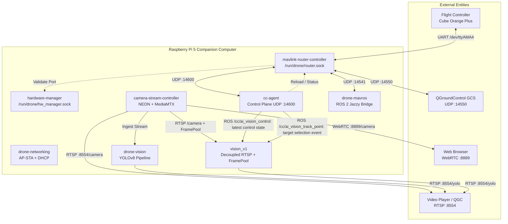

# Drone Edge Companion Computer

[](README.md)
[](tests/)
[](CMakeLists.txt)
[](docker-compose.yml)
[](LICENSE)

> [!TIP]
> 📋 **Hồ Sơ Cải Thiện Hệ Thống & Lộ Trình Chuyển Đổi Kỹ Thuật Chi Tiết:** Xem toàn bộ phân tích hiện trạng, rủi ro an toàn bay, giải pháp kiến trúc tối ưu (C++20, Docker, MAVLink/DDS) và lộ trình 4 pha tại thư mục: [`improvement/`](improvement/).


Hệ sinh thái Companion Computer phân tán trên nền tảng Raspberry Pi 5 cho máy bay nông nghiệp AgriDrone (THACO). Toàn bộ hệ thống được xây dựng trên chuẩn ngôn ngữ **C++20 Native** kết hợp kiến trúc micro-container Docker độc lập, tối ưu hóa giao tiếp nội bộ qua Unix Domain Sockets và mạng UDP độ trễ thấp.

---

## Mục lục (Table of Contents)
- [Tổng quan Phân hệ](#tổng-quan-phân-hệ)
- [Sơ đồ Kiến trúc Tổng thể](#sơ-đồ-kiến-trúc-tổng-thể)
- [Yêu cầu Hệ thống](#1-yêu-cầu-hệ-thống)
- [Cấu hình Lần đầu](#2-cấu-hình-lần-đầu)
- [Kiểm thử Tập trung CTest](#3-kiểm-thử-tập-trung-c-unit--integration-tests)
- [Biên dịch Docker ARM64](#4-cách-build-docker-images-arm64-trên-wsl2)
- [Triển khai Lên Raspberry Pi](#5-triển-khai-deploy-lên-raspberry-pi)
- [Vận hành & Giám sát Hệ thống](#6-vận-hành--giám-sát-hệ-thống)
- [Quy tắc Dự án & Quản trị Quy chuẩn](#7-quy-tắc-dự-án--quản-trị-hệ-thống)
- [Đóng góp (Contributing)](#8-đóng-góp-contributing)
- [Giấy phép (License)](#9-giấy-phép-license)

---

## Tổng quan Phân hệ

| Phân hệ / Module | Đường dẫn mã nguồn | Vai trò cốt lõi | Hồ sơ Kỹ thuật |
|---|---|---|:---:|
| **Companion Agent & Hardware Registry** | [`src/cc-agent`](src/cc-agent/) | Bộ não điều khiển, quản lý độc quyền phần cứng (`HardwareRegistry` qua `/run/drone/hw_manager.sock`), 2-phase config transactions, 30s rollback guard | [Docs & UML](src/cc-agent/docs/) |
| **MAVLink Router** | [`src/mavlink-router-controller`](src/mavlink-router-controller/) | Điều phối MAVLink, **Graceful Standby Mode**, router UDP `:14550`, `:14541`, `:14600` | [Docs & UML](src/mavlink-router-controller/docs/) |
| **Networking** | [`src/drone-networking`](src/drone-networking/) | Phát WiFi AP (`AP_DRONE`), cấp DHCP `dnsmasq`, mDNS `thong.local` | [Docs & UML](src/drone-networking/docs/) |
| **Camera RTSP** | [`src/camera-stream-controller`](src/camera-stream-controller/) | Thu hình RealSense/V4L2, tăng tốc ARM NEON, MediaMTX RTSP `/camera` | [Docs & UML](src/camera-stream-controller/docs/) |
| **AI Vision** | [`src/drone-vision`](src/drone-vision/) | Suy luận YOLOv8, phát hiện vật thể, đẩy luồng annotated `/yolo` | [Docs & UML](src/drone-vision/docs/) |
| **AI Vision v1** | [`src/modules/vision_v1`](src/modules/vision_v1/) | Video RTSP độc lập inference; YOLO đọc FramePool và chỉ cập nhật `DetectionSnapshot` | [Docs & UML](src/modules/vision_v1/docs/) |
| **MAVROS** | [`src/mavros`](src/mavros/) | Cầu nối ROS 2 Jazzy, giải mã custom telemetry plugin | [Docs & UML](src/mavros/docs/) |

---

## Sơ đồ Kiến trúc Tổng thể



---

## 1. Yêu cầu Hệ thống

### Máy phát triển / Build (WSL2 Ubuntu 24.04)
- Docker Desktop đang chạy và WSL integration đã bật.
- C++20 toolchain (`g++-13` hoặc mới hơn, `cmake >= 3.28`, `libgtest-dev`, `libyaml-cpp-dev`, `libgstreamer1.0-dev`).
- SSH client, `make`, `bash`.
- Kết nối mDNS tới Pi: `thong.local` hoặc IP tĩnh qua LAN/WiFi.

### Raspberry Pi 5
- Raspberry Pi OS / Ubuntu 64-bit (aarch64), Docker Engine + Docker Compose plugin.
- User `thong` thuộc group `docker`.
- UART4 đã được bật cho Flight Controller (`/dev/ttyAMA4` ở 921600 baud); UART0 cho SIYI Air Unit (`/dev/ttyAMA0` ở 115200 baud).
- Cổng USB 3.0 màu xanh cho camera RealSense.

---

## 2. Cấu hình Lần đầu

Tại thư mục repository trong WSL:

```bash
cp .env.example .env
```

Kiểm tra nội dung `.env`:

```dotenv
PI_HOST=thong.local
PI_USER=thong
MDNS_HOSTNAME=thong
DRONE_SERIAL_PORT=/dev/ttyAMA4
DRONE_BAUD_RATE=921600
GCS_IP=
```

Thiết lập SSH key không mật khẩu tới Pi:

```bash
make setup-ssh
ssh drone-pi
```

Nếu Pi mới thiết lập lần đầu (cài Docker và nạp cấu hình UART4 vào `config.txt`):

```bash
make setup-pi
# Sau khi Pi reboot, kích hoạt tự khởi động khi cấp nguồn:
make autostart
```

---

## 3. Kiểm thử Tập trung (C++ Unit & Integration Tests)

Dự án áp dụng tiêu chuẩn kiểm thử **100% C++ GoogleTest & CTest** cho cả 4 module lõi và 2 luồng tích hợp toàn hệ thống:

```bash
# Biên dịch toàn bộ mã nguồn C++ và bài test
make build-native

# Chạy toàn bộ 33 bài test tự động qua CTest
make test
```

### Bảng phân bố kiểm thử (30/30 Tests PASSED):
| Module | File Test | Số lượng | Nội dung kiểm thử |
|---|---|:---:|---|
| `cc-agent` | `src/cc-agent/tests/` | 16 | Transaction engine commit/rollback, Heartbeat rollback guard, đọc metrics hệ thống, HardwareRegistry (Scan, Health, Validate, Reserve/Release) |
| `mavlink-router-controller` | `src/mavlink-router-controller/tests/` | 6 | Sinh config Standby & Active mode, IPC reload, giám sát tiến trình con |
| `camera-stream-controller` | `src/camera-stream-controller/tests/` | 3 | Parse cấu hình YAML camera, fallback stub camera, xử lý khung hình NEON |
| **Root Integration (IPC)** | `tests/test_ipc_hardware_router.cpp` | 3 | Giao tiếp UDS thực giữa UdsHubServer (HardwareSubsystemHandler) và RouterSupervisor |
| **Root Integration (MAVLink)** | `tests/test_mavlink_loopback.cpp` | 2 | Loopback UDP thực: MAVLink Heartbeat và Custom Telemetry Dialect THACO (ID 42014) |

---

## 4. Cách Build Docker Images ARM64 (trên WSL2)

Build thực hiện trực tiếp trên WSL thông qua `docker buildx` nhắm mục tiêu kiến trúc `linux/arm64`:

| Phân hệ / Container | Lệnh Build | Thư mục mã nguồn |
|---|---|---|
| **Companion Agent (kèm Hardware Registry)** | `make build-cc-agent` | `src/cc-agent/` |
| **MAVLink Router** | `make build-mavlink` | `src/mavlink-router-controller/` |
| **Networking & WiFi AP** | `make build-networking` | `src/drone-networking/` |
| **Camera RTSP Streamer** | `make build-camera-rtsp` | `src/camera-stream-controller/` |
| **AI Vision (YOLO)** | `make build-vision` | `src/drone-vision/` |
| **AI Vision v1 (decoupled)** | `make build-vision-v1` | `src/modules/vision_v1/` |
| **ROS 2 MAVROS** | `make build-mavros` | `src/mavros/` |
| **Toàn bộ Container cốt lõi** | `make build-all` | mavlink, cc-agent, networking, camera |

---

## 5. Triển khai (Deploy) Lên Raspberry Pi

> 📖 **Xem tài liệu chi tiết quy trình triển khai & vận hành**:
> - [deploy/README.md](deploy/README.md): Tổng quan kiến trúc 5 tầng triển khai (`setup/`, `build/`, `ship/`, `monitor/`, `systemd/`).
> - [deploy/ship/README.md](deploy/ship/README.md): Cơ chế phân giải target thông minh (Zero-Conf mDNS `drone.local` ➔ Fallback IP) & triển khai từ xa.
> - [deploy/build/README.md](deploy/build/README.md): Hướng dẫn chi tiết cách build chéo ARM64 bằng Docker Buildx & đóng gói tarball.

Các lệnh deploy dưới đây sẽ tự động **build ARM64 → nén truyền qua SSH → nạp image → recreate đúng container tương ứng trên Pi**:

```bash
# Deploy từng container độc lập (không restart container khác):
make deploy-mavlink      # Deploy mavlink-router-controller
make deploy-cc-agent     # Deploy cc-agent
make deploy-networking   # Deploy drone-networking
make deploy-camera-rtsp  # Deploy camera-stream-controller
make deploy-vision       # Deploy drone-vision (Profile vision)
make deploy-vision-v1    # Deploy vision_v1 (Profile vision-v1)
make deploy-mavros       # Deploy drone-mavros (Profile mavros)

# Deploy toàn bộ 5 container cốt lõi:
make deploy

# Deploy nhanh khi image đã có sẵn (bỏ qua bước build):
make deploy-fast
```

---

## 6. Vận hành & Giám sát Hệ thống

### Điều khiển từ máy phát triển (WSL2):
```bash
# Xem trạng thái các container đang chạy trên Pi
make ps

# Xem log thời gian thực:
make logs-mavlink        # Log MAVLink Router
make logs-hw             # Log Hardware Manager
make logs-cc-agent       # Log Companion Agent
make logs-networking     # Log WiFi & DHCP
make logs-camera-rtsp    # Log Camera RealSense & MediaMTX
make logs-vision         # Log YOLO Vision
make logs-vision-v1      # Log decoupled Vision v1

# Khởi động lại từng service khi cần:
make restart-mavlink
make restart-hw
make restart-camera-rtsp

# Mutual exclusion: mỗi lệnh start sẽ dừng implementation vision còn lại
make start-vision-v1
make start-vision
make restart-vision-v1
make stop-vision-v1

# Chẩn đoán tự động toàn diện:
make doctor
```

`vision_v1` đọc RTSP `/camera` vào latest video mailbox, render overlay và publish
RTMP `:1935/yolo`; YOLO chạy trên worker độc lập, đọc FramePool và cập nhật
immutable `DetectionSnapshot`. MediaMTX phục vụ kết quả tại RTSP `:8554/yolo`.
Output suy ra từ frame RTSP thực tế, giữ aspect ratio và FOV trong bounds
`width/height`, không upscale: `1280×720 → 640×360` với bounds `640×480`.
Publisher rebuild caps khi resolution thay đổi; bbox scale từ kích thước snapshot.
Các lệnh start/restart và targeted deploy chỉ bật implementation được chọn sau
khi đã dừng implementation còn lại thành công. Nếu tự chạy Compose trực tiếp,
hãy dừng vision còn lại trước; profiles không tự bảo đảm mutual exclusion.
Doctor báo `ERR_33_VISION_PUBLISHER_CONFLICT` nếu cả hai cùng chạy.

Luồng `CC_AI_VISION_CONTROL` (42015) đi từ QGC qua MAVLink Router tới
`edge-agent/cc_mavlink`; `MavlinkReceiver` decode bằng header generated và publish
`cc_msgs/msg/AiVisionControl` trên `/cc/ai_vision_control` với
`RELIABLE + TRANSIENT_LOCAL`, depth 1. `VisionNode` lưu thread-safe ba cờ
`bounding_box`, `tracking`, `following` (mặc định đều `false`); khi bounding box
tắt, receiver ép hai cờ còn lại về `false`. Bounding box OFF ẩn mọi box và clear
selected target, không dừng video/inference. `COMMAND_LONG / MAV_CMD_CAMERA_TRACK_POINT`
(2004) đi qua receiver tới `/cc/ai_vision_track_point`
(`cc_msgs/msg/AiVisionTrackPoint`, RELIABLE + VOLATILE, depth 1), không ACK.
Vision chỉ chọn target khi bbox/tracking bật, từ snapshot chưa stale theo
`detection_max_age`; mọi điểm trong bbox hợp lệ có track ID đều chọn được, không
giới hạn khoảng cách tới tâm theo radius. Overlap chọn tâm gần nhất trong tọa độ
normalized, tie theo track ID nhỏ hơn. Click chưa match được giữ tối đa 1 giây
theo monotonic clock và thử lại trên mỗi snapshot mới; timeout giữ target hiện tại.
Inference worker dùng YOLO `track(persist=True)`; overlay highlight theo
`Detection.track_id` với bbox vàng `(0,255,255)`, nét 3 và nhãn `SELECTED #id`.
Selected ID được giữ khi target di chuyển/tạm mất, chỉ clear khi bbox/tracking
tắt hoặc click lại cùng ID. OFF clear cả pending click; repeated control hoặc
Following thay đổi giữ selection. Mount config camera/v1 là file và camera
profiles là mount sibling; entrypoint dùng bản COPY + chmod trong image. Following chỉ lưu state, chưa có flight behavior;
MAVLink ownership vẫn ở agent. Xem
[`src/modules/vision_v1/README.md`](src/modules/vision_v1/README.md#ai-vision-control-state).

### Endpoints mạng và Truy cập:
| Dịch vụ | Giao thức / Cổng | Địa chỉ kết nối |
|---|---|---|
| **WiFi Hotspot** | 802.11 AP | SSID: `AP_DRONE` (Mật khẩu: `12345678`) |
| **AP Gateway Recovery** | IPv4 Static | `192.168.10.1` |
| **MAVLink QGC** | UDP Bi-directional | `thong.local:14550` (hoặc `192.168.10.1:14550`) |
| **MAVLink TCP Server** | TCP | `thong.local:5760` |
| **MAVLink MAVROS Local**| UDP Local | `127.0.0.1:14541` (Local socket) |
| **Camera RTSP Raw** | RTSP / TCP | `rtsp://thong.local:8554/camera` |
| **Camera WebRTC** | HTTP H5 | `http://thong.local:8889/camera` |
| **YOLO Video Stream** | RTSP / TCP | `rtsp://thong.local:8554/yolo` |

---

## 7. Quy tắc Dự án & Quản trị Hệ thống

Tất cả các quy tắc phát triển, ranh giới dịch vụ và quy trình bảo vệ cấu hình được quản lý tại thư mục [`.agents/rules/`](.agents/rules/):
- [`00-core.md`](.agents/rules/00-core.md): Nguồn chân lý, ranh giới phần cứng và định nghĩa 7 phân hệ.
- [`01-networking.md`](.agents/rules/01-networking.md): Quy định AP-STA, DHCP và Netplan.
- [`02-mavlink.md`](.agents/rules/02-mavlink.md): Single Source of Truth cho MAVLink packets (`thaco_common.xml`), Standby Mode và cấm broadcast 14550.
- [`03-camera-rtsp.md`](.agents/rules/03-camera-rtsp.md): Ranh giới camera stream và MediaMTX.
- [`04-vision.md`](.agents/rules/04-vision.md): Quy định pipeline AI YOLO và an toàn bay.
- [`05-doctor.md`](.agents/rules/05-doctor.md): Ma trận mã lỗi chẩn đoán tự động tuần tự.
- [`06-doc-sync-and-rule-governance.md`](.agents/rules/06-doc-sync-and-rule-governance.md): Quy định bắt buộc đồng bộ tài liệu, bắt buộc hồ sơ UML (`sequence.puml`, `system.puml`) cho mỗi module, và chốt chặn an toàn: **Hỏi ý kiến người dùng trước khi sửa bất kỳ rule nào**.

---

## 8. Đóng góp (Contributing)
1. Fork repository và tạo nhánh mới: `git checkout -b feature/amazing-feature`.
2. Tuân thủ tiêu chuẩn lập trình **C++20**.
3. Chạy toàn bộ test suite để đảm bảo không lỗi hồi quy: `make test`.
4. Cập nhật đầy đủ `README.md` và các sơ đồ UML trong thư mục `docs/` theo quy định tại `Rule 06`.
5. Tạo Pull Request với mô tả chi tiết.

---

## 9. Giấy phép (License)
Dự án được phân phối dưới giấy phép mã nguồn mở [MIT License](https://opensource.org/licenses/MIT).
