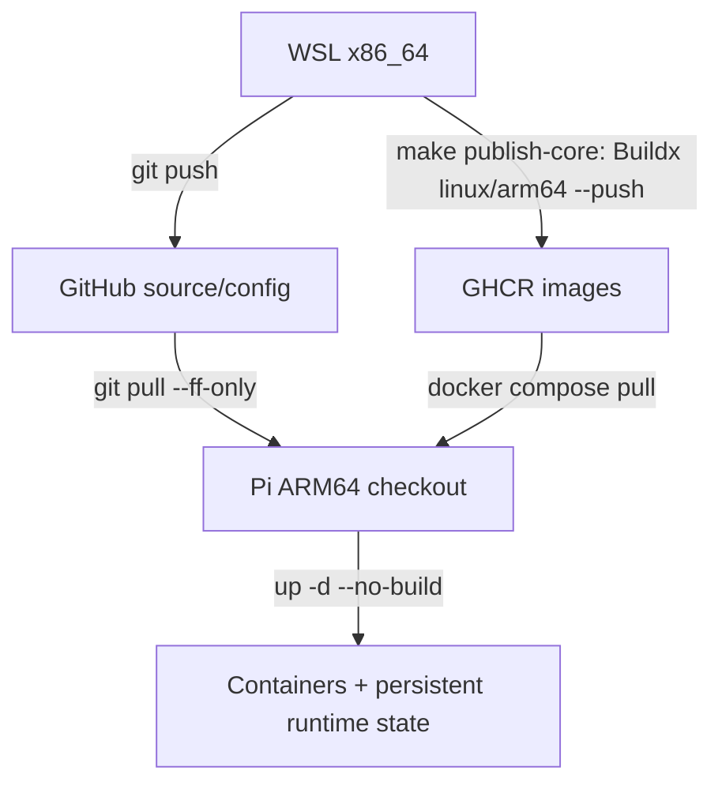

# Drone Edge deployment: GitHub source + GHCR ARM64 images

GitHub stores source, versioned scripts, configuration templates and the YOLO model.
GHCR stores Docker images. The Raspberry Pi never compiles application source.



## Image naming and tags

Copy `.env.example` to private `.env` and set the actual owner/org yourself:

```dotenv
REGISTRY=ghcr.io
IMAGE_NAMESPACE=your-lowercase-owner-or-org
IMAGE_TAG=dev-ai-tracking-flow
EXPECTED_BRANCH=dev/ai_tracking_flow
DRONE_RUNTIME_DIR=./runtime
```

Do not use the example namespace as a real owner. No token belongs in this file.
The convention is `ghcr.io/IMAGE_NAMESPACE/IMAGE_NAME:IMAGE_TAG`.
Core image names: `mavlink-router-controller`, `cc-agent`, `drone-networking`,
`camera-stream-controller`. Optional images: `drone-mavros`, `drone-vision`.
The Compose service for `drone-mavros` is **`mavros`**, built from **`src/mavros`**.

Publication creates a full Git SHA tag and the chosen development tag. Published
SHA tags are reused after ARM64/revision validation; these tools do not rebuild
and overwrite them. GHCR does not enforce tag immutability by itself: restrict
other publishers, or pin image digests for stronger release guarantees.
Clean working tree and `EXPECTED_BRANCH` are required for publication.
The optional SSH deploy command also checks that HEAD matches the fetched upstream.

For reproducible deployment, choose the full Git SHA. A development tag can move.
`update.sh` verifies image revision labels against the checkout and refuses to
start containers when the image and source commits differ. Publish every selected
service and its dependencies from the same commit before updating.

## Authentication

On WSL, log into GHCR with your GitHub username and a PAT **classic** with
`write:packages`. For private images, Pi needs its own login/token with
`read:packages` and package access; organization SSO may require authorization.
Public images can be pulled anonymously. Git repository authentication is separate.

```bash
read -r -p 'GitHub username: ' GHCR_USER
read -r -s -p 'GHCR token: ' GHCR_TOKEN
printf '\n'
printf '%s' "$GHCR_TOKEN" | docker login ghcr.io -u "$GHCR_USER" --password-stdin
unset GHCR_TOKEN
```

Use a Docker credential helper where available. Never put tokens in `.env`,
Dockerfiles, Compose, command arguments or Git. See
[GitHub Container registry authentication](https://docs.github.com/en/packages/working-with-a-github-packages-registry/working-with-the-container-registry).
CLI-published packages start private by default; explicitly configure visibility
and package access. Optionally set `IMAGE_SOURCE_URL=https://github.com/OWNER/REPO`
when publishing to link the package to its repository via an OCI label.

## First Pi checkout and private configuration

Hardware and Docker must already be provisioned separately with `setup/`.
Clone the repository into `~/drone-edge`, check out `dev/ai_tracking_flow`, and
configure its upstream. This is a Git clone, not a source build.

```bash
git clone --branch dev/ai_tracking_flow YOUR_REPOSITORY_URL ~/drone-edge
cd ~/drone-edge
cp .env.example .env
# Edit .env: actual IMAGE_NAMESPACE, chosen IMAGE_TAG and Pi-specific settings.
umask 077
mkdir -p runtime/agent runtime/networking
cp deploy/config/agent-telemetry.env.example runtime/agent/telemetry.env
cp src/drone-networking/wifi.example.json runtime/networking/wifi.json
# Edit private wifi.json to set the intended hotspot identity/password.
```

The agent telemetry file is writable because transactions save FC/SIYI settings.
Deployment `.env` is not mounted into the agent. Agent YAML state uses the named
volume `cc-agent-state`, with `DRONE_CONFIG_DIR=/var/lib/cc-agent`.
The networking directory is mounted read/write, so atomic WiFi file replacement
works and does not modify a tracked file. It owns AP configuration; station
credentials/netplan must still be provisioned on the host separately.

For deployment outside the repository, set `DRONE_RUNTIME_DIR` to an absolute
private directory. `CAMERA_CONFIG_FILE`, `VISION_CONFIG_FILE`, `VISION_MODEL_FILE`
and `HOSTAPD_CONFIG_FILE` can select private overrides; defaults are tracked,
read-only templates/model. To customize tracked templates for one Pi, copy them
into private runtime storage and set the override instead of editing the checkout.

### Migration from the old tracked private files

Older commits tracked `.env`, `src/drone-networking/wifi.json`, and
`deploy/ship/target.env`. **Back them up outside the checkout before the first Git
pull that removes them.** Restore `.env` afterwards, add registry settings, and
move WiFi data into the new runtime directory. Keep any customized tracked YAML
outside the checkout too. Review/resolve local tracked modifications before pull;
the updater refuses a dirty checkout and never uses reset/stash to discard data.
Removing a file from the current tree does not remove historical credentials.

## Normal release/update

Developer WSL, after reviewing and committing changes:

```bash
git push
make publish-core IMAGE_TAG=dev-ai-tracking-flow
# Optional: publish from the same commit as core dependencies.
make publish-mavros IMAGE_TAG=dev-ai-tracking-flow
make publish-vision IMAGE_TAG=dev-ai-tracking-flow
```

Pi:

```bash
cd ~/drone-edge
make update
# Optional service selection also pulls/starts its dependencies:
bash deploy/update.sh --service mavros
bash deploy/update.sh --service drone-vision
```

The Pi updater runs `git pull --ff-only`, validates mounts, pulls the selected
images, checks linux/arm64 plus Git revision labels, and runs
`docker compose up -d --no-build --pull never`, then status/verification.
It does not install packages, build, alter netplan/boot/UART, reboot, or prune data.
Core selection explicitly excludes optional profiles, including Tailscale.
Verification accepts router UDP Standby when FC is absent; listener checks alone
do not prove live FC telemetry or camera video quality.

Equivalent manual commands, after setting `.env` and provisioning private files:

```bash
git pull --ff-only
docker compose pull
docker compose up -d --no-build --pull never
docker compose ps
bash deploy/ship/verify-deployment.sh
```

Prefer `make update` for architecture, revision, bind-file and branch checks.
Avoid `COMPOSE_PROFILES=tailscale` in generic manual commands until it is resolved.

## Optional SSH convenience and offline transport

`make deploy` publishes on WSL and executes the Pi Git/registry update over SSH.
`make deploy-fast` performs the remote update without publication. These are
optional conveniences; they do not transfer source trees or image archives.
Remote updates use the immutable HEAD tag. `TARGET_REMOTE_DIR` can override the
Pi checkout path; use `~/drone-edge` to refer to the remote user's home.

Legacy offline transport is retained explicitly:

```bash
make build-core IMAGE_TAG=offline-dev
make deploy-offline IMAGE_TAG=offline-dev PI_HOST=drone.local
```

This uses Docker save/gzip/SSH/load and rsync **only Git-tracked app files**.
Provision the private Pi `.env` and runtime files separately. No private files,
runtime state, netplan installation, reboot or automatic prune are included.
This is a separate fallback, not the normal release workflow. Optional offline
services require their images/dependencies to already be loaded.

## Configuration ownership

| Artifact | Ownership / persistence |
|---|---|
| Dockerfiles, Compose, scripts, YAML/conf defaults, log helpers, `yolo26n.pt` | Tracked by Git; pulled, mounted read-only as appropriate |
| `.env`, `deploy/ship/target.env` | Local ignored deployment settings; no registry token |
| `runtime/networking/wifi.json` | Private credentials/runtime config; ignored; directory mount rw |
| `runtime/agent/telemetry.env` | Private writable serial settings; ignored |
| `cc-agent-state`, `cc-telemetry-state`, `tailscale-state`, `mavlink-logs` | Docker named volumes; never Git data; update does not delete them |
| `/run/drone` | Host IPC sockets; transient, not Git |
| Registry login | External Docker credential storage/helper |

## Tailscale

**MANUAL / UNRESOLVED.** Its separate profile retains the original custom image
reference (override with `TAILSCALE_IMAGE`). No new image or publisher has been
invented. Confirm its provenance and ARM64 platform before enabling it. Core
publication/update does not include this service.

## Layout and validation

`build/images.sh`: common local build/GHCR publication; `build/validate_image.py`:
image validation; `ship/deploy.sh`: optional SSH execution; `update.sh`: Pi-only
update; `ship/offline-deploy.sh`: legacy transport; `setup/`: provisioning;
`monitor/`: diagnostics; `systemd/`: boot autostart.
Systemd starts already-loaded images with `--no-build --pull never`; publication
and updates are explicit operations, not boot-time compilation or image pulls.

```bash
IMAGE_NAMESPACE=validation-owner docker compose --profile vision --profile mavros config --quiet
shellcheck -x deploy/lib/common.sh deploy/build/images.sh deploy/update.sh deploy/ship/*.sh
python3 tests/test_registry_workflow.py
```

The workflow tests fake Git/Docker; they do not build, push or contact a Pi.
