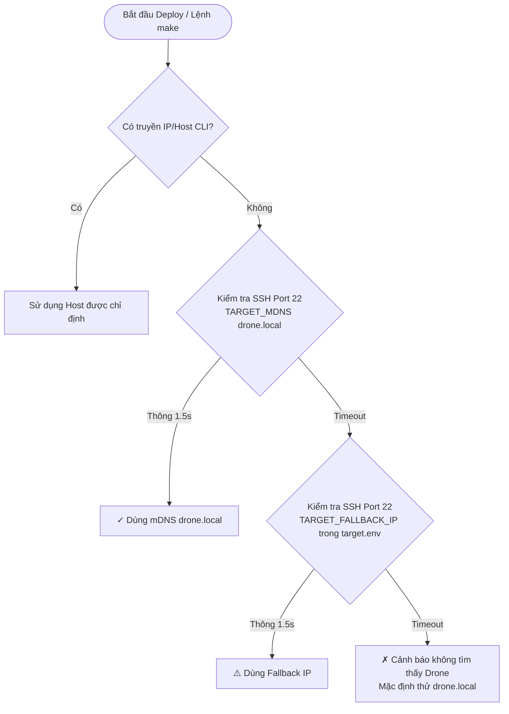

# Drone Edge Computing - Shipping & Remote Deployment (`deploy/ship/`)

Thư mục `deploy/ship/` đảm nhiệm toàn bộ quy trình **kết nối, phân giải mục tiêu thông minh (mDNS vs Fallback IP), đồng bộ mã nguồn, nạp Docker images và giám sát sức khỏe container** từ xa trên Companion Computer.

---

## 📁 Cấu trúc Thư mục

```text
deploy/ship/
├── README.md                  # 📖 Tài liệu hướng dẫn phân giải target & triển khai
├── target.env                 # Cấu hình mDNS domain, Fallback IP và SSH user
├── target.example.env         # Bản mẫu cấu hình target
├── resolve_target.sh          # Bộ phân giải mục tiêu thông minh 2 nấc (mDNS ➔ Fallback IP)
├── deploy.sh                  # Kịch bản chính đồng bộ code, nạp image & kích hoạt container
└── verify-deployment.sh       # Xác thực trạng thái container và sockets sau deploy
```

---

## 🎯 1. Cơ chế Phân giải Target Thông minh (Smart Target Resolution)

Hệ thống triển khai hoạt động theo mô hình **Zero-Conf Deployment**: Người phát triển không cần nhớ hoặc gõ thủ công địa chỉ IP mỗi lần deploy.



### 1.1. Cấu hình tại `target.env`
Tệp cấu hình shell-native siêu nhẹ, không phụ thuộc vào `jq` hay python:
```bash
# Tên miền mDNS phát bởi container drone-networking
TARGET_MDNS=drone.local

# IP dự phòng khi Drone chưa lên mDNS hoặc mạng chặn Multicast
TARGET_FALLBACK_IP=10.14.95.6

# User SSH trên Companion Computer
TARGET_USER=thong

# Thư mục chứa project trên Companion Computer
TARGET_REMOTE_DIR=~/drone-edge
```

### 1.2. Thử nghiệm bộ phân giải `resolve_target.sh`
```bash
# Xem kết quả phân giải trực quan:
bash deploy/ship/resolve_target.sh

# Lấy riêng địa chỉ Host cho subshell / Makefile:
bash deploy/ship/resolve_target.sh --quiet
```

---

## 🚀 2. Hướng dẫn Triển khai (Deploy)

### 2.1. Triển khai tự động hoàn toàn (Không cần gõ IP)
Hệ thống tự động phân giải qua `resolve_target.sh`:
```bash
# Deploy toàn bộ 5 container cốt lõi:
make deploy

# Hoặc chạy trực tiếp script:
./deploy/deploy.sh
```

### 2.2. Triển khai khi muốn chỉ định IP thủ công
Khi cần ép buộc deploy tới một IP hoặc host cụ thể:
```bash
# Qua Makefile:
make deploy PI_HOST=10.14.95.6

# Hoặc qua deploy.sh:
./deploy/deploy.sh 10.14.95.6
./deploy/deploy.sh thong@10.14.95.6
```

### 2.3. Triển khai từng phân hệ độc lập (Zero-Downtime)
Chỉ cập nhật duy nhất container chỉ định mà không khởi động lại các container khác:
```bash
make deploy-cc-agent     # Cập nhật CC Control Plane Agent
make deploy-mavlink      # Cập nhật MAVLink Router Controller
make deploy-networking   # Cập nhật AP WiFi & DHCP
make deploy-camera-rtsp  # Cập nhật Camera RTSP Streamer
make deploy-vision       # Cập nhật YOLO Vision
make deploy-mavros       # Cập nhật MAVROS ROS 2
```

---

### 2.4. Triển khai Siêu Tốc (High-Performance Fast Deploy)
```bash
# Deploy siêu tốc bỏ qua bước build (khi chỉ thay đổi cấu hình hoặc đã build sẵn):
make deploy-fast

# Hoặc dùng flag trực tiếp:
./deploy/deploy.sh --no-build

# Bắt buộc build lại bỏ qua cache dirty-check:
./deploy/deploy.sh --force-build
```

---

## ⚡ 3. Cơ chế Tối ưu hóa Hiệu năng Triển khai (High-Performance Engine)

Quá trình deploy đã được tối ưu hóa toàn diện theo 4 tầng để giảm thời gian từ **5-15 phút xuống chỉ còn vài giây**:

1. **Smart Dirty Check (Tự động phát hiện thay đổi mã nguồn):**
   - Tự động kiểm tra fingerprint git SHA và uncommitted changes của từng thư mục `src/<service>`.
   - Nếu mã nguồn không thay đổi và image ARM64 đã tồn tại cục bộ, quá trình build chéo QEMU được **bỏ qua ngay lập tức** (tiết kiệm 80-90% thời gian).
   - Chỉ build lại duy nhất service có code bị sửa đổi.
2. **Nén & Stream Đa Luồng (Fast Delta Pipe):**
   - Tự động nhận diện công cụ nén đa luồng `pigz` (tận dụng đa nhân trên Pi 5 và WSL) để stream image qua SSH:
     `docker save  | pigz -1 -p 4 | ssh pi "pigz -dc | docker load"`
   - Tự động so sánh Image ID trước khi truyền: nếu Image ID trên Pi trùng khớp, bỏ qua 100% bước truyền tải.
3. **Đồng bộ Delta bằng `rsync`:**
   - Thay thế hoàn toàn lệnh `scp -r` cũ.
   - Tự động loại bỏ toàn bộ file rác và build artifacts thừa: `--exclude='.git*' --exclude='build*' --exclude='install*' --exclude='__pycache__*' --exclude='*.o' --exclude='*.a'`.
   - Tốc độ đồng bộ file cấu hình đạt mức **speedup > 700x** (chỉ mất ~0.5s).
4. **In-place Rolling Update (Zero-Downtime WiFi):**
   - Sử dụng `docker compose up -d --remove-orphans --no-build` thay vì `docker compose down`.
   - **Tuyệt đối không làm rớt WiFi Hotspot `AP_DRONE`** hay ngắt phiên SSH của người điều khiển trong khi cập nhật container.

---

## 🔍 4. Xác thực sau Triển khai (`verify-deployment.sh`)

Sau khi `deploy.sh` kích hoạt container, kịch bản `verify-deployment.sh` sẽ tự động chạy trên Drone để kiểm tra:
1. Trạng thái hoạt động `running` và `healthy` của container.
2. Sự tồn tại của các POSIX Unix Domain Sockets:
   - `/run/drone/hw_manager.sock`
   - `/run/drone/router.sock`
3. Trạng thái lắng nghe của các cổng mạng MAVLink `:14550`, RTSP `:8554`.
