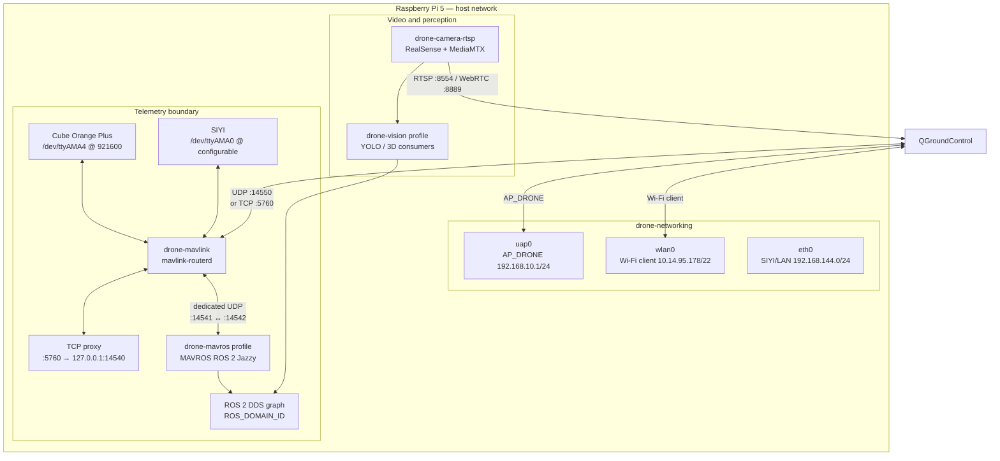

# Drone Edge Container Architecture

This diagram is the source-of-truth development map. It is intentionally
versioned as Mermaid so it remains reviewable in pull requests and renders in
GitHub, VS Code and Mermaid-compatible documentation viewers.

## Endpoint ownership

| Owner | Endpoint | Consumer |
|---|---|---|
| MAVLink Router | UART `/dev/ttyAMA4` | Flight Controller only |
| MAVLink Router | UDP `0.0.0.0:14550` | Active GCS clients |
| TCP proxy | TCP `:5760` | QGroundControl / tools |
| TCP proxy + Router | UDP `127.0.0.1:14540` | TCP proxy only |
| MAVLink Router + MAVROS | UDP `127.0.0.1:14541` / source `:14542` | MAVROS only |
| MAVROS | ROS 2 DDS | Vision and future telemetry subscribers |

> Never create a UDP broadcast endpoint on `:14550` while Router binds
> `0.0.0.0:14550` in host-network mode.

## Future autonomy boundary

RGB-D localization and any FC motion command are intentionally separated:
`camera_rgbd -> detector -> localizer -> target_tracker -> approach_planner -> autonomy_safety_gate -> offboard_controller -> MAVROS`.

Only the first safety foundation is present today. It has no MAVROS imports,
arming logic, flight-mode changes, or setpoint publisher. The dedicated
`autonomy` Compose profile and firmware adapter remain disabled until D435i
USB 3.x validation, extrinsic calibration, SITL, and bench-test gates pass.
