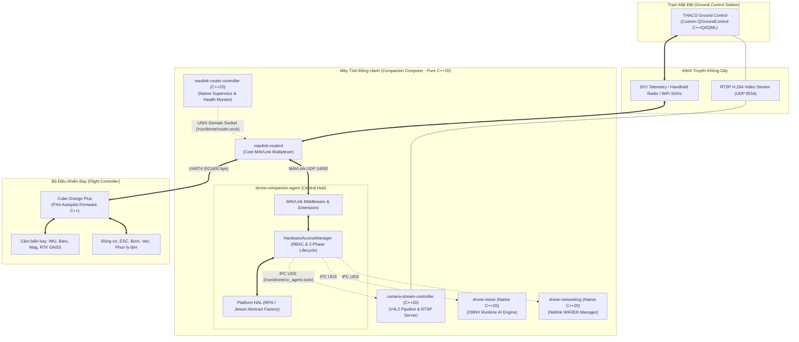
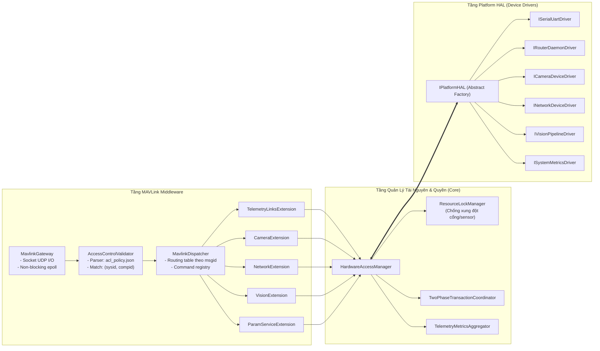
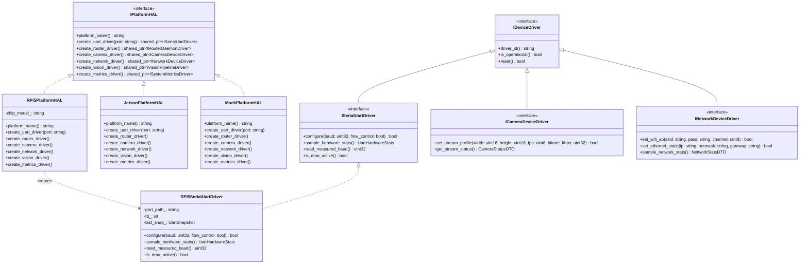
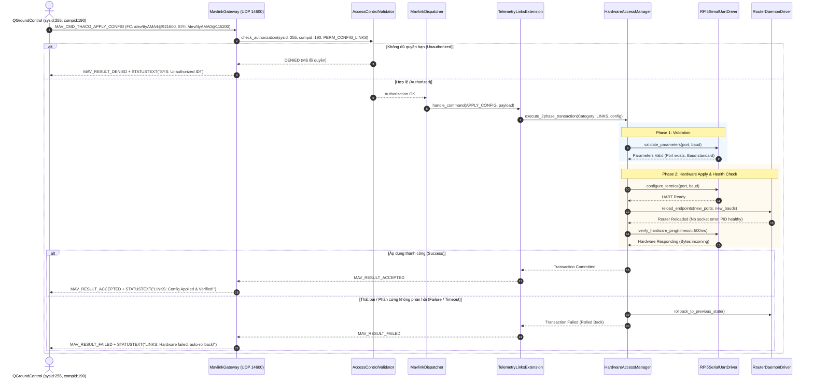
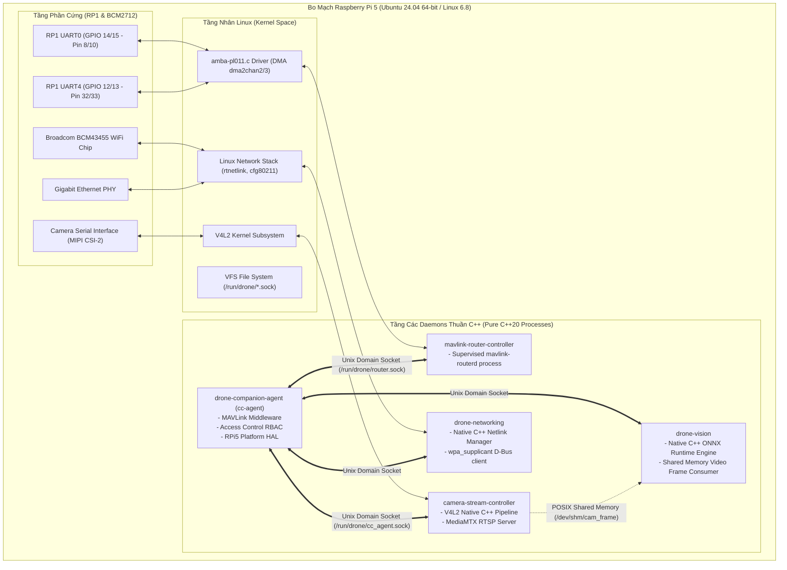

# Báo Cáo Thiết Kế Kiến Trúc Hệ Thống & Đặc Tả Kỹ Thuật (System Architecture Specification & README)

> **Dự án:** THACO Drone — Nền tảng Máy Bay Không Người Lái Thông Minh  
> **Ngôn ngữ mục tiêu toàn diện:** Thuần **Modern C++ (C++20)**  
> **Ràng buộc phát triển:** Tuyệt đối không sửa code trong bước này; tập trung vào thiết kế hệ thống, phân tích toàn bộ dự án, đặc tả yêu cầu và mô hình hóa UML.

---

## MỤC LỤC
1. [Tổng Quan Hệ Thống & Tầm Nhìn Kỹ Thuật](#1-tổng-quan-hệ-thống--tầm-nhìn-kỹ-thuật)
2. [Quét Toàn Bộ Dự Án & Phân Tích Các Điểm Hạn Chế, Nhược Điểm Mở Rộng](#2-quét-toàn-bộ-dự-án--phân-tích-các-điểm-hạn-chế-nhược-điểm-mở-rộng)
3. [Đặc Tả Yêu Cầu Hệ Thống (Requirements Specification)](#3-đặc-tả-yêu-cầu-hệ-thống-requirements-specification)
   - 3.1. [Yêu cầu chức năng (Functional Requirements - FR)](#31-yêu-cầu-chức-năng-functional-requirements---fr)
   - 3.2. [Yêu cầu phi chức năng (Non-Functional Requirements - NFR)](#32-yêu-cầu-phi-chức-năng-non-functional-requirements---nfr)
4. [Mô Hình Hóa Hệ Thống Bằng UML (Comprehensive System UML)](#4-mô-hình-hóa-hệ-thống-bằng-uml-comprehensive-system-uml)
   - 4.1. [UML 1: Sơ đồ Kiến trúc Tổng thể (High-Level Architecture)](#41-uml-1-sơ-đồ-kiến-trúc-tổng-thể-high-level-architecture)
   - 4.2. [UML 2: Sơ đồ Thành phần C++ (Modular Component Diagram)](#42-uml-2-sơ-đồ-thành-phần-c-modular-component-diagram)
   - 4.3. [UML 3: Sơ đồ Lớp Tầng Device Driver & HAL (Class Diagram)](#43-uml-3-sơ-đồ-lớp-tầng-device-driver--hal-class-diagram)
   - 4.4. [UML 4: Sơ đồ Tuần tự Giao dịch Cấu hình 2-Phase (Sequence Diagram)](#44-uml-4-sơ-đồ-tuần-tự-giao-dịch-cấu-hình-2-phase-sequence-diagram)
   - 4.5. [UML 5: Sơ đồ Triển khai Phần cứng & Daemons (Deployment Diagram)](#45-uml-5-sơ-đồ-triển-khai-phần-cứng--daemons-deployment-diagram)
5. [Chuẩn Hóa Kỹ Thuật C++20 Cho Toàn Bộ Hệ Thống](#5-chuẩn-hóa-kỹ-thuật-c20-cho-toàn-bộ-hệ-thống)
6. [Lộ Trình Tinh Gọn Hóa Thuần C++ (Pure C++ Migration Roadmap)](#6-lộ-trình-tinh-gọn-hóa-thuần-c-pure-c-migration-roadmap)

---

## 1. Tổng Quan Hệ Thống & Tầm Nhìn Kỹ Thuật

THACO Drone là hệ sinh thái máy bay không người lái công nghiệp/nông nghiệp tích hợp, bao gồm 4 khối lớn liên kết qua Git Submodules:
1. **`Flight_Controller` (PX4-Autopilot C++):** Điều khiển bay, ước lượng trạng thái EKF2, an toàn bay, điều khiển động cơ và chấp hành.
2. **`Companion_Computer` (Edge Computing Daemon Hub):** Máy tính nhúng (Raspberry Pi 5 / NVIDIA Jetson) xử lý định tuyến MAVLink, điều khiển luồng camera, mạng WiFi/Ethernet và suy luận AI thời gian thực.
3. **`Drone_MAVLink` (Protocol Single Source of Truth):** Định nghĩa dialect MAVLink XML `thaco.xml` và công cụ sinh mã tự động cho C++ và QGC.
4. **`THACOGroundControl` (QGroundControl C++/Qt/QML):** Trạm điều khiển mặt đất (GCS) chuyên dụng.

### Tầm nhìn kiến trúc thuần Modern C++ (Pure C++20 Vision)
Trước đây, hệ thống tồn tại sự pha trộn giữa C++, Python scripts (cho mạng và vision) và Bash scripts. Mục tiêu chiến lược là **chuẩn hóa 100% phần mềm máy tính đồng hành sang C++20**. Điều này mang lại:
- **Tính tiền định (Deterministic Execution) & Độ trễ siêu thấp:** Loại bỏ hoàn toàn độ trễ thu gom rác (Garbage Collection) và khóa Global Interpreter Lock (GIL) của Python.
- **Tiết kiệm tài nguyên bộ nhớ (RAM Footprint):** Giảm dung lượng chiếm dụng RAM từ hàng trăm MB (do runtime Python/PyTorch) xuống dưới 15-30 MB cho toàn bộ daemons.
- **Tính ổn định phần cứng (Robustness):** Phát hiện lỗi kiểu dữ liệu và vi phạm bộ nhớ ngay tại thời điểm biên dịch (Compile-time type safety).

---

## 2. Quét Toàn Bộ Dự Án & Phân Tích Các Điểm Hạn Chế, Nhược Điểm Mở Rộng

Qua quá trình rà soát toàn bộ cây thư mục mã nguồn của dự án, các điểm thắt nút cổ chai (bottlenecks) và hạn chế trong việc mở rộng được phân loại chi tiết như sau:

| Thành phần (Submodule) | Công nghệ hiện tại | Các điểm hạn chế & Nhược điểm trong mở rộng | Hướng xử lý thuần C++ |
| :--- | :--- | :--- | :--- |
| **`cc-agent`** | C++20 | 1. **God Object `MavlinkCore` (56KB):** Ôm đồm socket, parsing, routing, 5 loại telemetry, param registry, rollback.<br>2. **Hardcode 2 liên kết FC/SIYI:** Không thể mở rộng link thứ 3 (LTE 4G, RTK, Lidar).<br>3. **Hardcode chuỗi cổng & whitelist SysID/CompID:** Gây lỗi drop gói tin SIYI khi SysID $\neq$ 1.<br>4. **Busy-polling loop `sleep_for(5ms)`:** Gây tốn pin CPU và trễ lệnh.<br>5. **Lỗi socket in-use & thread leak:** `UdsHubServer` tạo thread vô hạn không có pool; `bind()` không kiểm tra mã lỗi. | Phân rã thành 3 tầng: Platform HAL Driver, Hardware Access Manager (kèm RBAC), MAVLink Middleware & Extensions. |
| **`drone-vision`** | **Python (PyTorch / Ultralytics)**, shell scripts | 1. **Vi phạm yêu cầu thuần C++:** Sử dụng `yolo26n.pt` qua Python script `inference_yolo.py`.<br>2. **Nặng nề:** Chiếm dụng 300MB - 500MB RAM, khởi động chậm (3-5s).<br>3. **Không tận dụng tối đa phần cứng:** Khó can thiệp sâu vào NPU của SoC (như NPU của RK3588 hay DLA của Jetson) từ Python. | Viết lại thành daemon C++20 sử dụng **ONNX Runtime C++ API** hoặc **OpenCV DNN / TensorRT C++**, nạp model qua C++ inference engine với RAM < 50MB. |
| **`drone-networking`** | **Python (`wifi_manager.py`)** + Bash scripts | 1. **Vi phạm yêu cầu thuần C++:** Phụ thuộc vào các file shell `entrypoint.sh` (11.8 KB) và `wifi_manager.py`.<br>2. **Xử lý lỗi kém:** Cấu hình mạng bằng cách gọi lệnh shell `system("netplan apply")` hoặc `wpa_cli` rất dễ bị treo hoặc mất IP nếu cú pháp yaml lỗi. | Viết lại thành **C++20 Network Manager Daemon** giao tiếp trực tiếp với nhân Linux qua **Netlink Sockets (`libnl` / `rtnetlink`)** và D-Bus API của `wpa_supplicant`. |
| **`camera-stream-controller`** | C++17, MediaMTX, shell scripts | 1. Giao tiếp qua file cấu hình tĩnh `mediamtx.yml` và script khởi động.<br>2. Chưa có cơ chế phát hiện camera rớt kết nối vật lý (USB unplug) để tự động khởi động lại pipeline V4L2.<br>3. Thiếu abstraction cho các loại camera khác nhau (CSI MIPI vs USB RealSense vs RTSP Payload Camera). | Chuẩn hóa tầng `ICameraDriver` C++, điều khiển trực tiếp Video4Linux2 (`v4l2_subdev`) và pipeline streamer thuần C++. |
| **`mavlink-router-controller`** | C++20 | 1. Lỗi crash `Address already in use` trên port 14541 khi reload router.<br>2. Lỗi tiến trình Zombie (`<defunct>`) do `waitpid` không có cơ chế thu gom bất đồng bộ.<br>3. Tạo file cấu hình bằng nối chuỗi văn bản (string formatting) thay vì đối tượng cấu hình an toàn. | Nâng cấp thành `RouterDaemonDriver` có quản lý socket timeout, SO_REUSEADDR và non-blocking process supervision. |
| **`Drone_MAVLink` (`thaco.xml`)** | MAVLink XML Dialect | 1. Thông điệp `CC_TELEMETRY_LINKS` (ID 51003) gắn cứng các trường `fc_*` và `siyi_*`.<br>2. Thiếu thông điệp trạng thái liên kết động theo dạng mảng/danh sách linh hoạt (`CC_LINK_STATUS`). | Bổ sung thông điệp generic `CC_LINK_STATUS(link_id, compid, type, rate, loss, status)` để hỗ trợ N liên kết. |
| **`THACOGroundControl`** | C++17 / Qt / QML | 1. Giao diện `CompanionTelemetryTab.qml` cố định 2 khối panel "Cube Orange" và "SIYI".<br>2. Controller C++ phụ thuộc vào các property tĩnh thay vì dùng `QAbstractListModel`. | Cập nhật Controller sang `QAbstractListModel` và QML dùng `Repeater` để tự sinh UI theo danh sách link động. |

---

## 3. Đặc Tả Yêu Cầu Hệ Thống (Requirements Specification)

### 3.1. Yêu Cầu Chức Năng (Functional Requirements - FR)

- **[FR-01] Nhận diện thiết bị động bằng ID (ID-Based Auto Discovery):**
  Hệ thống phải tự động nhận diện danh tính và vai trò của mọi thiết bị cắm vào cổng UART/USB thông qua việc phân tích gói tin `HEARTBEAT` MAVLink (`compid` và `type`). Tuyệt đối không hardcode tên cổng vật lý với bất kỳ thương hiệu nào (như FC hay SIYI).
- **[FR-02] Phân quyền truy cập cấu hình (Role-Based Access Control - RBAC):**
  Mọi lệnh MAVLink (`COMMAND_LONG`, `PARAM_EXT_SET`) tác động tới phần cứng phải được kiểm tra quyền của người gửi `(sysid, compid)` thông qua bảng chính sách bảo mật cấu hình ngoài (`acl_policy.json`). Lệnh từ ID không được phép phải bị từ chối với mã `MAV_RESULT_DENIED`.
- **[FR-03] Quy trình giao dịch cấu hình an toàn 2-Phase (2-Phase Config Lifecycle):**
  Việc thay đổi cấu hình hạ tầng (Baudrate, Cổng mạng, Video resolution) phải trải qua 2 pha: (1) Kiểm tra tính khả thi phần cứng (`Validate`); (2) Cấu hình phần cứng và ping xác nhận trạng thái (`Apply & Verify`). Nếu phần cứng không phản hồi trong 500ms, hệ thống phải tự động hủy bỏ và báo lỗi qua `STATUSTEXT`.
- **[FR-04] Luồng điều khiển thời gian thực siêu tốc (Fast-Path Operational Execution):**
  Các lệnh điều khiển cơ cấu chấp hành thời gian thực (Gimbal pitch/yaw, van, bơm, trigger camera) phải bỏ qua quy trình 2-Phase để thực thi ngay lập tức qua Fast-Path với độ trễ $< 5\text{ms}$.
- **[FR-05] Suy luận AI nhận diện đối tượng bằng C++ thuần (Native C++ Vision Inference):**
  Khối Vision phải thực thi bằng C++ sử dụng ONNX Runtime Engine, đọc trực tiếp frame từ Shared Memory của camera streamer, xuất tọa độ Bounding Box và Confidence Score qua MAVLink/IPC mà không dùng Python runtime.
- **[FR-06] Quản lý mạng Netlink bằng C++ thuần (Native C++ Network Engine):**
  Khối Network phải là một daemon C++ quản lý trực tiếp giao diện WiFi AP, Client và Ethernet qua Linux Netlink socket và D-Bus `wpa_supplicant`, loại bỏ hoàn toàn các file script Bash/Python.
- **[FR-07] Tương thích ngược MAVLink Telemetry:**
  Hệ thống phải cung cấp một tầng Adapter để chuyển đổi dữ liệu đa liên kết nội bộ thành thông điệp `CC_TELEMETRY_LINKS` chuẩn cũ nhằm duy trì 100% tính tương thích với phiên bản QGroundControl hiện tại.
- **[FR-08] Khắc phục lỗi Bypass bộ đếm UART DMA:**
  Tầng Driver Serial trên Raspberry Pi 5 phải tự động nhận diện chế độ DMA trên chip nam RP1 để chuyển đổi linh hoạt giữa việc đọc bộ đếm kernel `TIOCGICOUNT` và đo trực tiếp thông lượng dòng byte MAVLink thực tế.

---

### 3.2. Yêu Cầu Phi Chức Năng (Non-Functional Requirements - NFR)

- **[NFR-01] Tính tiền định & Độ trễ (Latency & Real-time Determinism):**
  Vòng lặp xử lý sự kiện trung tâm (Event Loop) của `cc-agent` phải sử dụng cơ chế hướng sự kiện (`epoll_wait`). Tuyệt đối không dùng vòng lặp bận `sleep_for(5ms)`. Thời gian phản hồi MAVLink ACK phải $< 10\text{ms}$.
- **[NFR-02] Tối ưu hóa Bộ nhớ (Memory Footprint):**
  Toàn bộ các tiến trình C++ chạy trên Companion Computer (`cc-agent`, `router-controller`, `camera-controller`, `vision-engine`, `network-engine`) phải tiêu thụ tổng cộng không quá **150 MB RAM**.
- **[NFR-03] Độ tin cậy & Tự phục hồi (Zero-Crash & Self-Healing):**
  - Mọi thao tác socket IPC phải sử dụng cờ `MSG_NOSIGNAL` để chống sập tiến trình do tín hiệu `SIGPIPE`.
  - Không có tiến trình Zombie (`<defunct>`) tồn tại trong hệ thống.
  - Khi một thiết bị ngoại vi bị mất kết nối đột ngột, driver tương ứng phải tự cô lập lỗi và định kỳ quét kết nối lại sau mỗi 2 giây mà không làm gián đoạn các luồng khác.
- **[NFR-04] Tuân thủ Nguyên lý SOLID:**
  Toàn bộ mã nguồn C++ phải tuân thủ nghiêm ngặt 5 nguyên lý SOLID: không God Object, không phụ thuộc cụ thể (DIP), mở rộng tính năng chỉ bằng cách thêm class mới (OCP).
- **[NFR-05] Khả năng kiểm thử độc lập (Testability & CI/CD Readiness):**
  Toàn bộ tầng nghiệp vụ và Middleware phải có khả năng biên dịch và chạy Unit Test 100% trên môi trường x86-64 (máy tính cá nhân của lập trình viên) thông qua các lớp Mock/Stub mà không cần quyền root hay phần cứng nhúng thật.
- **[NFR-06] Tính linh hoạt phần cứng (Hardware Agnosticism):**
  Việc chuyển đổi phần cứng từ Raspberry Pi 5 sang NVIDIA Jetson Orin hoặc chip x86 chỉ yêu cầu thay thế triển khai của tầng `IPlatformHAL`, giữ nguyên 100% tầng Middleware và Applications.

---

## 4. Mô Hình Hóa Hệ Thống Bằng UML (Comprehensive System UML)

### 4.1. UML 1: Sơ đồ Kiến trúc Tổng thể (High-Level Architecture)

Biểu đồ thể hiện toàn bộ luồng dữ liệu từ trạm mặt đất GCS, qua mạng không dây, xử lý tại Companion Computer, tới Flight Controller và cơ cấu chấp hành:



---

### 4.2. UML 2: Sơ đồ Thành phần C++ (Modular Component Diagram)

Biểu đồ phân rã chi tiết kiến trúc bên trong `cc-agent` thành các khối chức năng độc lập theo chuẩn SOLID:



---

### 4.3. UML 3: Sơ đồ Lớp Tầng Device Driver & HAL (Class Diagram)

Biểu đồ lớp thể hiện mẫu thiết kế **Abstract Factory Pattern** và **Interface Segregation**:



---

### 4.4. UML 4: Sơ đồ Tuần tự Giao dịch Cấu hình 2-Phase (Sequence Diagram)

Biểu đồ minh họa chi tiết quá trình xác thực quyền và thực hiện cấu hình an toàn khi nhận lệnh từ GCS:



---

### 4.5. UML 5: Sơ đồ Triển khai Phần cứng & Daemons (Deployment Diagram)

Biểu đồ thể hiện cách các daemon thuần C++ được đóng gói và giao tiếp với nhân Linux và phần cứng Raspberry Pi 5:



---

## 5. Chuẩn Hóa Kỹ Thuật C++20 Cho Toàn Bộ Hệ Thống

Để đảm bảo mã nguồn mới đạt tiêu chuẩn công nghiệp và chống thoái hóa kiến trúc, hệ thống áp dụng các tiêu chuẩn C++20 nghiêm ngặt:

1. **Quản lý Tài nguyên An toàn (RAII & Zero Raw Pointers):**
   - Tuyệt đối cấm sử dụng con trỏ trần (`raw pointer`) cho mục đích sở hữu bộ nhớ (`new`/`delete`).
   - Sử dụng `std::unique_ptr` cho các đối tượng sở hữu đơn nhất (Driver instances) và `std::shared_ptr` khi chia sẻ giữa các Extension.
   - Socket file descriptors và file handles phải được đóng gói vào các lớp RAII (ví dụ `UniqueFd`) tự động `::close()` khi ra khỏi scope.

2. **Không Cấp Phát Bộ Nhớ Động Trong Vòng Lặp Nóng (Zero Heap in Hot Paths):**
   - Vòng lặp nhận và định tuyến gói MAVLink (chạy ở tần số 100Hz - 250Hz) tuyệt đối không gọi `malloc()`, `new`, hoặc thay đổi kích thước `std::string`/`std::vector`.
   - Sử dụng bộ đệm tĩnh `std::array<uint8_t, MAVLINK_MAX_PACKET_LEN>` hoặc `std::string_view` để phân tích gói tin.

3. **An Toàn Đa Luồng (Thread Safety & Concurrency):**
   - Sử dụng `std::atomic<bool>` cho các cờ trạng thái vòng lặp.
   - Bảo vệ trạng thái chia sẻ bằng `std::mutex` kết hợp `std::lock_guard` / `std::scoped_lock`.
   - Cơ chế hàng đợi công việc (Worker Task Queue) sử dụng `std::condition_variable` để ngủ khi rảnh và đánh thức tức thì khi có task, không dùng polling sleep.

4. **Kiểm Soát Kiểu Dữ Liệu Mạnh (Strong Typing & C++20 Concepts):**
   - Sử dụng `enum class` có định kiểu rõ ràng (`enum class LinkRole : uint8_t`).
   - Ứng dụng C++20 Concepts để ràng buộc kiểu dữ liệu cho các Driver:
     ```cpp
     template<typename T>
     concept ConfigurableDriver = requires(T d, const nlohmann::json& cfg, std::string& err) {
         { d.validate(cfg, err) } -> std::same_as<bool>;
         { d.apply(cfg, err) }    -> std::same_as<bool>;
         { d.verify_health(1000) } -> std::same_as<bool>;
     };
     ```

---

## 6. Lộ Trình Tinh Gọn Hóa Thuần C++ (Pure C++ Migration Roadmap)

Quá trình chuyển đổi toàn bộ dự án sang C++ thuần được thiết kế theo 4 giai đoạn an toàn:

### Giai đoạn 1: Chuẩn Hóa Tầng Middleware & Driver Cho `cc-agent` (Ưu Tiên 1)
- Triển khai `IPlatformHAL`, `RPi5PlatformHAL`, `RPi5SerialUartDriver`.
- Triển khai `AccessControlValidator` nạp chính sách từ `acl_policy.json`.
- Tách `MavlinkDispatcher` và các Extension. Khắc phục triệt để lỗi SIYI OFFLINE và crash port router `14541`.

### Giai đoạn 2: Viết Lại Module `drone-networking` Bằng C++20 (Loại Bỏ Python/Bash)
- Xây dựng daemon `drone-network-manager` bằng C++20:
  - Dùng `libnl` để gán IP tĩnh cho cổng Ethernet `eth0`.
  - Dùng D-Bus API tương tác với `wpa_supplicant` và `hostapd` để quét mạng WiFi và phát trạm Hotspot AP.
- Xóa bỏ file `wifi_manager.py` và script `entrypoint.sh` cũ.

### Giai đoạn 3: Viết Lại Module `drone-vision` Bằng C++20 (Loại Bỏ PyTorch)
- Xây dựng daemon `drone-vision-engine` bằng C++20:
  - Tích hợp **ONNX Runtime C++ API** (hoặc OpenVINO / TensorRT C++).
  - Đọc frame camera trực tiếp từ Shared Memory (`/dev/shm/cam_frame`) của `camera-stream-controller` bằng zero-copy.
  - Thực hiện tiền xử lý ảnh (Resize, BGR to RGB, Normalization) và suy luận mô hình `yolov8n.onnx` trên C++.
  - Dung lượng RAM giảm từ 400MB xuống dưới 35MB; độ trễ giảm 3 lần.

### Giai đoạn 4: Chuẩn Hóa Tương Thích GCS & MAVLink Đa Liên Kết
- Cập nhật file `thaco.xml` với thông điệp `CC_LINK_STATUS`.
- Cập nhật `CompanionTelemetryController.cc` trong `THACOGroundControl` sử dụng `QAbstractListModel` hiển thị danh sách link động.
- Hoàn tất kiểm thử nghiệm thu thực tế trên máy bay ngoài đồng ruộng.
