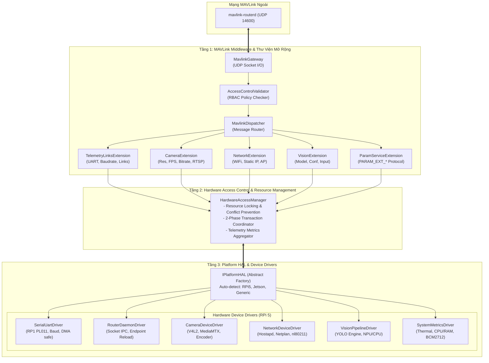

# Thiết Kế Kiến Trúc 3 Tầng Cho cc-agent: Tầng Device Driver (HAL), Quản Lý Quyền Truy Cập & MAVLink Middleware

## 1. Mục tiêu (Goal Description)
Thiết kế lại toàn diện kiến trúc `cc-agent` thành mô hình **3 tầng chuẩn SOLID (Single Responsibility, Open/Closed, Liskov, Interface Segregation, Dependency Inversion)**:
1. **Tầng Platform HAL & Device Drivers (Platform-Specific Hardware Drivers):** Trừu tượng hóa phần cứng theo mô hình Abstract Factory (`IPlatformHAL`), hiện tại tối ưu cho Raspberry Pi 5 (RP1 I/O controller, PL011 UARTs, Video4Linux2, Netplan) và sẵn sàng mở rộng cho NVIDIA Jetson hoặc SoC khác trong tương lai.
2. **Tầng Hardware Access Control & Resource Management (`HardwareAccessManager`):** Đóng vai trò Security & Resource Gateway; kiểm duyệt quyền hạn của MAVLink Sender ID (Role-Based Access Control) trước khi cho phép cấu hình phần cứng; quản lý quy trình áp dụng cấu hình an toàn 2-Phase (Validate $\rightarrow$ Apply $\rightarrow$ Health Check $\rightarrow$ Feedback).
3. **Tầng MAVLink Middleware & Extension Libraries:** Lắng nghe socket từ `mavlink-router`, giải mã MAVLink, kiểm tra RBAC Policy, và định tuyến gói tin tới các thư viện mở rộng (`IMavlinkExtension`) độc lập.

---

## 2. User Review Required (Yêu cầu Người dùng Đánh giá)

> [!IMPORTANT]
> **Bộ Phân Quyền Theo ID (RBAC Policy qua JSON):**
> Mọi lệnh cấu hình phần cứng (`COMMAND_LONG`, `PARAM_EXT_SET`, `CC_CONFIG_*`) đều bắt buộc đi qua bộ kiểm tra quyền `AccessControlValidator`.
> - GCS chính (`sysid=255, compid=190`): Toàn quyền cấu hình Network, Camera, Serial Telemetry, Reboot.
> - Autopilot FC (`sysid=1, compid=1`): Có quyền yêu cầu chuyển đổi cấu hình đường truyền (failover/baudrate).
> - Các ID lạ hoặc không nằm trong danh sách cho phép sẽ bị từ chối ngay lập tức với mã lỗi `MAV_RESULT_DENIED` và thông báo cảnh báo qua `STATUSTEXT`.

> [!NOTE]
> **Quy Trình Áp Dụng Cấu Hình 2-Phase:**
> Thay vì ghi file và gửi ACK ngay ("Fire-and-Forget"), quy trình mới sẽ:
> 1. **Phase 1 (Validate):** Driver kiểm tra thông số (cổng tồn tại, baudrate hỗ trợ, camera format hợp lệ). Nếu sai, từ chối ngay.
> 2. **Phase 2 (Apply & Verification):** Driver cấu hình phần cứng và ping/đọc phản hồi trong 500ms. Chỉ khi phần cứng hoạt động khỏe mạnh mới gửi `MAV_RESULT_ACCEPTED`. Nếu phần cứng lỗi, gửi `MAV_RESULT_FAILED` kèm lý do cụ thể.

---

## 3. Sơ Đồ Kiến Trúc 3 Tầng Tổng Thể



---

## 4. Chi Tiết Từng Tầng Kiến Trúc

### 4.1. Tầng 1: MAVLink Middleware & Extension Libraries
Tầng này tách biệt hoàn toàn logic mạng MAVLink khỏi logic phần cứng:

#### `AccessControlValidator` (Kiểm soát quyền theo ID)
```cpp
// middleware/access_control.hpp
struct ClientIdentity {
    uint8_t sysid;
    uint8_t compid;
};

enum class HardwarePermission {
    READ_TELEMETRY,
    CONFIG_LINKS,
    CONFIG_CAMERA,
    CONFIG_NETWORK,
    CONFIG_VISION,
    SYSTEM_REBOOT
};

class AccessControlValidator {
public:
    bool load_policy(const std::string& policy_file_path);
    bool is_authorized(uint8_t sysid, uint8_t compid, HardwarePermission perm) const;
};
```
File cấu hình phân quyền `/etc/drone/acl_policy.json`:
```json
{
  "roles": [
    {
      "name": "Primary_GCS",
      "match": { "sysid": 255, "compid": 190 },
      "permissions": ["READ_TELEMETRY", "CONFIG_LINKS", "CONFIG_CAMERA", "CONFIG_NETWORK", "CONFIG_VISION", "SYSTEM_REBOOT"]
    },
    {
      "name": "Flight_Controller",
      "match": { "sysid": 1, "compid": 1 },
      "permissions": ["READ_TELEMETRY", "CONFIG_LINKS"]
    },
    {
      "name": "Secondary_Controller",
      "match": { "sysid": 255, "compid": 1 },
      "permissions": ["READ_TELEMETRY", "CONFIG_CAMERA"]
    }
  ]
}
```

#### `IMavlinkExtension` (Thư viện mở rộng dạng Plugin)
Mỗi module chức năng triển khai một extension độc lập:
```cpp
class IMavlinkExtension {
public:
    virtual ~IMavlinkExtension() = default;
    virtual std::string extension_name() const = 0;
    virtual std::vector<uint32_t> supported_message_ids() const = 0;
    virtual std::vector<uint16_t> supported_commands() const = 0;
    virtual bool handle_message(const mavlink_message_t* msg) = 0;
    virtual bool handle_command(const mavlink_command_long_t* cmd, uint8_t sender_sysid, uint8_t sender_compid) = 0;
};
```

---

### 4.2. Tầng 2: Hardware Access Control & Resource Management (`HardwareAccessManager`)

Đây là tầng "cửa khẩu" duy nhất để thao tác với phần cứng:
- **Ngăn chặn xung đột tài nguyên:** Đảm bảo không có 2 extension nào cùng mở 1 cổng Serial hoặc cùng điều khiển 1 Camera sensor cùng lúc.
- **Thực thi quy trình 2-Phase Transaction:**
  ```cpp
  class HardwareAccessManager {
  public:
      // Quy trình 2-Phase cấu hình phần cứng
      ConfigResult validate_and_apply(
          uint8_t sender_sysid, uint8_t sender_compid,
          HardwareCategory category,
          const nlohmann::json& desired_config
      ) {
          // 1. Kiểm tra quyền của người gửi
          if (!acl_.is_authorized(sender_sysid, sender_compid, map_to_perm(category))) {
              return ConfigResult::Denied("Unauthorized sender ID: sysid=" + std::to_string(sender_sysid));
          }

          auto driver = hal_->get_driver(category);
          if (!driver) return ConfigResult::Failed("Driver not available for category");

          // 2. Phase 1: Validate
          std::string err;
          if (!driver->validate(desired_config, err)) {
              return ConfigResult::Rejected("Validation failed: " + err);
          }

          // 3. Phase 2: Apply & Health Verification
          if (!driver->apply(desired_config, err)) {
              return ConfigResult::Failed("Hardware apply failed: " + err);
          }

          if (!driver->verify_health(1000 /*ms timeout*/)) {
              driver->rollback();
              return ConfigResult::Failed("Hardware failed to respond after apply, rolled back");
          }

          return ConfigResult::Success("Applied and verified successfully");
      }
  };
  ```

---

### 4.3. Tầng 3: Platform HAL & Device Drivers

#### Abstract Factory (`IPlatformHAL`)
Tự động nhận dạng bo mạch khi khởi động:
```cpp
class IPlatformHAL {
public:
    virtual ~IPlatformHAL() = default;
    virtual std::string platform_name() const = 0; // "Raspberry Pi 5", "NVIDIA Jetson Orin", etc.

    virtual std::shared_ptr<ISerialUartDriver>    create_uart_driver(const std::string& port) = 0;
    virtual std::shared_ptr<IRouterDaemonDriver>  create_router_driver() = 0;
    virtual std::shared_ptr<ICameraDeviceDriver>  create_camera_driver() = 0;
    virtual std::shared_ptr<INetworkDeviceDriver> create_network_driver() = 0;
    virtual std::shared_ptr<IVisionPipelineDriver>create_vision_driver() = 0;
    virtual std::shared_ptr<ISystemMetricsDriver> create_metrics_driver() = 0;
};
```

#### Triển khai Driver cụ thể cho Raspberry Pi 5 (`RPi5PlatformHAL`)
- **`RPi5SerialUartDriver`:**
  - Nhận diện đúng kiến trúc chip nam RP1 (`1f00030000.serial` - UART0, `1f00040000.serial` - UART4).
  - Tự động phát hiện khi nào DMA đang kích hoạt (`dma2chan3`) để tự động chuyển sang đọc byte counter từ tầng stream thay vì chỉ phụ thuộc mù vào `TIOCGICOUNT` (giải quyết triệt để lỗi SIYI bị báo OFFLINE).
- **`RPi5RouterDaemonDriver`:**
  - Khắc phục lỗi `Address already in use` trên port 14541 bằng cơ chế đóng socket sạch và kiểm tra socket state bằng `ss` trước khi fork.
  - Sử dụng `waitpid(..., WNOHANG)` để thu gom tiến trình zombie (`<defunct>`).

---

## 5. Tổ Chức Thư Mục Mã Nguồn Đề Xuất

```text
cc-agent/
├── include/
│   ├── middleware/                     <-- TẦNG 1: MAVLINK MIDDLEWARE
│   │   ├── mavlink_gateway.hpp         (Socket UDP, raw packet send/recv)
│   │   ├── access_control.hpp          (RBAC Policy Engine kiểm tra sender ID)
│   │   ├── mavlink_dispatcher.hpp      (Bộ định tuyến gói tin)
│   │   └── imavlink_extension.hpp      (Interface cho các thư viện mở rộng)
│   ├── extensions/                     <-- THƯ VIỆN MỞ RỘNG (PLUGINS)
│   │   ├── telemetry_links_ext.hpp     (Quản lý link và baudrate)
│   │   ├── camera_stream_ext.hpp       (Quản lý camera RTSP)
│   │   ├── network_config_ext.hpp      (Quản lý WiFi/Ethernet)
│   │   ├── vision_ai_ext.hpp           (Quản lý model YOLO)
│   │   └── param_service_ext.hpp       (Giao thức PARAM_EXT_*)
│   ├── core/                           <-- TẦNG 2: RESOURCE & ACCESS MANAGER
│   │   ├── hardware_access_manager.hpp (Cửa khẩu bảo mật & Transaction Coordinator)
│   │   └── resource_lock.hpp           (Chống xung đột tài nguyên)
│   ├── hal/                            <-- TẦNG 3: PLATFORM HAL & DRIVERS
│   │   ├── iplatform_hal.hpp           (Abstract Factory Interface)
│   │   ├── idriver.hpp                 (Interface cơ sở cho các Driver)
│   │   ├── iserial_uart_driver.hpp
│   │   ├── icamera_driver.hpp
│   │   ├── inetwork_driver.hpp
│   │   └── isystem_metrics_driver.hpp
│   └── platforms/                      <-- TRIỂN KHAI THEO PHẦN CỨNG CỤ THỂ
│       ├── rpi5/
│       │   ├── rpi5_platform_hal.hpp
│       │   ├── rpi5_uart_driver.hpp    (Xử lý RP1 chip, DMA, PL011)
│       │   └── rpi5_metrics_driver.hpp (Nhiệt độ BCM2712)
│       ├── jetson/                     (Dự phòng mở rộng)
│       └── mock/                       (Mock Driver phục vụ Unit Test x86)
├── src/
│   ├── middleware/
│   ├── extensions/
│   ├── core/
│   ├── platforms/rpi5/
│   └── main.cpp                        (Lắp ráp DI / Composition Root)
└── config/
    ├── acl_policy.json                 (Bảng phân quyền MAVLink SysID/CompID)
    └── hardware_manifest.json          (Khai báo cổng & thiết bị)
```

---

## 6. Kế Hoạch Kiểm Thử & Xác Minh (Verification Plan)

### Automated Unit Tests
1. **`test_access_control.cpp`:**
   - Kiểm tra `is_authorized()` với ID được phép $\rightarrow$ Trả về `true`.
   - Kiểm tra ID lạ gửi lệnh cấu hình $\rightarrow$ Trả về `false`, sinh mã `MAV_RESULT_DENIED`.
2. **`test_hardware_access_manager.cpp`:**
   - Kiểm tra 2-Phase Transaction: Mock Driver trả về validate lỗi $\rightarrow$ Quá trình apply dừng lại ngay lập tức.
   - Kiểm tra chống xung đột tài nguyên: 2 extension cùng yêu cầu port `/dev/ttyAMA0` $\rightarrow$ Extension thứ hai bị từ chối `ResourceBusy`.
3. **`test_rpi5_uart_driver.cpp`:**
   - Kiểm tra mô phỏng DMA UART: Khi `TIOCGICOUNT` không tăng, driver tự kích hoạt fallback stream byte counter.

### Manual Hardware Verification (trên Drone thật)
1. **Kiểm tra phân quyền từ GCS:**
   - Dùng QGroundControl (sysid 255) bấm Apply cấu hình $\rightarrow$ Thành công (`MAV_RESULT_ACCEPTED`).
   - Dùng script gửi lệnh từ sysid 99 $\rightarrow$ Bị chặn ngay lập tức, QGC nhận cảnh báo `STATUSTEXT: "SYS: Denied unauthorized config command from sysid=99"`.
2. **Kiểm tra độ ổn định sau Apply:**
   - Xác nhận router không bị crash do port `14541`.
   - Xác nhận cả FC và SIYI giữ trạng thái ổn định, không bị nhảy baudrate.
