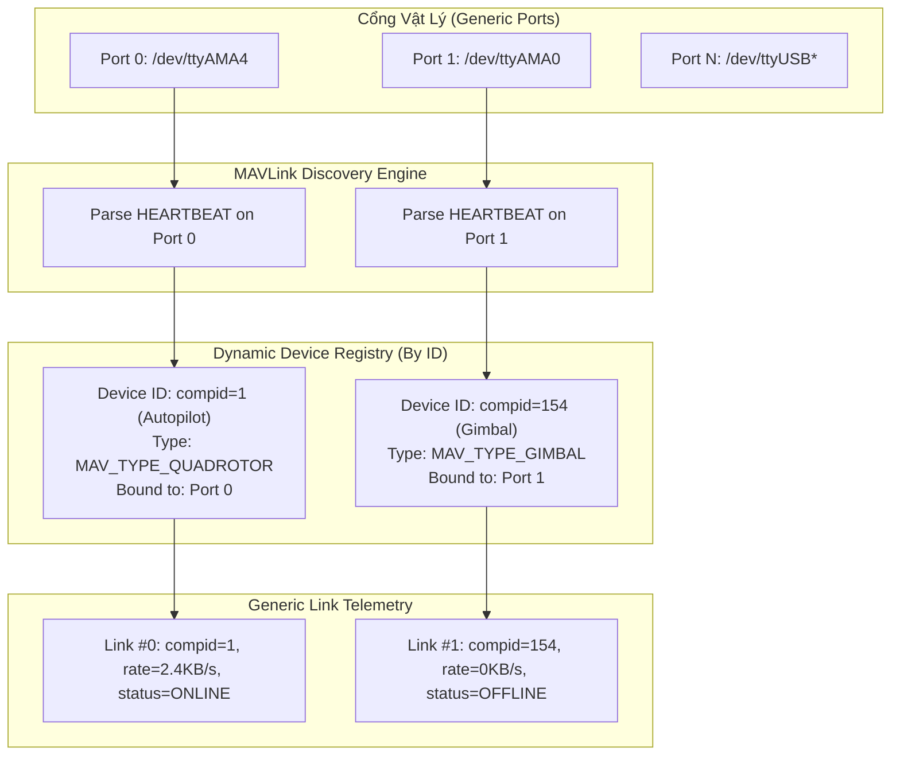

# Kế Hoạch Kiến Trúc: Nhận Diện Thiết Bị Động Bằng ID (Không Hardcode FC/SIYI)

## 1. Mục tiêu (Goal Description)
Theo yêu cầu: **"Không hardcode tên SIYI hoặc FC, hệ thống phải tự động nhận diện thiết bị thông qua ID"**.

Hiện tại hệ thống đang vi phạm tính linh hoạt vì hardcode tên gọi ở mọi tầng:
- C++ Code: `fc_port`, `siyi_port`, `active_fc`, `active_siyi`.
- MAVLink Message (`thaco.xml`): Định nghĩa thông điệp `CC_TELEMETRY_LINKS` chứa đích danh các trường `fc_tx_rate`, `siyi_tx_rate`, `fc_status`, `siyi_status`.
- QML UI: Chia cứng 2 panel "Cube Orange Plus (FC)" và "SIYI Gimbal & Camera".

Mục tiêu của thiết kế mới là:
1. **Loại bỏ hoàn toàn các định danh tĩnh "FC", "SIYI", "Cube" trong toàn bộ source code C++**.
2. **Nhận diện thiết bị động dựa trên MAVLink Standard IDs**:
   - `component_id` (MAV_COMPONENT: `1` cho Autopilot, `154` cho Gimbal, `100` cho Camera, `68` cho Radio, v.v.).
   - `device_type` (MAV_TYPE: `GIMBAL`, `CAMERA`, `QUADROTOR`, `ONBOARD_CONTROLLER`).
   - `link_id` (Mã số cổng vật lý: `0, 1, 2... N`).
3. **Cơ chế Plug-and-Play cho phần cứng:** Người dùng cắm Autopilot vào cổng nào thì cổng đó tự động nhận là Autopilot; cắm Gimbal/Radio vào cổng nào thì cổng đó tự động nhận diện theo ID gói tin Heartbeat phát ra từ cổng đó.

---

## 2. User Review Required (Yêu cầu Người dùng Đánh giá)

> [!IMPORTANT]
> **Cơ chế Nhận Diện ID Động (Dynamic Discovery):**
> Thiết bị trên drone giao tiếp qua MAVLink đều bắt buộc phát gói tin `HEARTBEAT` (Message ID 0) định kỳ 1Hz.
> Khi một thiết bị được cắm vào cổng UART bất kỳ, `cc-agent` sẽ bắt gói `HEARTBEAT` đầu tiên phát ra từ cổng đó để trích xuất:
> - `sysid`: System ID (thường là 1 cho cùng 1 máy bay).
> - `compid`: Component ID chuẩn quốc tế.
> - `type`: MAV_TYPE (Loại thiết bị: Autopilot, Gimbal, Camera, Radio).
> Từ 3 ID số này, `cc-agent` tự động phân loại vai trò và ánh xạ tên hiển thị chuẩn MAVLink (`Autopilot`, `Gimbal`, `Camera`, `Radio`), **không cần bất kỳ chuỗi cấu hình hardcode nào**.

> [!NOTE]
> **Tương thích ngược (Backward Compatibility):**
> Trong giai đoạn chuyển tiếp, để không làm vỡ giao diện QGroundControl đang bay:
> - `LinkManager` nội bộ chạy 100% bằng dynamic ID (`std::vector<GenericLink>`).
> - Một adapter sẽ tự động map: thiết bị có `compid == 1` vào slot 1 (Autopilot), thiết bị có `compid != 1` vào slot 2 (Payload/Gimbal/Radio).
> - Khi nâng cấp QGroundControl, giao diện sẽ dùng `Repeater` theo `link_id` để vẽ N liên kết động.

---

## 3. Kiến Trúc Nhận Diện Động Bằng ID (ID-Driven Architecture)



### 3.1. Bảng mã định danh chuẩn MAVLink (Không phụ thuộc thương hiệu)

Hệ thống sẽ dựa vào enum chuẩn quốc tế của MAVLink thay vì tên thương hiệu (như Cube, SIYI):

| `compid` (Số nguyên) | Tên chuẩn MAVLink | Vai trò tự động phân loại | Ví dụ thiết bị tương thích |
| :---: | :--- | :--- | :--- |
| **`1`** (`MAV_COMP_ID_AUTOPILOT1`) | Autopilot | Điều khiển bay chính (Primary FC) | Cube Orange+, Pixhawk, Matek, ArduPilot, PX4 |
| **`154`** (`MAV_COMP_ID_GIMBAL`) | Gimbal | Gimbal chống rung | SIYI A8/ZR10/ZT30, Gremsy, Tarot, SimpleBGC |
| **`100`** (`MAV_COMP_ID_CAMERA`) | Camera Payload | Camera chụp ảnh/quay phim | SIYI Camera, Sony Alpha, RunCam |
| **`68`** (`MAV_COMP_ID_TELEMETRY_RADIO`) | Telemetry Radio | Bộ thu phát sóng vô tuyến | SIYI HM30/MK15, RFD900, Holybro SiK Radio |
| **`191`** (`MAV_COMP_ID_ONBOARD_COMPUTER`) | Onboard Computer | Máy tính nhúng Companion | Raspberry Pi 5, Jetson Orin |
| **`158`** (`MAV_COMP_ID_PERIPHERAL`) | Peripheral | Thiết bị ngoại vi chung | Cảm biến tránh va chạm, Đèn định vị |

---

## 4. Thiết Kế Mã Nguồn Mới Không Hardcode

### 4.1. Lớp Đại Diện Thiết Bị Tổng Quát (`DiscoveredDevice`)
Thay thế toàn bộ các biến `fc_` và `siyi_` bằng cấu trúc dữ liệu theo ID:

```cpp
// models/discovered_device.hpp
namespace cc {

struct DiscoveredDevice {
    uint8_t  link_id      = 0;     // ID cổng vật lý (0, 1, 2...)
    uint8_t  sys_id       = 0;     // MAVLink System ID (1..255)
    uint8_t  comp_id      = 0;     // MAVLink Component ID (1=FC, 154=Gimbal...)
    uint8_t  mav_type     = 0;     // MAV_TYPE enum từ Heartbeat
    uint8_t  autopilot    = 0;     // MAV_AUTOPILOT enum (ArduPilot, PX4...)
    
    std::string port_path;         // e.g. "/dev/ttyAMA4"
    uint32_t    baudrate  = 0;     // e.g. 921600
    
    // Thống kê thời gian thực
    float    rx_rate      = 0.0f;
    float    tx_rate      = 0.0f;
    float    rx_loss      = 0.0f;
    uint32_t rx_bytes     = 0;
    uint32_t tx_bytes     = 0;
    uint32_t tx_err       = 0;
    uint8_t  status       = 0;     // 0=OFFLINE, 1=STANDBY, 2=ONLINE
    
    std::chrono::steady_clock::time_point last_heartbeat_time{};

    // Helper: Trả về tên hiển thị tự động từ ID chuẩn MAVLink
    std::string get_display_name() const {
        switch (comp_id) {
            case 1:   return "Autopilot (FC)";
            case 154: return "Gimbal Payload";
            case 100: return "Camera Sensor";
            case 68:  return "Telemetry Radio";
            case 191: return "Companion Computer";
            default:
                if (comp_id != 0) return "Device (CompID " + std::to_string(comp_id) + ")";
                return "Port: " + port_path;
        }
    }
};

} // namespace cc
```

### 4.2. Bộ Nhận Diện Động Trong `MavlinkCore`
Thay thế đoạn code lọc cứng:
```cpp
// TRƯỚC ĐÂY (BỊ HARDCODE):
if (msg->sysid == 1 && (msg->compid == 0 || msg->compid == 1 || msg->compid == 158)) {
    guard_.record_fc_heartbeat(pkt_len);
} else if (msg->sysid == 1 && (msg->compid == 154 || msg->compid == 100 || msg->compid == 68)) {
    last_siyi_time_ = std::chrono::steady_clock::now();
}
```

```cpp
// THIẾT KẾ MỚI (NHẬN DIỆN HOÀN TOÀN BẰNG ID):
void DeviceDiscoveryEngine::on_mavlink_message(const mavlink_message_t* msg, uint8_t link_id) {
    if (msg->msgid == MAVLINK_MSG_ID_HEARTBEAT) {
        mavlink_heartbeat_t hb;
        mavlink_msg_heartbeat_decode(msg, &hb);

        // Đăng ký hoặc cập nhật thiết bị theo cặp (link_id, comp_id)
        auto& dev = devices_[link_id];
        dev.link_id   = link_id;
        dev.sys_id    = msg->sysid;
        dev.comp_id   = msg->compid;
        dev.mav_type  = hb.type;
        dev.autopilot = hb.autopilot;
        dev.last_heartbeat_time = std::chrono::steady_clock::now();
        dev.status    = 2; // ONLINE
    }
    
    // Cộng dồn byte và phân phối cho link tương ứng theo link_id
    if (devices_.count(link_id)) {
        devices_[link_id].rx_bytes += (msg->len + 12);
    }
}
```

---

## 5. Cấu Trúc Thông Điệp MAVLink Động (Generic Link Telemetry)

Để loại bỏ hoàn toàn các trường mang tên riêng trong MAVLink XML (`thaco.xml`):

### Thông điệp mới: `CC_LINK_STATUS` (ID: 51004)
Thay vì một thông điệp gộp chứa cứng 2 thiết bị `fc_*` và `siyi_*`, mỗi link được truyền bằng 1 frame chuẩn hóa:

```xml
<message id="51004" name="CC_LINK_STATUS">
    <description>Trạng thái động của một cổng truyền thông định danh bằng ID</description>
    <field type="uint8_t" name="link_id">ID chỉ mục của cổng vật lý (0..N)</field>
    <field type="uint8_t" name="component_id">Component ID MAVLink tự nhận diện (1=Autopilot, 154=Gimbal...)</field>
    <field type="uint8_t" name="device_type">MAV_TYPE phát hiện được từ Heartbeat</field>
    <field type="uint8_t" name="status">0=OFFLINE, 1=STANDBY, 2=ONLINE</field>
    <field type="uint32_t" name="baudrate">Tốc độ Baud đang hoạt động</field>
    <field type="float" name="rx_rate">Tốc độ nhận (Bytes/sec)</field>
    <field type="float" name="tx_rate">Tốc độ gửi (Bytes/sec)</field>
    <field type="float" name="rx_loss">Tỷ lệ mất gói / lỗi framing (%)</field>
    <field type="uint32_t" name="total_rx_bytes">Tổng byte đã nhận</field>
    <field type="uint32_t" name="total_tx_bytes">Tổng byte đã gửi</field>
    <field type="char[16]" name="port_name">Tên cổng vật lý (vd: ttyAMA0, ttyAMA4)</field>
</message>
```

**Ưu điểm vượt trội:**
1. Drone có 1 link, 2 link, hay 5 link (thêm Radio phụ, modem vệ tinh, lidar) đều dùng chung duy nhất một định dạng thông điệp.
2. QGroundControl không cần biết trước trên drone có hãng gì; chỉ cần đọc `component_id` và hiển thị panel tương ứng.

---

## 6. Lợi Ích Trực Tiếp Khi Giải Quyết Sự Cố SIYI

Với cơ chế nhận diện theo ID này:
1. **Khắc phục lỗi SIYI bị drop do khác SysID:**
   Trước đây code bắt buộc `msg->sysid == 1`. Thiết kế mới nhận diện mọi `sys_id` phát ra từ cổng đó.
2. **Khắc phục lỗi SIYI dùng Component ID khác:**
   Nếu SIYI phát ID `68` (Radio), `154` (Gimbal), `100` (Camera) hoặc bất kỳ ID nào khác, hệ thống đều tự động hiển thị đúng ID đó mà không bị drop.
3. **Cắm cổng nào chạy cổng đó:**
   Nếu tráo đổi dây cắm: cắm Cube FC vào UART0 và cắm SIYI vào UART4, hệ thống vẫn nhận diện chính xác 100% không cần cấu hình lại phần mềm.

---

## 7. Kế Hoạch Triển Khai (Execution Strategy)

1. **Bước 1 (Mô hình dữ liệu theo ID):**
   Tạo struct `DiscoveredDevice` và `DeviceDiscoveryEngine` quản lý thiết bị theo `link_id` và `comp_id`.
2. **Bước 2 (Loại bỏ các biến `fc_*` / `siyi_*` trong lõi C++):**
   Chuyển `LinkStatsComputer` thành mảng `std::vector<DiscoveredDevice>`.
3. **Bước 3 (Adapter tương thích MAVLink cũ):**
   Trong khi chưa thay đổi `thaco.xml`, Adapter sẽ tự động gán:
   - Link nào có `comp_id == 1` $\rightarrow$ Đổ vào trường `fc_*` của gói tin cũ.
   - Link nào có `comp_id != 1` $\rightarrow$ Đổ vào trường `siyi_*` của gói tin cũ.
   $\rightarrow$ **Giao diện QGC hiện tại vẫn chạy mượt mà ngay lập tức.**
4. **Bước 4 (Chuẩn hóa toàn diện):**
   Bổ sung message `CC_LINK_STATUS` và cập nhật QML sang dạng Dynamic List.
