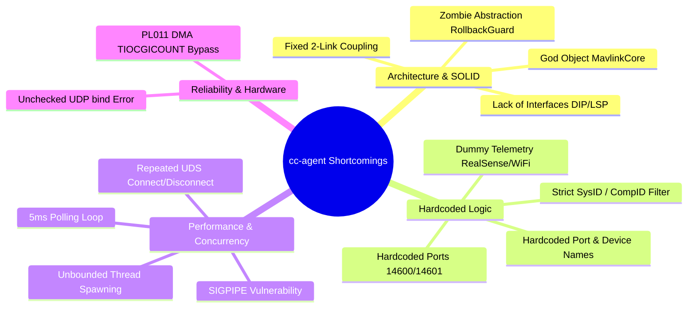

# Báo Cáo Phân Tích: Các Nhược Điểm Cốt Lõi Cần Điều Chỉnh Của `cc-agent`

## 1. Mục tiêu (Goal Description)
Phân tích toàn diện hiện trạng mã nguồn của `cc-agent` (Drone Companion Agent) nhằm chỉ ra các **nhược điểm kiến trúc, lỗi tiềm ẩn về độ tin cậy, thắt nút cổ chai hiệu năng, vi phạm nguyên lý thiết kế SOLID và các vị trí bị hardcode**. Từ đó, đề xuất phương án điều chỉnh chi tiết theo chuẩn sản phẩm công nghiệp (Production-Grade).

---

## 2. Tổng Hợp 14 Nhược Điểm Của `cc-agent` Hiện Tại



---

### NHÓM I: NHƯỢC ĐIỂM KIẾN TRÚC & THIẾT KẾ (SOLID VIOLATIONS)

#### 1. "God Object" `MavlinkCore` (Vi phạm Single Responsibility Principle)
- **Vị trí:** [`mavlink_core.hpp`](file:///home/lnh/THACO_Drone/Companion_Computer/src/cc-agent/include/mavlink_core.hpp) & [`mavlink_core.cpp`](file:///home/lnh/THACO_Drone/Companion_Computer/src/cc-agent/src/mavlink_core.cpp) (hơn 1.200 dòng, kích thước 56 KB).
- **Hiện trạng:** Một lớp duy nhất đảm nhiệm tới 8 trách nhiệm độc lập:
  1. Quản lý socket UDP mạng (bind, sendto, recvfrom).
  2. Vòng lặp giải mã từng byte MAVLink (`mavlink_parse_char`).
  3. Định tuyến và xử lý các loại lệnh (`COMMAND_LONG`, `APPLY_CONFIG`).
  4. Quản lý luồng background worker và task queue.
  5. Đóng gói và phát định kỳ 5 thông điệp telemetry (`LINKS`, `CAMERA`, `VISION`, `NETWORK`, `SYSTEM`).
  6. Xử lý giao thức tham số mở rộng MAVLink (`PARAM_EXT_*`).
  7. Kết nối định kỳ 1Hz qua UDS tới `/run/drone/router.sock`.
  8. Quản lý bộ đệm dự thảo (drafts) và cảnh báo lệch baudrate.
- **Tác hại:** Rất khó bảo trì; bất kỳ thay đổi nhỏ ở tính năng này (như thêm tham số) đều có nguy cơ làm gián đoạn tính năng khác (như telemetry). Không thể viết unit test riêng lẻ cho từng thành phần.

#### 2. Ràng buộc cứng 2 liên kết FC & SIYI (Vi phạm Open/Closed Principle)
- **Vị trí:** [`link_stats.hpp`](file:///home/lnh/THACO_Drone/Companion_Computer/src/cc-agent/include/link_stats.hpp), [`config_engine.hpp`](file:///home/lnh/THACO_Drone/Companion_Computer/src/cc-agent/include/config_engine.hpp).
- **Hiện trạng:** Các struct `LinkFields`, `LinkStatsFallback`, `TelemetryConfig` đều cố định các biến bắt đầu bằng `fc_*` và `siyi_*`.
- **Tác hại:** Drone không thể gắn thêm liên kết thứ 3 (ví dụ: modem 4G/5G LTE, RTK GPS UART, Lidar, Satellite Telemetry) nếu không đập đi viết lại toàn bộ mã nguồn C++ và định nghĩa MAVLink.

#### 3. Thiếu vắng hoàn toàn các Interface trừu tượng (Vi phạm DIP & LSP)
- **Hiện trạng:** `cc-agent` không có bất kỳ interface trừu tượng nào (`ITransport`, `ILinkDevice`, `IRouterClient`, `IHardwareProvider`).
- **Tác hại:** Các module cấp cao phụ thuộc trực tiếp vào các hàm POSIX thấp cấp (`ioctl(TIOCGICOUNT)`, `socket()`, `::open()`). Việc này khiến việc chạy Unit Test bắt buộc phải có máy ảo Linux hoặc bo mạch Raspberry Pi thật với quyền root, không thể test tự động trên CI/CD hay máy tính x86 thông thường.

#### 4. Lớp `RollbackGuard` trở thành "Zombie Abstraction"
- **Vị trí:** [`rollback_guard.cpp`](file:///home/lnh/THACO_Drone/Companion_Computer/src/cc-agent/src/rollback_guard.cpp).
- **Hiện trạng:** Tên gọi là `RollbackGuard` (Người bảo vệ hoàn tác), nhưng toàn bộ logic đếm ngược hoàn tác (rollback timer) đã bị comment out:
  ```cpp
  // No auto-rollback: configuration changes remain applied as requested by user
  // No forced auto-rollback: user confirmed changes are not dangerous
  ```
  Hiện tại lớp này thực chất chỉ là một Heartbeat Tracker cho FC và gọi `save_telemetry_config()`.
- **Tác hại:** Gây hiểu lầm nghiêm trọng về mặt kiến trúc cho bất kỳ kỹ sư nào đọc code (nghĩ rằng có cơ chế an toàn hoàn tác cấu hình khi mất kết nối, nhưng thực tế không có).

---

### NHÓM II: NHƯỢC ĐIỂM HARDCODE (RIGID COUPLING)

#### 5. Hardcode định danh cổng và tên thiết bị
- **Vị trí:** [`hardware_registry.cpp#L70-L85`](file:///home/lnh/THACO_Drone/Companion_Computer/src/cc-agent/src/hardware_registry.cpp#L70-L85):
  ```cpp
  if (path == "/dev/ttyAMA4") {
      dev.description = "Flight Controller (Cube Orange Plus UART4)";
  } else if (path == "/dev/ttyAMA0") {
      dev.description = "SIYI Air Unit Telemetry (UART0)";
  }
  ```
- **Tác hại:** Nếu người dùng đổi sang cắm FC qua cổng USB (`/dev/ttyACM0`) hoặc cổng UART khác, mô tả thiết bị sẽ bị sai hoàn toàn.

#### 6. Whitelist cứng SysID & CompID
- **Vị trí:** [`mavlink_core.cpp#L539-L546`](file:///home/lnh/THACO_Drone/Companion_Computer/src/cc-agent/src/mavlink_core.cpp#L539-L546):
  ```cpp
  if (msg->sysid == 1 && (msg->compid == 0 || msg->compid == 1 || msg->compid == 158)) {
      guard_.record_fc_heartbeat(pkt_len);
  } else if (msg->sysid == 1 && (msg->compid == 154 || msg->compid == 100 || msg->compid == 68)) {
      last_siyi_time_ = std::chrono::steady_clock::now();
  }
  ```
- **Tác hại:** Nếu thiết bị ngoại vi (như gimbal SIYI hoặc hãng khác) phát với `sysid != 1` (ví dụ gimbal mặc định sysid = 2) hoặc phát compid generic, hệ thống sẽ âm thầm drop gói tin và báo thiết bị `OFFLINE`.

#### 7. Hardcode dữ liệu cảm biến giả lập (Dummy Data)
- **Vị trí:**
  - `send_telemetry_camera()`: Gán cứng `"RealSense D435"`, `"RGB-D"`, `"USB3-1"`, `"12345678"`.
  - `network_monitor.cpp`: Gán cứng `"THACO-WiFi"`, `"thaco123456"`, `"10.14.95.43"`.
- **Tác hại:** Khi thay đổi camera (ví dụ camera SIYI qua RTSP hoặc camera CSI) hoặc đổi cấu hình WiFi, thông tin hiển thị lên GCS vẫn là RealSense và IP cũ.

#### 8. Hardcode địa chỉ socket và cổng mạng
- **Vị trí:**
  - Cổng nhận cục bộ `14601` và cổng router `14600` nằm rải rác trong code.
  - Tên các khóa môi trường trong `.env` (`DRONE_SERIAL_PORT`, `DRONE_BAUD_RATE`, `SIYI_SERIAL_PORT`, `SIYI_BAUD`) bị hardcode chuỗi lặp đi lặp lại trong cả `config_engine.cpp` và `mavlink_core.cpp`.

---

### NHÓM III: NHƯỢC ĐIỂM HIỆU NĂNG & ĐỒNG THỜI (PERFORMANCE & CONCURRENCY)

#### 9. Vòng lặp bận (Busy-Polling) 5ms trong `main.cpp`
- **Vị trí:** [`main.cpp#L173-L177`](file:///home/lnh/THACO_Drone/Companion_Computer/src/cc-agent/src/main.cpp#L173-L177):
  ```cpp
  while (g_running) {
      mavlink->process_incoming();
      // ...
      std::this_thread::sleep_for(std::chrono::milliseconds(5));
  }
  ```
- **Tác hại:**
  - CPU liên tục thức dậy 200 lần mỗi giây ngay cả khi hệ thống hoàn toàn rảnh rỗi (gây tốn pin trên drone).
  - Tạo ra độ trễ giả tạo (latency lên tới 5ms) cho các lệnh điều khiển MAVLink nhận vào.
  - **Khắc phục:** Cần chuyển sang cơ chế Event-driven sử dụng `epoll_wait` hoặc `select` với timeout.

#### 10. Mở và đóng kết nối UDS lặp lại mỗi giây (`query_router_stats`)
- **Vị trí:** [`mavlink_core.cpp#L194-L219`](file:///home/lnh/THACO_Drone/Companion_Computer/src/cc-agent/src/mavlink_core.cpp#L194-L219):
  - Cứ mỗi 1 giây (`send_1hz_telemetry()`), hàm này lại tạo socket mới `::socket(AF_UNIX)`, `::connect()`, gửi NDJSON, nhận NDJSON và `::close()`.
- **Tác hại:** Lãng phí tài nguyên tạo/hủy socket descriptor và tốn syscall không cần thiết. Nên duy trì kết nối persistent socket hoặc dùng non-blocking client.

#### 11. Tạo thread vô hạn không kiểm soát (Unbounded Thread Creation)
- **Vị trí:** [`uds_hub_server.cpp#L107`](file:///home/lnh/THACO_Drone/Companion_Computer/src/cc-agent/src/uds_hub_server.cpp#L107):
  ```cpp
  std::thread(&UdsHubServer::handle_client, this, client_fd).detach();
  ```
- **Tác hại:** Mỗi client UDS kết nối đến sẽ sinh ra một thread mới tách rời (`detach`). Không có Thread Pool, không có giới hạn kết nối đồng thời. Nếu một script lỗi kết nối liên tục, hệ thống sẽ cạn kiệt PID/thread và văng lỗi `std::system_error: Resource temporarily unavailable`.

#### 12. Nguy cơ tiến trình bị crash đột ngột vì tín hiệu `SIGPIPE`
- **Vị trí:** [`uds_hub_server.cpp#L158`](file:///home/lnh/THACO_Drone/Companion_Computer/src/cc-agent/src/uds_hub_server.cpp#L158):
  ```cpp
  ::send(client_fd, out.data(), out.size(), 0);
  ```
- **Tác hại:** Sử dụng cờ `0` thay vì `MSG_NOSIGNAL`. Nếu client UDS đột ngột ngắt kết nối (crash hoặc timeout) trước khi server gửi dữ liệu phản hồi, nhân Linux sẽ phát tín hiệu `SIGPIPE` làm crash toàn bộ tiến trình `cc-agent`.

---

### NHÓM IV: NHƯỢC ĐIỂM TIN CẬY & PHẦN CỨNG (RELIABILITY & HARDWARE)

#### 13. Âm thầm bỏ qua lỗi `bind()` socket UDP trong `init()`
- **Vị trí:** [`mavlink_core.cpp#L98`](file:///home/lnh/THACO_Drone/Companion_Computer/src/cc-agent/src/mavlink_core.cpp#L98):
  ```cpp
  bind(sock_fd_, reinterpret_cast<struct sockaddr*>(&local), sizeof(local));
  ```
- **Tác hại:** Giá trị trả về của `bind()` không hề được kiểm tra. Nếu cổng `14601` bị chiếm dụng bởi một tiến trình zombie, `bind()` thất bại âm thầm, `cc-agent` vẫn chạy nhưng không bao giờ nhận được bất kỳ gói MAVLink nào từ router mà không có một dòng log cảnh báo.

#### 14. Bế tắc bộ đếm khi Linux kích hoạt UART DMA (Pi 5)
- **Vị trí:** [`hardware_registry.cpp#L130`](file:///home/lnh/THACO_Drone/Companion_Computer/src/cc-agent/src/hardware_registry.cpp#L130):
  - Dựa hoàn toàn vào `ioctl(TIOCGICOUNT)` để đo byte RX.
- **Tác hại:** Trên Raspberry Pi 5, nhân Linux kích hoạt kênh DMA RX cho PL011 UART (`dma2chan3`), bỏ qua ngắt ký tự `icount.rx`. Trong khi FC có cơ chế fallback sang `RollbackGuard`, SIYI không có cơ chế bù trừ tương đương khi compid bị lệch, dẫn đến tình trạng phần cứng có dữ liệu nhưng UI vẫn báo `0 B/s` và `OFFLINE`.

---

## 3. Bảng Ma Trận Đánh Giá Mức Độ Nghiêm Trọng

| ID | Nhược điểm | Mức độ nghiêm trọng | Rủi ro hoạt động | Khuyến nghị khắc phục |
| :---: | :--- | :---: | :--- | :--- |
| **#1** | God Object `MavlinkCore` | 🔴 **Cao** | Khó bảo trì, dễ sinh bug lan | Tách thành Dispatcher, Transport, Services |
| **#2** | Hardcode 2-Link (FC/SIYI) | 🔴 **Cao** | Không thể mở rộng thêm link mới | Chuyển sang mảng `std::vector<ILinkDevice>` |
| **#5** | Hardcode mô tả thiết bị | 🟡 **Trung bình** | Sai lệch khi đổi cổng | Đọc từ Hardware Manifest JSON |
| **#6** | Hardcode SysID/CompID | 🔴 **Cao** | Rớt gói tin gimbal/radio SIYI | Nhận diện tự động theo MAVLink Heartbeat |
| **#9** | Polling loop `sleep_for(5ms)` | 🟡 **Trung bình** | Tốn CPU, tăng latency | Đổi sang `epoll`/`select` Event-driven |
| **#10**| Socket UDS mở/đóng liên tục | 🟢 **Thấp** | Overhead syscalls | Giữ persistent client socket |
| **#11**| Detached thread không giới hạn | 🔴 **Cao** | Crash do cạn kiệt thread | Dùng Thread Pool hoặc Async I/O |
| **#12**| Thiếu `MSG_NOSIGNAL` | 🔴 **Cao** | Crash tiến trình do SIGPIPE | Thêm `MSG_NOSIGNAL` hoặc bỏ qua SIGPIPE |
| **#13**| Không kiểm tra kết quả `bind()`| 🔴 **Cao** | Agent tê liệt ngầm khi trùng port | Kiểm tra `bind() < 0` và exit an toàn |
| **#14**| DMA bypass `TIOCGICOUNT` | 🟡 **Trung bình** | Báo sai RX Rate trên Pi 5 | Bổ sung Fallback MAVLink Byte Counter |

---

## 4. Kế Hoạch Điều Chỉnh Tối Ưu (Action Plan)

1. **Giai đoạn 1 (Khắc phục lỗi tiềm ẩn & An toàn hệ thống):**
   - Thêm `MSG_NOSIGNAL` cho tất cả lệnh `send()` trên socket.
   - Thêm kiểm tra lỗi bắt buộc cho `bind()` trong `MavlinkCore::init()`.
   - Giới hạn luồng trong `UdsHubServer`.
2. **Giai đoạn 2 (Tách rời kiến trúc theo SOLID):**
   - Tách `MavlinkCore` thành `MavlinkTransport` và `MavlinkDispatcher`.
   - Tách `ParamService` thành class độc lập.
3. **Giai đoạn 3 (Xóa bỏ Hardcode & Động hóa ID):**
   - Đưa `DiscoveredDevice` và cơ chế MAVLink Heartbeat Sniffer vào thay thế các biến `fc_` và `siyi_`.
   - Đọc danh mục thiết bị từ file manifest JSON ngoài.
4. **Giai đoạn 4 (Tối ưu hóa hiệu năng):**
   - Chuyển vòng lặp `main.cpp` sang cơ chế hướng sự kiện (Event-driven với `epoll`).
