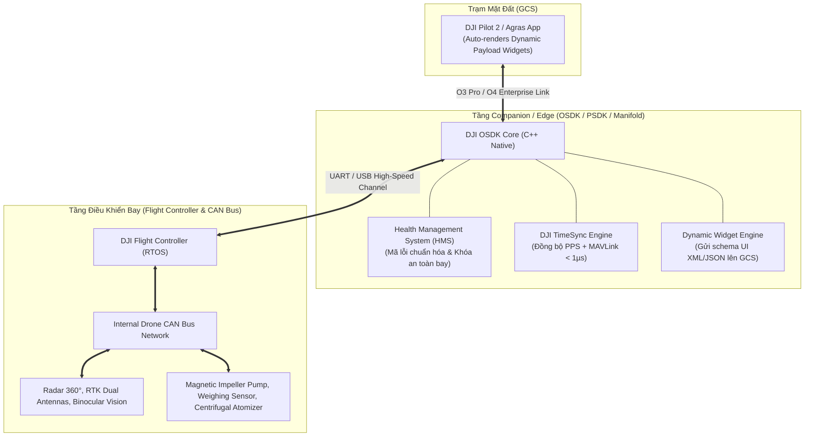
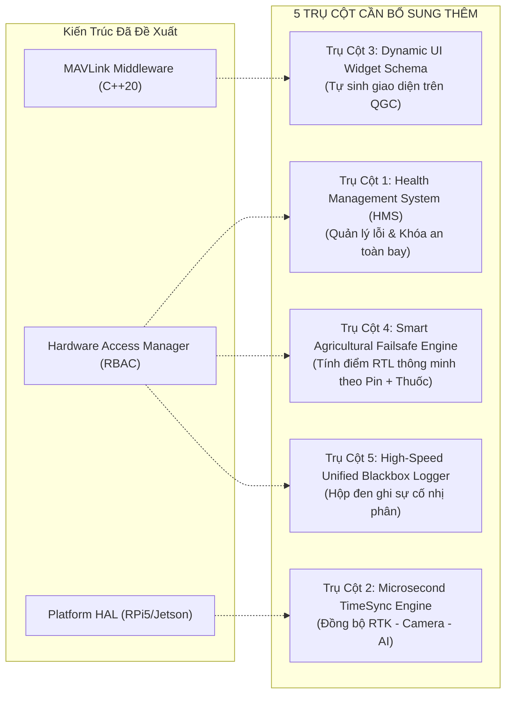

# So Sánh Kiến Trúc THACO Drone Với Hệ Sinh Thái DJI & Đánh Giá Các Thành Phần Còn Thiếu

> **Tài liệu tham chiếu:** Phân tích đối sánh kiến trúc Companion Computer của THACO Drone với kiến trúc công nghiệp của **DJI (DJI Onboard SDK - OSDK, Payload SDK - PSDK, DJI Agras T40/T50)**.  
> **Ngôn ngữ mục tiêu:** Thuần **Modern C++ (C++20)**.  
> **Nguyên tắc:** Không sửa code; tập trung nghiên cứu kiến trúc, chỉ ra khoảng cách công nghệ (Gap Analysis) và đề xuất các bổ sung kỹ thuật thiết yếu.

---

## 1. DJI Thiết Kế Hệ Thống Như Thế Nào? (How DJI Architects Its Drones)

Hệ sinh thái DJI (đặc biệt là dòng công nghiệp **Matrice 300/350 RTK** và dòng nông nghiệp **Agras T30/T40/T50**) là tiêu chuẩn vàng của ngành drone toàn cầu. Kiến trúc phần mềm điều khiển của DJI được chia thành 3 lớp cốt lõi:



### Các công nghệ hạt nhân của DJI:
1. **DJI OSDK (Onboard SDK):**
   - Tầng Platform Abstraction Layer (`dji_platform.hpp`): Trừu tượng hóa hoàn toàn hệ điều hành (Linux, FreeRTOS, STM32, Windows) thông qua Interface C++ thuần.
   - Cơ chế bảo mật: Bắt buộc kích hoạt qua App ID, App Key, mã hóa phiên (AES-256) và kiểm tra quyền của từng loại lệnh.
2. **DJI PSDK (Payload SDK & E-Port):**
   - Cơ chế **Dynamic UI Widgets**: Khi một tải ngoài (Gimbal, Loa, Radar, Cảm biến lưu lượng) cắm vào cổng E-Port, payload tự gửi một tệp mô tả giao diện (XML/JSON schema). Ứng dụng DJI Pilot trên tay cầm tự động sinh ra các thanh trượt (sliders), nút bấm (buttons), danh sách lựa chọn (dropdowns) mà **lập trình viên không cần sửa hay build lại ứng dụng GCS**.
3. **DJI HMS (Health Management System):**
   - Mọi trục trặc phần cứng đều sinh ra một **Mã Lỗi Số Học Duy Nhất (Hex Error Code)**, ví dụ `0x1A020034` (Radar bám bụi, Motor 3 quá nhiệt, Tốc độ UART suy giảm). Hệ thống tự phân loại mức độ (Notice $\rightarrow$ Warning $\rightarrow$ Serious $\rightarrow$ Fatal) và tự động kích hoạt Failsafe (khóa Arming, bay về Home, hoặc hạ cánh khẩn cấp).
4. **DJI TimeSync:**
   - Sử dụng xung phần cứng PPS (Pulse Per Second) kết hợp thuật toán căn chỉnh thời gian phần mềm để đạt độ chính xác thời gian $< 1\mu\text{s}$ giữa Camera Shutter, RTK GNSS và IMU.

---

## 2. Bảng Đối Chiếu: THACO Drone vs. DJI

| Tiêu chí kiến trúc | Hệ sinh thái DJI (OSDK / PSDK / Agras) | THACO Drone Hiện Tại | THACO Drone Kiến Trúc Đề Xuất (3-Tier HAL + Middleware) |
| :--- | :--- | :--- | :--- |
| **Ngôn ngữ lõi** | 100% C++ (C++11/C++14/C++17) | Hỗn hợp: C++, Python (Vision/Net), Bash scripts | **Thuần 100% Modern C++ (C++20)** cho mọi daemons |
| **Tầng Platform HAL** | `DJI_Platform` C++ (Abstract OS, POSIX, RTOS, Serial, Thread, Time) | Chưa có (gọi trực tiếp POSIX `ioctl`, `open`) | `IPlatformHAL` Abstract Factory (RPi5, Jetson, Generic Linux) $\rightarrow$ **Tương đồng 100% với DJI** |
| **Phân quyền & Bảo mật** | App ID, App Key, Activation Handshake, Session tokens | Không kiểm tra quyền (nhận bừa mọi ID gửi đến) | **Role-Based Access Control (RBAC Policy qua JSON)** $\rightarrow$ **Chuẩn hóa công nghiệp** |
| **Nhận diện thiết bị** | PSDK Auto-Negotiation qua E-Port (SkyPort) | Hardcode chuỗi tên tĩnh (`fc_`, `siyi_`) | **Dynamic Discovery qua MAVLink Component ID & Device Type** |
| **Quản lý sức khỏe (HMS)**| Hệ thống HMS tập trung với mã lỗi số học chuẩn hóa | Các chuỗi text tự do qua `STATUSTEXT` | ⚠️ **Đang thiếu — Cần bổ sung!** |
| **Đồng bộ thời gian** | Phần cứng PPS + Phần mềm Timesync ($< 1\mu\text{s}$) | Đồng hồ hệ thống độc lập, không đồng bộ | ⚠️ **Đang thiếu — Cần bổ sung!** |
| **Giao diện GCS động** | Payload gửi schema UI $\rightarrow$ GCS tự render | QML gắn cứng các bảng hiển thị | ⚠️ **Đang thiếu — Cần bổ sung!** |
| **Độ tin cậy giao dịch** | Transactional apply có xác nhận phần cứng | Fire-and-forget (ghi file rồi ACK ngay) | **2-Phase Transaction (Validate $\rightarrow$ Apply $\rightarrow$ Verify $\rightarrow$ Rollback)** |

---

## 3. Khoảng Cách Công Nghệ: Những Điểm Còn Thiếu Cần Bổ Sung (Gap Analysis)

So chiếu với tiêu chuẩn của DJI, kiến trúc của THACO Drone hiện tại còn thiếu **5 trụ cột công nghệ thiết yếu**. Để trở thành một hệ thống drone nông nghiệp đẳng cấp công nghiệp, chúng ta cần bổ sung các trụ cột này:



---

### TRỤ CỘT 1: HỆ THỐNG QUẢN LÝ SỨC KHỎE THIẾT BỊ (HMS - HEALTH MANAGEMENT SYSTEM)

#### Vấn đề hiện tại:
`cc-agent` chỉ gửi các đoạn văn bản thô qua MAVLink `STATUSTEXT` (ví dụ: `"FC: ONLINE"`, `"SIYI: OFFLINE"`). 
Trạm mặt đất GCS không thể tự động parse chuỗi chữ để:
- Phát âm thanh cảnh báo chính xác (tiếng Việt).
- Tự động khóa lệnh cất cánh (Arming Check) nếu Radar bị lỗi hoặc nhiệt độ SoC quá cao.
- Hiển thị hướng dẫn xử lý từng bước cho nông dân ngoài ruộng.

#### Thiết kế bổ sung (Giống DJI HMS):
Định nghĩa bảng mã lỗi chuẩn 32-bit `uint32_t error_code`:
```cpp
// include/core/hms_types.hpp
enum class HmsSeverity : uint8_t {
    NOTICE   = 1, // Thông tin trạng thái
    WARNING  = 2, // Cảnh báo (vẫn cho bay nhưng có nguy cơ)
    SERIOUS  = 3, // Lỗi nghiêm trọng (cấm cất cánh, nếu đang bay thì cảnh báo RTL)
    FATAL    = 4  // Lỗi khẩn cấp (buộc hạ cánh ngay lập tức)
};

struct HmsEvent {
    uint32_t    error_code;  // vd: 0x01010001 (UART4 Mismatch), 0x02010005 (Cam Pipeline Dead)
    HmsSeverity severity;
    uint8_t     subsystem_id;// 1=Telemetry, 2=Camera, 3=Vision, 4=Network, 5=Radar, 6=Spray
    uint32_t    timestamp_ms;
    char        extra_info[16];
};
```
- Khi `RPi5SerialUartDriver` phát hiện mất tín hiệu cổng `/dev/ttyAMA0`: Nó không gửi chuỗi text mà kích hoạt `HmsEvent` với mã `ERR_SIYI_NO_CARRIER`.
- QGroundControl nhận mã hex này $\rightarrow$ Tra từ điển thông báo hiển thị tiếng Việt: *"Mất kết nối Camera SIYI - Kiểm tra lại giắc cắm Pin 8/10 trên Pi 5"*.

---

### TRỤ CỘT 2: ĐỒNG BỘ THỜI GIAN VI GIÂY (MICROSECOND TIMESYNC ENGINE)

#### Vấn đề hiện tại:
- Cube Orange+ (PX4) có đồng hồ GPS Time riêng (nhận từ vệ tinh RTK).
- Raspberry Pi 5 có đồng hồ Linux System Clock (`CLOCK_REALTIME` hoặc `CLOCK_MONOTONIC`) riêng.
- Khi AI Vision phát hiện sâu bệnh hoặc chướng ngại vật ở frame $T_1$, tọa độ GPS được ghi nhận ở thời điểm $T_2$. Vì không đồng bộ, khoảng chênh lệch $\Delta T = |T_1 - T_2| \approx 50 - 200\text{ms}$. Với drone bay vận tốc $7\text{m/s}$, **sai số vị trí thực tế lên tới $0.35\text{m} - 1.4\text{m}$**, làm mất giá trị của bản đồ phun định vị chính xác cao (Precision Spraying Map).

#### Thiết kế bổ sung (Giống DJI TimeSync):
Triển khai giao thức **MAVLink Timesync Protocol (Message ID: 111 `TIMESYNC`)** kết hợp xung phần cứng:
```cpp
// include/core/timesync_engine.hpp
class TimeSyncEngine {
public:
    void on_timesync_message(const mavlink_timesync_t& ts);
    uint64_t companion_to_autopilot_time_us(uint64_t companion_time_us) const;
    uint64_t get_synchronized_epoch_us() const;
    bool is_synchronized() const;
private:
    int64_t clock_offset_us_ = 0;
    int64_t round_trip_latency_us_ = 0;
};
```
Mỗi frame hình ảnh và mỗi kết quả suy luận AI YOLO đều được đóng dấu thời gian (timestamp) đã được đồng bộ với RTK GPS của Flight Controller với độ sai lệch $< 1\text{ms}$.

---

### TRỤ CỘT 3: GIAO DIỆN ĐỘNG TRÊN TRẠM MẶT ĐẤT (DYNAMIC PAYLOAD UI WIDGETS)

#### Vấn đề hiện tại:
Mỗi khi thêm một cảm biến mới (ví dụ: cảm biến đo lưu lượng phun `FlowMeter`, hoặc radar đo cao bám đồi dốc), đội phát triển phải:
1. Sửa file `thaco.xml`.
2. Sửa mã C++ trong `cc-agent`.
3. Mở mã nguồn `THACOGroundControl` sửa file QML, vẽ thêm nút bấm, tạo controller C++ trong Qt rồi build lại file cài đặt `.exe` cho máy tính.

#### Thiết kế bổ sung (Giống DJI PSDK Widget Schema):
Tầng Middleware của `cc-agent` cung cấp một `WidgetSchemaProvider`:
- Khi kết nối với QGC, `cc-agent` gửi thông điệp cấu hình UI dạng JSON schema:
```json
{
  "widgets": [
    {
      "id": "spray_rate",
      "type": "SLIDER",
      "label": "Lưu Lượng Phun (L/phút)",
      "min": 0.5,
      "max": 8.0,
      "step": 0.1,
      "param_name": "AGRI_PUMP_RATE"
    },
    {
      "id": "nozzle_mode",
      "type": "DROPDOWN",
      "label": "Kích Thước Hạt Sương",
      "options": ["Mịn (100µm)", "Trung Bình (250µm)", "Hạt Thô (400µm)"],
      "param_name": "AGRI_ATOM_SIZE"
    }
  ]
}
```
Trạm mặt đất `THACOGroundControl` sử dụng `Instantiator` hoặc `Repeater` trong QML để **tự động vẽ các widget điều khiển này lên màn hình**. Khi nâng cấp hoặc thay đổi cảm biến trên máy bay, **không bao giờ cần phải biên dịch lại QGroundControl**.

---

### TRỤ CỘT 4: THUẬT TOÁN QUẢN LÝ AN TOÀN BAY NÔNG NGHIỆP THÔNG MINH (SMART AGRI-FAILSAFE)

#### Vấn đề hiện tại:
PX4 trên Flight Controller chỉ biết mức pin hiện tại. Nó không biết trong bình thuốc còn bao nhiêu lít.
Khi bay phun diện tích lớn (hàng chục hecta):
- Nếu hết thuốc giữa chừng: Máy bay vẫn bay tiếp không tải, gây tốn pin vô ích.
- Nếu pin yếu nhưng thuốc vẫn còn: Máy bay có thể không đủ pin để cõng 30kg thuốc bay về Home point.

#### Thiết kế bổ sung (Giống DJI Smart RTH):
Tích hợp `SmartAgriFailsafeManager` vào `cc-agent`:
- Đọc đồng thời:
  1. Trọng lượng thuốc còn lại trong bình (từ cảm biến cân tải / lưu lượng).
  2. Dung lượng pin thực tế và điện áp từng cell.
  3. Khoảng cách địa lý từ vị trí hiện tại về điểm cất cánh (Home Point) ngược chiều gió.
- Tính toán điểm **Optimal Breakpoint**:
  - Tự động lưu tọa độ điểm đang phun dở khi hết thuốc.
  - Tự động ra lệnh Flight Controller chuyển chế độ bay về trạm tiếp thuốc (Return To Launch) trước khi pin tụt xuống ngưỡng nguy hiểm.
  - Khi cất cánh lại: Drone tự động bay thẳng tới đúng tọa độ điểm dở dang để tiếp tục phun, không bị phun đè lên hàng lúa cũ.

---

### TRỤ CỘT 5: HỘP ĐEN GHI DỮ LIỆU ĐỒNG BỘ HIỆU NĂNG CAO (UNIFIED BLACKBOX RECORDER)

#### Vấn đề hiện tại:
Log đang bị phân mảnh ở nhiều nơi:
- Log bay của FC nằm trên thẻ nhớ microSD của Cube Orange (`.ulg`).
- Log hệ thống của Companion Computer nằm rải rác trong `journalctl`, log docker và log router.
Khi drone gặp sự cố rơi ngoài ruộng, việc ghép nối mốc thời gian giữa log của FC và log của Pi cực kỳ mất thời gian và dễ sai lệch.

#### Thiết kế bổ sung:
Xây dựng module `UnifiedBlackboxRecorder` thuần C++20 trên `cc-agent`:
- Ghi nhật ký dạng nhị phân tuần tự (Binary Circular Ring-Buffer) tốc độ cao ($< 0.1\%$ CPU).
- Ghi đồng thời vào một file nén nhị phân `.tlog` duy nhất:
  - Tất cả các gói MAVLink nhận/gửi.
  - Tình trạng tải CPU, nhiệt độ SoC từng giây.
  - Mã lỗi HMS và phản hồi của các Driver phần cứng.
  - Trạng thái kết nối của từng cổng UART.

---

## 4. Tổng Kết & Khuyến Nghị Kiến Trúc Từ Góc Nhìn Chuyên Gia

### Đánh giá sự tương đồng với DJI:
Mô hình **3 tầng (Platform HAL Driver $\rightarrow$ Hardware Access Manager $\rightarrow$ MAVLink Middleware)** mà chúng ta đã thống nhất hoàn toàn **tương đồng về mặt triết lý với DJI OSDK & PSDK**:
- Tách rời phần cứng (Platform Abstraction) $\rightarrow$ Giống `DJI_Platform`.
- Tách rời các chức năng thành module $\rightarrow$ Giống PSDK Function Modules.
- Kiểm soát quyền chặt chẽ $\rightarrow$ Giống DJI Activation & Authority Management.

### Lời khuyên của Senior Architect:
Để đưa THACO Drone lên vị thế cạnh tranh sòng phẳng với các dòng drone công nghiệp/nông nghiệp hàng đầu:
1. **Giữ vững nguyên tắc cốt lõi đã thiết lập:** Thuần C++20, kiến trúc 3 tầng SOLID, loại bỏ hardcode cổng/ID.
2. **Bổ sung ngay 2 tính năng thiết yếu đầu tiên:**
   - **Hệ thống Quản lý Sức khỏe HMS (Mã lỗi số học):** Để chuyển trạng thái cảnh báo từ text thô sang mã số có cấu trúc.
   - **Tầng Timesync đồng bộ thời gian:** Để đảm bảo dữ liệu camera/AI và GPS của FC ăn khớp đến từng mili-giây.
3. **Các tính năng Dynamic UI và Smart Agri-Failsafe** sẽ được phát triển ở giai đoạn tiếp theo (Phase 2 & 3) trên nền tảng vững chắc của tầng Driver và Middleware đã được thiết kế.
