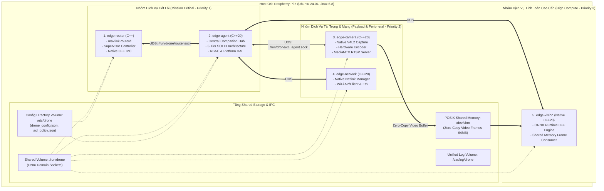

# Kiến Trúc Docker Chuẩn Hóa & Tổng Hợp Toàn Bộ Yêu Cầu Dự Án THACO Drone

> **Dự án:** THACO Drone — Hệ sinh thái Máy bay Không người lái Thông minh  
> **Ngôn ngữ mục tiêu:** Thuần **Modern C++ (C++20)**  
> **Phần cứng mục tiêu:** Raspberry Pi 5 (hiện tại) $\rightarrow$ NVIDIA Jetson Orin Nano (tương lai)  
> **Tài liệu đặc tả:** Kiến trúc Container hóa Docker & Bảng Tổng Hợp Yêu Cầu Hệ Thống (Master Requirements)

---

## MỤC LỤC
1. [Thiết Kế Kiến Trúc Docker Chuẩn Hóa Cho Companion Computer](#1-thiết-kế-kiến-trúc-docker-chuẩn-hóa-cho-companion-computer)
   - 1.1. [Các nhược điểm nghiêm trọng của Docker Compose hiện tại](#11-các-nhược-điểm-nghiêm-trọng-của-docker-compose-hiện-tại)
   - 1.2. [Mô hình phân chia Container theo Domain-Driven Design (DDD)](#12-mô-hình-phân-chia-container-theo-domain-driven-design-ddd)
   - 1.3. [Cơ chế Giao tiếp Liên Tiến trình (IPC) & Zero-Copy Shared Memory](#13-cơ-chế-giao-tiếp-liên-tiến-trình-ipc--zero-copy-shared-memory)
   - 1.4. [Phân bổ Tài nguyên, Giới hạn Cgroups & Mức độ Ưu tiên (Resource Quotas)](#14-phân-bổ-tài-nguyên-giới-hạn-cgroups--mức-độ-ưu-tiên-resource-quotas)
   - 1.5. [Bảo mật & Quyền Hạn Tối Thiểu (Principle of Least Privilege)](#15-bảo-mật--quyền-hạn-tối-thiểu-principle-of-least-privilege)
   - 1.6. [Bản Đặc tả `docker-compose.yml` Chuẩn Hóa Sản Xuất](#16-bản-đặc-tả-docker-composeyml-chuẩn-hóa-sản-xuất)
2. [Bảng Tổng Hợp Toàn Bộ Yêu Cầu Dự Án (Master Requirements Specification)](#2-bảng-tổng-hợp-toàn-bộ-yêu-cầu-dự-án-master-requirements-specification)
   - 2.1. [Yêu cầu Nghiệp vụ & Miền ứng dụng Nông nghiệp (Business & Domain Requirements)](#21-yêu-cầu-nghiệp-vụ--miền-ứng-dụng-nông-nghiệp-business--domain-requirements)
   - 2.2. [Yêu cầu Phần cứng & Hạ tầng Điện tử (Hardware & Embedded Platform Requirements)](#22-yêu-cầu-phần-cứng--hạ-tầng-điện-tử-hardware--embedded-platform-requirements)
   - 2.3. [Yêu cầu Phần mềm & Công nghệ Thuần C++ (Software & Pure C++20 Requirements)](#23-yêu-cầu-phần-mềm--công-nghệ-thuần-c-software--pure-c20-requirements)
   - 2.4. [Yêu cầu Kiến trúc Hệ thống & SOLID (Architecture & Design Requirements)](#24-yêu-cầu-kiến-trúc-hệ-thống--solid-architecture--design-requirements)
   - 2.5. [Yêu cầu An toàn Bay, Độ Tin cậy & Tiêu chuẩn Công nghiệp (Safety, Reliability & Industry Standards)](#25-yêu-cầu-an-toàn-bay-độ-tin-cậy--tiêu-chuẩn-công-nghiệp-safety-reliability--industry-standards)

---

## 1. Thiết Kế Kiến Trúc Docker Chuẩn Hóa Cho Companion Computer

### 1.1. Các nhược điểm nghiêm trọng của Docker Compose hiện tại

Khi kiểm tra cấu trúc Docker hiện tại trên Raspberry Pi 5 (`drone.local`), chúng tôi phát hiện nhiều rủi ro nghiêm trọng:
1. **Lạm dụng `privileged: true` và `network_mode: host` cho tất cả container:** Phá vỡ hoàn toàn cơ chế cô lập an toàn của Docker. Bất kỳ lỗi tràn bộ đệm nào của container phụ (như camera hay vision) đều có thể can thiệp thẳng vào hệ thống mạng của FC.
2. **Mount file `.env` trực tiếp qua nhiều container:** Khi cập nhật file bằng công cụ như `scp` hoặc `rsync`, inode của file bị thay đổi dẫn đến đứt gãy hardlink (lỗi `could not save config to storages` đã từng gặp).
3. **Kích thước Image khổng lồ vì Python/PyTorch:** Image `drone-vision` phình to tới **2.47 GB**; tổng dung lượng Docker trên thẻ nhớ Pi chiếm hơn **10 GB**, làm chậm thời gian boot và dễ gây hỏng phân vùng thẻ nhớ khi mất nguồn đột ngột.
4. **Không có giới hạn tài nguyên (Resource Limits):** Container `drone-vision` có thể nuốt trọn 100% CPU và RAM khi xử lý frame phức tạp, khiến container `cc-agent` hoặc router bị thiếu RAM và sập nguồn (OOM Killer).
5. **Cơ chế khởi động và phụ thuộc lỏng lẻo:** `depends_on` không kèm `condition: service_healthy`, khiến các service khởi động tranh chấp cổng mạng (như lỗi socket in-use port 14541).

---

### 1.2. Mô hình phân chia Container theo Domain-Driven Design (DDD)

Kiến trúc Docker chuẩn hóa chia hệ thống Companion Computer thành **5 container chuyên trách (Micro-daemons)** thuần C++20:



---

### 1.3. Cơ chế Giao tiếp Liên Tiến trình (IPC) & Zero-Copy Shared Memory

1. **Giao tiếp Lệnh & Thống kê (Control & Telemetry IPC):**
   - Sử dụng **UNIX Domain Socket (UDS)** ánh xạ qua volume `/run/drone`.
   - Giao thức trao đổi: Nhị phân hoặc NDJSON siêu nhẹ. Tốc độ giao tiếp UDS trong RAM đạt $> 500.000\text{ msg/s}$ với độ trễ $< 0.05\text{ms}$.
2. **Giao tiếp Luồng Video Không-Sao-Chép (Zero-Copy Video Stream IPC):**
   - Vấn đề cũ: Container Camera stream video qua mạng socket UDP tới container Vision $\rightarrow$ Tốn 2 lần copy dữ liệu bộ nhớ (Kernel $\leftrightarrow$ User space), ngốn 15-20% CPU chỉ để truyền frame.
   - Giải pháp chuẩn hóa: Cấu hình `shm_size: 64m` chia sẻ thư mục `/dev/shm`. Container Camera ghi frame trực tiếp vào vòng đệm RAM chung; Container Vision chỉ cần đọc con trỏ bộ nhớ (Zero-Copy). Độ trễ giảm về $0\text{ms}$, tiết kiệm 100% băng thông mạng nội bộ.

---

### 1.4. Phân bổ Tài nguyên, Giới hạn Cgroups & Mức độ Ưu tiên (Resource Quotas)

Để đảm bảo máy bay an toàn tuyệt đối khi bay, tài nguyên CPU và RAM phải được phân bổ theo thang bậc ưu tiên (Priority Levels):

| Tên Container | Mức ưu tiên | Hạn ngạch CPU (`cpus`) | Hạn ngạch RAM (`mem_limit`) | Chính sách khởi động lại | Hành vi khi quá tải (OOM) |
| :--- | :---: | :---: | :---: | :---: | :--- |
| **`edge-router`** | 🔴 Cực Cao | 0.5 core | 32 MB | `restart: always` | Tuyệt đối không được phép chết (OOM score -1000). |
| **`edge-agent`** | 🔴 Cực Cao | 0.5 core | 48 MB | `restart: always` | Bộ não trung tâm, không được phép chết. |
| **`edge-network`** | 🟡 Cao | 0.3 core | 32 MB | `restart: always` | Đảm bảo duy trì kết nối WiFi/Ethernet. |
| **`edge-camera`** | 🟡 Cao | 1.0 core | 96 MB | `restart: unless-stopped` | Giới hạn buffer để không phình bộ nhớ. |
| **`edge-vision`** | 🟢 Trung bình | 1.5 core | 128 MB | `restart: unless-stopped` | Chấp nhận bị kernel kill trước nếu thiếu RAM, không làm ảnh hưởng bay. |
| **TỔNG CỘNG** | — | **3.8 / 4.0 cores** | **< 350 MB / 4096 MB** | — | **Hệ thống luôn dư thừa > 3.5 GB RAM cho Linux Kernel & Cache.** |

---

### 1.5. Bảo mật & Quyền Hạn Tối Thiểu (Principle of Least Privilege)

Loại bỏ hoàn toàn cờ `privileged: true`. Chỉ cấp quyền cụ thể theo nhu cầu:
- **`edge-router` & `edge-agent`:**
  - `devices:` Chỉ ánh xạ các cổng serial cần thiết: `/dev/ttyAMA0`, `/dev/ttyAMA4`, `/dev/ttyACM*`.
  - `cap_add: [SYS_RAWIO]` để truy cập thanh ghi UART nếu cần.
- **`edge-camera`:**
  - `devices:` Chỉ ánh xạ `/dev/video*`, `/dev/media*`, `/dev/dma_heap`.
- **`edge-network`:**
  - `network_mode: host` (Bắt buộc cho network manager).
  - `cap_add: [NET_ADMIN, NET_RAW]`.
- **`edge-vision`:**
  - Hoàn toàn chạy chế độ non-privileged, không truy cập thiết bị phần cứng trực tiếp, chỉ đọc `/dev/shm`.

---

### 1.6. Bản Đặc tả `docker-compose.yml` Chuẩn Hóa Sản Xuất

```yaml
version: '3.8'

networks:
  drone-internal:
    driver: bridge
    ipam:
      config:
        - subnet: 172.28.0.0/16

volumes:
  drone-ipc:
    driver: local
    driver_opts:
      type: tmpfs
      device: tmpfs
      o: size=16m,mode=1777
  drone-config:
    driver: local
  drone-logs:
    driver: local

services:
  # 1. Core MAVLink Multiplexer & Router
  edge-router:
    image: thaco/edge-router:latest
    container_name: edge-router
    restart: always
    network_mode: host
    cpus: 0.5
    mem_limit: 32m
    devices:
      - /dev/ttyAMA0:/dev/ttyAMA0
      - /dev/ttyAMA4:/dev/ttyAMA4
    volumes:
      - drone-ipc:/run/drone
      - drone-config:/etc/drone:ro
      - drone-logs:/var/log/drone
    healthcheck:
      test: ["CMD", "/usr/local/bin/router-healthcheck"]
      interval: 10s
      timeout: 3s
      retries: 3

  # 2. Central Companion Hub (3-Tier SOLID Agent C++20)
  edge-agent:
    image: thaco/edge-agent:latest
    container_name: edge-agent
    restart: always
    network_mode: host
    cpus: 0.5
    mem_limit: 48m
    depends_on:
      edge-router:
        condition: service_healthy
    devices:
      - /dev/ttyAMA0:/dev/ttyAMA0
      - /dev/ttyAMA4:/dev/ttyAMA4
    volumes:
      - drone-ipc:/run/drone
      - drone-config:/etc/drone
      - drone-logs:/var/log/drone
      - /sys:/sys:ro
      - /proc:/proc:ro
    environment:
      - PLATFORM_TARGET=rpi5
      - DRONE_CONFIG_FILE=/etc/drone/drone_config.json
      - ACL_POLICY_FILE=/etc/drone/acl_policy.json
    healthcheck:
      test: ["CMD", "pgrep", "drone-companion-agent"]
      interval: 10s
      timeout: 3s
      retries: 3

  # 3. Native C++ V4L2 & RTSP Camera Controller
  edge-camera:
    image: thaco/edge-camera:latest
    container_name: edge-camera
    restart: unless-stopped
    network_mode: host
    cpus: 1.0
    mem_limit: 96m
    ipc: shareable
    devices:
      - /dev/video0:/dev/video0
      - /dev/dma_heap:/dev/dma_heap
    volumes:
      - drone-ipc:/run/drone
      - drone-config:/etc/drone:ro
      - /dev/shm:/dev/shm
    healthcheck:
      test: ["CMD", "pgrep", "camera-controller"]
      interval: 15s
      timeout: 5s
      retries: 3

  # 4. Native C++ Vision Engine (ONNX Runtime Zero-Copy)
  edge-vision:
    image: thaco/edge-vision:latest
    container_name: edge-vision
    restart: unless-stopped
    cpus: 1.5
    mem_limit: 128m
    depends_on:
      edge-camera:
        condition: service_healthy
    volumes:
      - drone-ipc:/run/drone
      - drone-config:/etc/drone:ro
      - /dev/shm:/dev/shm:ro
    environment:
      - INFERENCE_BACKEND=cpu_neon # hoặc npu / tensorrt

  # 5. Native C++ Netlink Network Manager
  edge-network:
    image: thaco/edge-network:latest
    container_name: edge-network
    restart: always
    network_mode: host
    cap_add:
      - NET_ADMIN
      - NET_RAW
    volumes:
      - drone-ipc:/run/drone
      - drone-config:/etc/drone
```

---

## 2. Bảng Tổng Hợp Toàn Bộ Yêu Cầu Dự Án (Master Requirements Specification)

Dưới đây là bản tổng hợp đầy đủ và chi tiết toàn bộ các yêu cầu của dự án THACO Drone, phân loại thành 5 chiều kích chuẩn:

### 2.1. Yêu Cầu Nghiệp Vụ & Miền Ứng Dụng Nông Nghiệp (Business & Domain)

| Mã yêu cầu | Tên yêu cầu | Mô tả chi tiết nghiệp vụ |
| :---: | :--- | :--- |
| **REQ-DOM-01** | Phun thuốc & Rải hạt tự động (Precision Spraying & Spreading) | Điều khiển lưu lượng bơm màng và đĩa quay ly tâm tương thích với tốc độ bay thực tế của máy bay; đảm bảo mật độ hạt thuốc đồng đều (lít/ha) bất kể gió hay tốc độ bay thay đổi. |
| **REQ-DOM-02** | Bám địa hình đồi dốc (Terrain Following) | Giao tiếp thời gian thực với Radar đo cao bám địa hình để duy trì khoảng cách phun ổn định (cách mặt tán cây 1.5m - 3.0m) trên địa hình ruộng bậc thang, vườn đồi dốc. |
| **REQ-DOM-03** | Tránh vật cản đa hướng 360° (Obstacle Avoidance) | Nhận dữ liệu từ Radar quét trước/sau và cảm biến quang học; tự động dừng khẩn cấp hoặc bay vòng tránh dây điện, ngọn cây, người đi bộ trong bán kính an toàn ($> 3\text{m}$). |
| **REQ-DOM-04** | Điểm dừng thông minh (Smart Breakpoint & Resume) | Tự động ghi nhớ tọa độ chính xác khi hết thuốc hoặc pin yếu; tự động bay về trạm tiếp thuốc và sau đó bay thẳng lại đúng điểm dở dang để phun tiếp, không phun trùng lặp. |
| **REQ-DOM-05** | Nhận diện sâu bệnh & Cây trồng qua AI (AI Crop Health Monitoring) | Sử dụng camera góc nhìn thẳng hoặc nghiêng kết hợp model AI YOLO suy luận thời gian thực để khoanh vùng diện tích bị sâu bệnh hại, đánh dấu tọa độ địa lý phục vụ phun điểm (Spot Spraying). |

---

### 2.2. Yêu Cầu Phần Cứng & Hạ Tầng Điện Tử (Hardware & Embedded Platform)

| Mã yêu cầu | Tên yêu cầu | Đặc tả kỹ thuật phần cứng |
| :---: | :--- | :--- |
| **REQ-HW-01** | Bộ điều khiển bay (Flight Controller) | **Cube Orange Plus** (vi xử lý STM32H753, 3 cụm IMU dự phòng chống rung, 2 cảm biến áp suất khí quyển), chạy firmware **PX4 Autopilot**. |
| **REQ-HW-02** | Máy tính đồng hành (Companion Computer) | Giai đoạn 1: **Raspberry Pi 5** (Broadcom BCM2712 Quad-Core Cortex-A76 @ 2.4GHz, chip nam RP1 I/O, 4GB/8GB LPDDR4X).<br>Giai đoạn 2: **NVIDIA Jetson Orin Nano** (Ampere GPU 1024 cores, NVDLA AI accelerator). |
| **REQ-HW-03** | Hệ thống truyền thông tầm xa (Air Link) | **SIYI Telemetry / Air Unit** (cổng UART @ 115200/57600 bps và cổng Ethernet/RTSP cho video stream). |
| **REQ-HW-04** | Định vị chính xác cao (RTK GNSS) | Bộ đôi ăng-ten RTK Heading & Position (độ chính xác định vị tới $\pm 1\text{cm} + 1\text{ppm}$). |
| **REQ-HW-05** | Cảm biến tải nông nghiệp | Cảm biến lưu lượng (Flow Meter), Cảm biến cân tải trọng lượng bình thuốc (Load Cell / Continuous Weighing Sensor). |

---

### 2.3. Yêu Cầu Phần Mềm & Công Nghệ Thuần C++ (Software & Pure C++20)

| Mã yêu cầu | Tên yêu cầu | Tiêu chuẩn kỹ thuật phần mềm |
| :---: | :--- | :--- |
| **REQ-SW-01** | Chuẩn hóa 100% Modern C++ (C++20) | Toàn bộ mã nguồn chạy trên Companion Computer (`cc-agent`, `router-controller`, `camera-streamer`, `vision-engine`, `network-engine`) phải được viết bằng **C++20**. Tuyệt đối loại bỏ runtime Python và script Bash. |
| **REQ-SW-02** | Chuẩn hóa Giao thức MAVLink 2.0 | Giao thức MAVLink 2 với Single Source of Truth là file XML `Drone_MAVLink/message_definitions/v1.0/thaco.xml`. Mã nguồn C++ header sinh tự động và đồng bộ qua script trung tâm. |
| **REQ-SW-03** | Trạm mặt đất THACOGroundControl | Ứng dụng GCS dựa trên QGroundControl viết bằng **C++17, Qt 5/6, QML**. Hỗ trợ hiển thị bản đồ bay tiếng Việt, bảng điều khiển phun, đồ thị telemetry thời gian thực và quản lý nhiệm vụ bay tự động. |
| **REQ-SW-04** | AI Inference Engine Thuần C++ | Sử dụng **ONNX Runtime C++ API** (tối ưu hóa NEON cho ARM64 / TensorRT cho Jetson). Nạp mô hình nhị phân `.onnx`. Đọc frame từ Shared Memory `/dev/shm` với độ trễ suy luận $< 30\text{ms}$/frame. |
| **REQ-SW-05** | Quản lý Mạng Netlink Thuần C++ | Daemon C++ tương tác trực tiếp với Linux Kernel qua Netlink (`rtnetlink`, `genetlink`) và D-Bus của `wpa_supplicant`, không dùng lệnh fork shell `system()`. |

---

### 2.4. Yêu Cầu Kiến Trúc Hệ Thống & SOLID (Architecture & Design)

| Mã yêu cầu | Tên yêu cầu | Nguyên lý thiết kế |
| :---: | :--- | :--- |
| **REQ-ARC-01** | Kiến trúc 3 tầng phân rã chuẩn SOLID | Tầng 1: MAVLink Middleware & Extensions (`IMavlinkExtension`).<br>Tầng 2: Hardware Access Control & Resource Management (`HardwareAccessManager`).<br>Tầng 3: Platform HAL & Device Drivers (Mẫu Abstract Factory `IPlatformHAL`). |
| **REQ-ARC-02** | Nhận diện thiết bị động bằng ID (Zero-Hardcode) | Cấm hardcode tên "FC", "SIYI" trong code. Tự động nhận diện thiết bị qua MAVLink Component ID (`1`=FC, `154`=Gimbal, `68`=Radio, `100`=Camera) và Device Type phát ra từ cổng đó. |
| **REQ-ARC-03** | Kiểm soát quyền MAVLink RBAC | Kiểm tra quyền của sender `(sysid, compid)` qua file chính sách `acl_policy.json`. Chỉ GCS chính mới có quyền cấu hình hạ tầng. |
| **REQ-ARC-04** | Giao dịch cấu hình an toàn 2-Phase | Cấu hình hạ tầng bắt buộc qua 2 pha: `Validate` $\rightarrow$ `Apply & Verify`. Tự động rollback và gửi `MAV_RESULT_FAILED` nếu phần cứng không phản hồi trong 500ms. |
| **REQ-ARC-05** | Luồng Fast-Path cho lệnh nông nghiệp | Các lệnh điều khiển vòi phun, bơm, tilt gimbal đi qua luồng Fast-Path thực thi trực tiếp với độ trễ $< 5\text{ms}$. |
| **REQ-ARC-06** | Hướng sự kiện (Event-Driven epoll) | Vòng lặp chính dùng `epoll_wait`. Loại bỏ hoàn toàn vòng lặp busy-polling `sleep_for(5ms)`. |

---

### 2.5. Yêu Cầu An Toàn Bay, Độ Tin Cậy & Tiêu Chuẩn Công Nghiệp (Safety & Standards)

| Mã yêu cầu | Tên yêu cầu | Tiêu chuẩn an toàn & Chống lỗi |
| :---: | :--- | :--- |
| **REQ-SAF-01** | Hệ thống Quản lý Sức khỏe HMS (Giống DJI HMS) | Mọi lỗi phần cứng đều sinh mã lỗi 32-bit có cấu trúc (`error_code`, `severity`, `subsystem_id`), giúp GCS hiển thị thông báo tiếng Việt chính xác và kích hoạt quy trình an toàn tự động. |
| **REQ-SAF-02** | Đồng bộ thời gian vi giây (TimeSync) | Đồng bộ mốc thời gian giữa RTK GPS của FC và frame hình ảnh/AI của Companion Computer với độ lệch $< 1\text{ms}$ qua giao thức MAVLink `TIMESYNC`. |
| **REQ-SAF-03** | Chống sập tiến trình (Zero-Crash & SIGPIPE Immunity) | Tất cả các socket IPC và mạng bắt buộc dùng cờ `MSG_NOSIGNAL`. Không để lỗi ngắt kết nối đột ngột của một client làm sập toàn bộ `cc-agent`. |
| **REQ-SAF-04** | Kiểm tra lỗi ràng buộc Socket (Strict Bind Verification) | Mọi lời gọi `bind()` và `listen()` socket bắt buộc phải kiểm tra mã lỗi trả về. Báo lỗi và dừng an toàn, không chạy âm thầm khi trùng port. |
| **REQ-SAF-05** | Bảo vệ mất nguồn đột ngột (Atomic Config Persistence) | Cấu hình lưu trữ theo cơ chế Atomic Write (`ghi file tạm` $\rightarrow$ `fsync()` $\rightarrow$ `rename()`), bảo đảm an toàn dữ liệu 100% khi phi công rút pin máy bay đột ngột ngoài đồng. |
| **REQ-SAF-06** | Hộp đen dữ liệu nhị phân thống nhất (Unified Blackbox) | Ghi nhật ký tuần tự tốc độ cao dạng Binary Circular Buffer ($< 0.1\%$ CPU), phục vụ phân tích nguyên nhân sự cố sau chuyến bay. |
