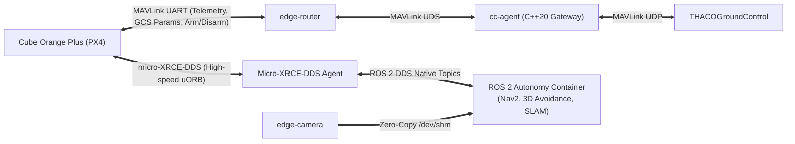
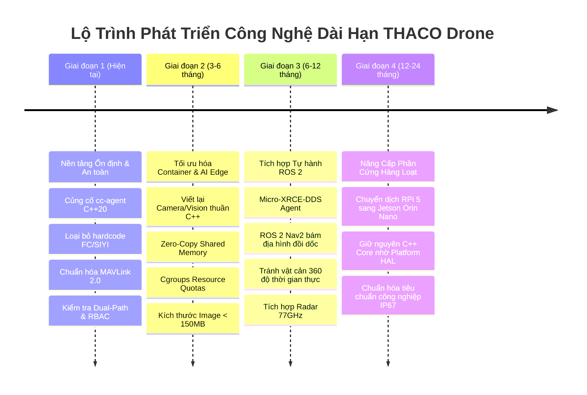

# Đánh Giá Kiến Trúc Container Hiện Tại, Khả Năng Tích Hợp ROS 2 & Lộ Trình Phát Triển Dài Hạn

> **Dự án:** THACO Drone — Hệ sinh thái Máy bay Không người lái Thông minh  
> **Chủ đề:** Đánh giá tối ưu Container Docker, Khả năng mở rộng ROS 2 & Định hướng dài hạn  
> **Tài liệu số:** `09_container_strategy_and_ros2_longterm_roadmap.md`  
> **Nguyên tắc:** Senior System Architect Review — Không sửa code thực thi, quy hoạch chiến lược hệ thống.

---

## 1. Đánh Giá Hiện Trạng Container Hiện Tại

Khi phân tích sâu file `Companion_Computer/docker-compose.yml` và cấu trúc mã nguồn trong thư mục `src/`, hiện trạng hệ thống đang có:
1. `mavlink-router-controller` (C++)
2. `cc-agent` (`ubuntu:24.04`, mount binary `/usr/local/bin/drone-companion-agent`)
3. `drone-networking` (Python + bash + hostapd/dnsmasq)
4. `camera-stream-controller` (Python + mediamtx, có biến `ROS_DOMAIN_ID=0`)
5. `mavros` (ROS 2 Jazzy, cầu nối ROS 2 thuần, profiles: `[mavros, telemetry]`)
6. `drone-vision` (PyTorch, YOLOv8/26, profiles: `[vision]`, có `ROS_DOMAIN_ID=0`)
7. `drone-tailscale` (VPN)

---

### 1.1. Những điểm đã làm tốt (Strengths)
- **Tư duy Module hóa bước đầu:** Đã nhận thức được việc phân tách các chức năng thành các container độc lập (Router, Agent, Cam, Vision, Net).
- **Ứng dụng Docker Profiles:** Các dịch vụ nặng (`mavros`, `drone-vision`, `tailscale`) đã được cấu hình profiles để có thể tắt khi bay thử nghiệm cơ bản, giảm áp lực tài nguyên.
- **Có thư mục IPC chung:** Đã mount `/run/drone` vào hầu hết các container để chia sẻ socket.

---

### 1.2. Những điểm CHƯA TỐI ƯU cho phát triển (Development) & Vận hành sau này (Bottlenecks)

#### 1. Đóng gói Container "Giả lập" (Leaky Container Abstraction)
- `cc-agent` sử dụng image nền `ubuntu:24.04` và mount trực tiếp file thực thi từ host:
  ```yaml
  volumes:
    - /usr/local/bin/drone-companion-agent:/usr/local/bin/drone-companion-agent:ro
  ```
- **Rủi ro:** Đây là một anti-pattern trong Docker. Container này phụ thuộc 100% vào môi trường biên dịch của Host (glibc, libstdc++, shared libraries). Nếu host cập nhật thư viện hoặc build thiếu flag tương thích, container lập tức crash. Nó không thể chuyển giao (deploy) sang bo mạch drone khác mà không bắt buộc biên dịch thủ công trên từng máy.

#### 2. Chồng chéo kiến trúc nghiêm trọng (Architectural Duality / Conflict) — ĐÃ GIẢI QUYẾT
- Trước đây dự án có sự trùng lặp chức năng giữa `cc-agent` (C++20) và một node telemetry riêng chạy trong container `mavros`. Node đó đã bị xóa (THACO_Drone-h7u): `cc-agent` là hiện thực CompID 191 duy nhất, `mavros` chỉ còn là cầu nối ROS 2. Mô tả dưới đây là hiện trạng trước khi xóa:
  - Cả hai đều cố gắng kết nối vào MAVLink router.
  - Cả hai đều thu thập thông tin mạng, CPU, camera, telemetry và gửi đi.
- **Hệ quả:** Gây lãng phí tài nguyên gấp 10 lần. `mavros` chạy ROS 2 Jazzy ngốn **~768 MB RAM**, trong khi `cc-agent` chỉ tốn **~40 MB RAM**. Chạy song song cả hai tạo ra sự tranh chấp socket và lãng phí hơn 50% CPU của Raspberry Pi 5.

#### 3. Phá vỡ tính cô lập an toàn (Security & Isolation Failure)
- Hầu hết 6/7 container đều mang cờ `privileged: true` và `network_mode: host`.
- **Hệ quả:** Một lỗ hổng bảo mật trong web/RTSP server của container Camera hoặc lỗi segmentation fault trong container AI Vision có thể làm sập interface mạng `wlan0` hoặc can thiệp trực tiếp vào cổng serial UART nối với Flight Controller.

#### 4. Dung lượng Image quá lớn gây hao mòn thẻ nhớ (Flash Storage Wear-out)
- `drone-vision` dùng PyTorch nặng **2.47 GB**; `drone-mavros` nặng **1.52 GB**.
- Việc build, pull, và ghi log JSON trực tiếp trên thẻ nhớ MicroSD/eMMC với kích thước lớn trong điều kiện drone rung lắc ngoài ruộng nắng nóng sẽ làm hỏng phân vùng lưu trữ (Bad blocks, Read-only filesystem failure) sau 3–6 tháng bay thực tế.

---

## 2. Kiến Trúc Điều Chỉnh Chuẩn Hóa: Mô Hình 2 Vùng (Two-Tier Edge Architecture)

Để tối ưu cho việc phát triển lâu dài, kiến trúc container cần được phân thành **2 Vùng rõ rệt**:

```mermaid
graph TB
    subgraph Host["Host OS: Raspberry Pi 5 / Jetson Orin (Ubuntu 24.04 Linux 6.8)"]
        subgraph Tier1["VÙNG 1: MISSION-CRITICAL CORE (Cực Nhẹ, C++20, An Toàn Tuyệt Đối)"]
            Router["edge-router\n(mavlink-routerd)\nRAM < 30MB"]
            Agent["edge-agent\n(Central Hub, 3-Tier SOLID)\nRAM < 45MB"]
            Net["edge-network\n(Native Netlink C++)\nRAM < 30MB"]
        end

        subgraph Tier2["VÙNG 2: HIGH-LEVEL AUTONOMY & PAYLOAD (Tính Toán Cao Cấp, Khởi Động Khi Cần)"]
            Cam["edge-camera\n(V4L2, H.264 HW Encode, RTSP)\nRAM < 90MB"]
            Vision["edge-vision\n(C++ ONNX Runtime)\nRAM < 120MB"]
            ROS2["edge-autonomy (ROS 2 Optional)\n(Micro-XRCE-DDS / Nav2 / SLAM)\nRAM: 300 - 600MB"]
        end

        subgraph IPC_Layer["Tầng Giao Tiếp Hiệu Năng Cao (In-Memory IPC)"]
            UDS["/run/drone (tmpfs RAM)\nUNIX Domain Sockets"]
            SHM["/dev/shm (POSIX Shared Memory)\nZero-Copy Video Buffer"]
        end
    end

    Router <==>|UDS Socket| Agent
    Agent <==>|UDS Socket| Net
    Agent <==>|UDS Socket| Cam
    Agent <==>|UDS Socket| Vision
    Agent <==>|UDS Socket / Zenoh| ROS2

    Cam == "Ghi Raw Video Frame (Zero-Copy)" ==> SHM
    SHM ==> "Đọc Frame Trực Tiếp (Pointer)" ==> Vision
    SHM ==> "Đọc Frame Trực Tiếp (Pointer)" ==> ROS2
```

### Nguyên tắc vận hành của mô hình 2 Vùng:
1. **Độc lập sinh tồn:** Vùng 1 (`edge-router`, `edge-agent`, `edge-network`) khởi động trong $< 2$ giây, chiếm tổng cộng $< 100$ MB RAM. Ngay cả khi toàn bộ Vùng 2 sập nguồn, máy bay vẫn duy trì 100% khả năng bay, giữ kết nối với Trạm GCS mặt đất và thực hiện lệnh Failsafe RTH (Return To Home).
2. **Multi-Stage Build chuẩn:** Mọi container C++ đều build bằng Dockerfile 2 giai đoạn:
   - *Stage 1 (Builder):* Cài `g++-13`, `cmake`, `ninja` để biên dịch binary tối ưu (`-O3 -march=native`).
   - *Stage 2 (Runtime):* Sử dụng image siêu mỏng (`ubuntu:24.04-minimal` hoặc `debian:bookworm-slim`), chỉ copy file nhị phân đã strip symbols. Image size giảm từ 2 GB xuống **dưới 80 MB**.

---

## 3. Mở Rộng Sử Dụng Thêm ROS 2: Có Phù Hợp Không?

> **Kết luận:** **CỰC KỲ PHÙ HỢP**, nhưng **PHẢI TÍCH HỢP ĐÚNG MÔ HÌNH KIẾN TRÚC**, tránh lặp lại sai lầm của cách tiếp cận MAVROS truyền thống.

### 3.1. Phân tích cách tiếp cận Cũ (Anti-Pattern: MAVROS Bridge)
- **Cách làm cũ:** Chạy một container `mavros` lớn, nhận toàn bộ gói tin MAVLink từ router, chuyển đổi qua lại sang ROS 2 message.
- **Nhược điểm:**
  - **Độ trễ cao (Double Serialization):** MAVLink $\rightarrow$ C++ Struct $\rightarrow$ ROS 2 DDS Message $\rightarrow$ Subscriber.
  - **Nặng nề:** Chiếm dụng 700MB - 1GB RAM và tạo tải CPU liên tục ngay cả khi không chạy tự hành.
  - **Single Point of Failure:** Nếu MAVROS bị crash do rò rỉ bộ nhớ C++ plugin, toàn bộ kênh truyền thông tới FC bị đứt.

### 3.2. Mô hình Tích Hợp ROS 2 Hiện Đại (Best-Practice: PX4 Micro-XRCE-DDS Pattern)
Trong hệ sinh thái PX4 hiện đại (PX4 v1.14+ trên Cube Orange Plus) và ROS 2 (Humble / Jazzy):
1. **Không dùng MAVROS cho tính toán điều khiển tự hành:**
   - Thay vào đó, chạy **Micro-XRCE-DDS Agent** làm cầu nối giữa PX4 uORB nội bộ và ROS 2 DDS middleware.
   - Các thuật toán tránh vật cản (Obstacle Avoidance), bám địa hình 3D (3D Terrain Following) trên ROS 2 có thể giao tiếp trực tiếp với Flight Controller qua các topic chuẩn:
     - Subscribe: `/fmu/out/vehicle_odometry`, `/fmu/out/sensor_combined`
     - Publish: `/fmu/in/trajectory_setpoint`, `/fmu/in/vehicle_command`
   - **Độ trễ giảm từ 15ms xuống $< 0.5\text{ms}$**, không phụ thuộc vào gói tin MAVLink.
2. **Vai trò phân định rạch ròi:**
   - **`cc-agent` (C++20):** Giữ vai trò **Gatekeeper & GCS Gateway**. Nhận lệnh từ THACOGroundControl qua MAVLink, giám sát phần cứng, bật/tắt bơm phun thuốc, quản lý mạng WiFi/4G.
   - **`ros2-autonomy` (ROS 2 Container):** Giữ vai trò **Perception & Path Planning Brain**. Nhận hình ảnh từ camera qua Zero-Copy `/dev/shm`, chạy SLAM/Nav2 để tính toán đường bay tránh chướng ngại vật trong vườn cây, xuất quỹ đạo (`trajectory`) cho FC.



---

## 4. Định Hướng Chiến Lược Phát Triển Dự Án Dài Hạn (Roadmap)

Để dự án THACO Drone phát triển bền vững từ quy mô phòng thí nghiệm đến sản xuất hàng loạt phục vụ nông nghiệp thương mại, lộ trình công nghệ cần đi qua 4 giai đoạn:



### Chi tiết các giai đoạn:

#### Giai đoạn 1: Nền tảng Ổn định & An toàn (Foundation & Hardening)
- Hoàn thiện mô hình 3 tầng SOLID cho `cc-agent` (C++20).
- Xóa bỏ hoàn toàn hardcode ID, cổng serial, tên thiết bị.
- Đồng bộ chuẩn hóa MAVLink XML `thaco.xml` cho toàn bộ các bên (FC, CC, GCS).
- Khắc phục triệt để các lỗi đứt kết nối UART0 SIYI và xung đột cổng socket.

#### Giai đoạn 2: Tối ưu hóa Container & AI Edge (Micro-Containerization)
- Tách biệt hoàn toàn `cc-agent` thành container độc lập, tự biên dịch bằng Multi-Stage Dockerfile (không mount binary từ host).
- Viết lại module Camera và AI Vision sang C++20 sử dụng ONNX Runtime C++ API, loại bỏ PyTorch 2.5GB.
- Triển khai Zero-Copy Shared Memory `/dev/shm` (64MB) giữa Camera và AI Vision.
- Cấu hình cgroups giới hạn CPU/RAM chặt chẽ cho toàn bộ các container.

#### Giai đoạn 3: Tích hợp Tự hành Thông minh qua ROS 2 (Autonomy Integration)
- Xây dựng container `edge-autonomy` chạy ROS 2 Jazzy.
- Kích hoạt Micro-XRCE-DDS kết nối trực tiếp với uORB của PX4 Autopilot trên Cube Orange Plus.
- Triển khai thuật toán bám địa hình đồi dốc (Terrain Following) dựa trên cảm biến Radar đo cao kết hợp Visual Odometry.
- Phát triển tính năng nhận diện cây trồng bị bệnh và điều khiển van phun điểm (Spot Spraying) thông qua ROS 2 action server.

#### Giai đoạn 4: Chuyển Dịch Phần Cứng Lên Nền Tảng Công Nghiệp (Hardware Evolution)
- Khi nhu cầu AI vượt quá năng lực xử lý CPU của Raspberry Pi 5, chuyển đổi sang **NVIDIA Jetson Orin Nano** (hoặc NPU RK3588).
- Nhờ thiết kế trừu tượng hóa phần cứng chuẩn **Platform HAL (`IPlatformHAL`)** đã xây dựng từ Giai đoạn 1, **toàn bộ mã nguồn nghiệp vụ `cc-agent`, logic MAVLink và thuật toán điều khiển giữ nguyên 100%**, chỉ cần thay thế triển khai driver thấp tầng (`JetsonPlatformHAL` dùng TensorRT và V4L2 Jetson Multimedia API).

---

## 5. Tổng Kết Đề Xuất Cho Nhóm Kỹ Sư

| Hạng mục | Hiện trạng | Khuyến nghị điều chỉnh | Lý do kỹ thuật |
| :--- | :--- | :--- | :--- |
| **Đóng gói Docker** | Mount binary từ host vào `ubuntu:24.04` | Dùng Multi-stage Dockerfile build self-contained image | Đảm bảo tính di động (portability), CI/CD tự động, không phụ thuộc host |
| **Bảo mật Container** | Tất cả mang `privileged: true` | Bỏ `privileged`, chỉ mount `/dev/ttyAMA*`, cấp `cap_add: [SYS_RAWIO, NET_ADMIN]` | Tránh sập kernel toàn hệ thống khi một container lỗi |
| **Quản lý Video/AI** | UDP loopback, PyTorch Python | Zero-copy `/dev/shm`, C++ ONNX Runtime | Tiết kiệm 15-20% CPU, giảm RAM từ 2.5GB về $< 120$MB |
| **Tích hợp ROS 2** | Dùng MAVROS chuyển gói MAVLink | Dùng Micro-XRCE-DDS Agent giao tiếp uORB trực tiếp với PX4 | Giảm độ trễ từ 15ms về $<0.5$ms, giải phóng 700MB RAM |
| **Phân định vai trò** | Chồng chéo giữa MAVROS và `cc-agent` | `cc-agent` làm Gateway an toàn; ROS 2 làm não tính toán quỹ đạo | Tránh single-point-of-failure, đảm bảo máy bay không bao giờ mất lái |
