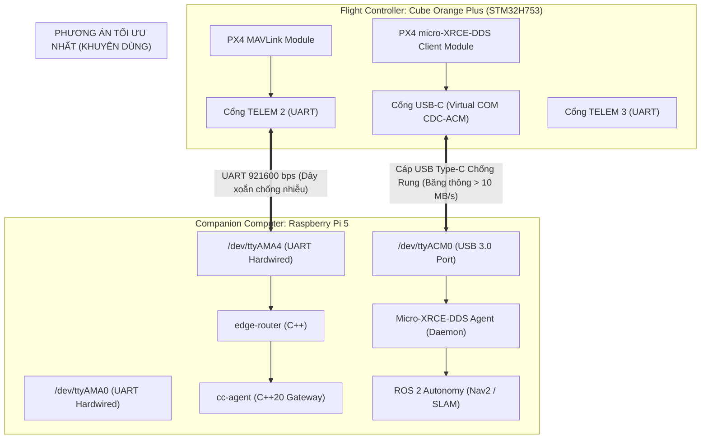

# Kiến Trúc Giao Tiếp Kép: MAVLink (UART) vs Micro-XRCE-DDS (USB/UART) Cho THACO Drone

> **Dự án:** THACO Drone — Hệ sinh thái Máy bay Không người lái Nông nghiệp  
> **Chủ đề:** Đánh giá phương án tách luồng MAVLink và Micro-XRCE-DDS giữa Flight Controller và Companion Computer  
> **Tài liệu số:** `10_mavlink_vs_micro_xrce_dds_dual_bus_architecture.md`  
> **Nguyên tắc:** Senior Avionics System Architecture Review — Không sửa code, tập trung giải pháp phần cứng & giao thức.

---

## 1. Trả Lời Câu Hỏi Cốt Lõi

### Câu hỏi 1: Nên để 1 luồng MAVLink qua UART và 1 luồng Micro-XRCE-DDS riêng đúng không?
> **Khẳng định:** **HOÀN TOÀN ĐÚNG VÀ BẮT BUỘC PHẢI TÁCH RIÊNG.**

Trong ngành hàng không không người lái hiện đại (PX4 Autopilot & ROS 2 Architecture), việc tách rời hai luồng này là nguyên tắc thiết kế bất di bất dịch (Separation of Concerns & Safety Isolation):
- **Luồng 1 (MAVLink):** Dành cho **Mission & Command Control** (GCS THACOGroundControl, telemetry cơ bản, Arm/Disarm, Failsafe, điều khiển vòi phun, đồng bộ tham số). Tốc độ 1Hz - 10Hz, đòi hỏi độ tin cậy tuyệt đối, không được phép tắc nghẽn.
- **Luồng 2 (Micro-XRCE-DDS):** Dành cho **High-Rate Autonomy & Perception Loop** (Odometry 50Hz, Trajectory Setpoint 50-100Hz, chướng ngại vật 3D, sensor fusion giữa AI/Radar và EKF2 của FC). Đòi hỏi băng thông cao, độ trễ vi giây.

---

### Câu hỏi 2: Phương án "1 UART cho MAVLink + 1 UART cho Micro-XRCE-DDS" đã TỐI ƯU NHẤT CHƯA?
> **Đánh giá:** Phương án này **KHẢ THI VÀ AN TOÀN**, nhưng **CHƯA PHẢI LÀ TỐI ƯU NHẤT VỚI MÔ HÌNH HIỆN TẠI (Cube Orange Plus + Raspberry Pi 5)**.

Điểm nghẽn chí mạng của việc dùng UART cho Micro-XRCE-DDS:
1. **Nghẽn băng thông UART (Bandwidth Choke):**
   - Tốc độ UART thông dụng 921600 baud chỉ cho thông lượng thực tế khoảng **$60 - 70\text{ KB/s}$**.
   - Khi chạy tự hành, các topic uORB xuất bản liên tục:
     - `vehicle_odometry` (50Hz) $\approx 15\text{ KB/s}$
     - `trajectory_setpoint` (50Hz) $\approx 10\text{ KB/s}$
     - `obstacle_distance` / Radar 3D (20Hz) $\approx 25\text{ KB/s}$
     - `sensor_combined` / IMU raw (100Hz nếu chạy VIO/SLAM) $\approx 35\text{ KB/s}$
   - **Tổng lưu lượng vượt ngưỡng chịu đựng của UART 921600**, dẫn đến **tràn bộ đệm DMA, rớt gói tin uORB**, làm thuật toán tránh vật cản hoặc bám địa hình bị trễ (lag), cực kỳ nguy hiểm khi drone bay sát mặt tán cây ở tốc độ cao.
2. **Chiếm dụng tài nguyên chân GPIO UART của Raspberry Pi 5:**
   - Chip RP1 trên Pi 5 chỉ cung cấp số lượng chân UART hạn chế. Dành 2 cổng UART cho FC sẽ làm mất cổng kết nối cho các tải trọng nông nghiệp khác (RTK GPS, Flow meter serial, Radar serial).

---

## 2. So Sánh 3 Phương Án Kết Nối Vật Lý Thực Tế



| Tiêu chí | Phương án A: 2x UART Serial | Phương án B: 1x UART (MAVLink) + 1x USB Type-C (DDS) ⭐ **(TỐI ƯU NHẤT)** | Phương án C: Dual Ethernet (Chuẩn tương lai) |
| :--- | :--- | :--- | :--- |
| **Đường truyền MAVLink** | TELEM 2 UART (`/dev/ttyAMA4`) | TELEM 2 UART (`/dev/ttyAMA4`) | UDP Port 14550 qua Ethernet switch |
| **Đường truyền DDS** | TELEM 3 UART (`/dev/ttyAMA0`) | Cáp USB Type-C (`/dev/ttyACM0`) | UDP Port 8888 qua Ethernet switch |
| **Băng thông DDS** | Hạn chế ($\sim 70\text{ KB/s}$) $\rightarrow$ Dễ nghẽn | Cực lớn ($> 12\text{ Mbps} \approx 1.5\text{ MB/s}$) $\rightarrow$ Thừa sức chạy SLAM/Radar | Khổng lồ ($100\text{ Mbps} - 1\text{ Gbps}$) |
| **Độ an toàn khi bay (Failsafe)** | Rất cao (UART dây cố định) | **Rất cao:** Nếu cáp USB lỏng, MAVLink trên UART vẫn sống 100%, GCS giữ quyền kiểm soát | Rất cao |
| **Mức độ phức tạp phần cứng** | Tốn 2 cổng UART vật lý trên Pi 5 | **Đơn giản nhất:** Chỉ cần 1 dây TELEM và 1 sợi cáp USB-C bọc giáp | Cần Carrier board có Ethernet PHY chip |
| **Khả năng cấu hình PX4** | Khá phức tạp (chia baudrate 2 port) | **Cực dễ:** PX4 tự nhận USB CDC-ACM làm kênh DDS | Cần cấu hình IP tĩnh cho FC |

---

## 3. Tại Sao Phương Án B Là Tối Ưu Nhất Cho Dự Án THACO Drone Hiện Tại?

### 1. Băng thông USB giải phóng toàn bộ sức mạnh của ROS 2
Cổng USB-C trên Cube Orange Plus kết nối trực tiếp vào bộ điều khiển USB OTG của vi điều khiển STM32H753. Khi chuyển sang chế độ CDC-ACM (Virtual Serial Port), tốc độ truyền thực tế đạt hàng Megabyte/giây. Bạn có thể xuất bản đồng thời:
- Dữ liệu Odometry tốc độ cao (100Hz)
- Trạng thái điều khiển cánh lái / động cơ (`actuator_motors` 50Hz)
- Quỹ đạo điều khiển bám dốc ruộng bậc thang (`trajectory_setpoint` 100Hz)
- Mảng dữ liệu khoảng cách chướng ngại vật từ Radar/LiDAR
$\rightarrow$ **Không bao giờ bị nghẽn buffer, không bị delay lệnh điều khiển.**

### 2. Cô lập hoàn toàn rủi ro (Fail-Safe Architecture)
- Hãy tưởng tượng tình huống xấu nhất: Rung chấn mạnh ngoài ruộng làm cáp USB của ROS 2 bị ngắt kết nối hoặc container ROS 2 bị treo do thuật toán AI quá tải.
- **Hệ thống vẫn an toàn tuyệt đối:** Kênh MAVLink chạy trên cổng UART cứng (`/dev/ttyAMA4`) hoàn toàn độc lập về mặt vật lý lẫn logic. Trạm mặt đất THACOGroundControl vẫn nhận telemetry đầy đủ, còi báo động HMS vang lên, và phi công lập tức gạt công tắc chuyển sang Manual hoặc máy bay tự động kích hoạt PX4 Return-To-Launch (RTL).

### 3. Tiết kiệm tối đa chân kết nối trên Raspberry Pi 5
- Giữ lại các chân UART còn lại trên header 40-pin của Pi 5 để kết nối:
  - Ăng-ten RTK Base/Rover
  - Cảm biến đo lưu lượng thuốc phun (RS485/UART Flowmeter)
  - Radar bám địa hình chuyên dụng (Millimeter-wave Radar UART)

---

## 4. Cấu Hình Khuyến Nghị Chuẩn Trong PX4 & Docker

Khi chuyển sang giai đoạn thực thi (sau này), cấu hình được thiết lập vô cùng trực quan và sạch sẽ:

### Trên Flight Controller (PX4 Parameters):
```ini
# 1. Kênh MAVLink chính kết nối edge-router
MAV_1_CONFIG    = 102    # TELEM 2
SER_TEL2_BAUD   = 921600 # Baudrate cao cho MAVLink

# 2. Kênh Micro-XRCE-DDS kết nối ROS 2
UXRCE_DDS_CFG   = 106    # USB (Cổng Type-C trên Cube Orange Plus)
```

### Trên Companion Computer (Docker Compose):
```yaml
services:
  # 1. Quản lý MAVLink (chỉ dùng UART cứng)
  edge-router:
    devices:
      - /dev/ttyAMA4:/dev/ttyAMA4
    environment:
      - DRONE_SERIAL_PORT=/dev/ttyAMA4
      - DRONE_BAUD_RATE=921600

  # 2. Quản lý Micro-XRCE-DDS Agent (kết nối cổng USB)
  edge-xrce-agent:
    image: micro-xrce-dds-agent:latest
    devices:
      - /dev/ttyACM0:/dev/ttyACM0
    command: ["MicroXRCEAgent", "serial", "--dev", "/dev/ttyACM0", "-b", "921600"]
    restart: unless-stopped
    cpus: 0.5
    mem_limit: 64m
```

---

## 5. Tổng Kết Đánh Giá Kiến Trúc

| Câu hỏi của bạn | Đánh giá từ Senior Architect |
| :--- | :--- |
| **Tách 1 MAVLink + 1 Micro-XRCE-DDS riêng?** | **Chính xác 100%.** Đây là kiến trúc chuẩn bắt buộc để đảm bảo an toàn bay. |
| **Cả 2 đều đi qua cổng UART đã tối ưu nhất chưa?** | **Chưa tối ưu.** Bị nghẽn băng thông UART ($<70\text{ KB/s}$), không đủ truyền odometry & radar 3D tốc độ cao. |
| **Giải pháp tối ưu nhất cho cấu hình hiện tại là gì?** | **1 UART (TELEM2) cho MAVLink + 1 Cáp USB-C cho Micro-XRCE-DDS.** Đạt băng thông $> 10\text{ MB/s}$, không nghẽn, cô lập an toàn vật lý, dễ cấu hình nhất. |
