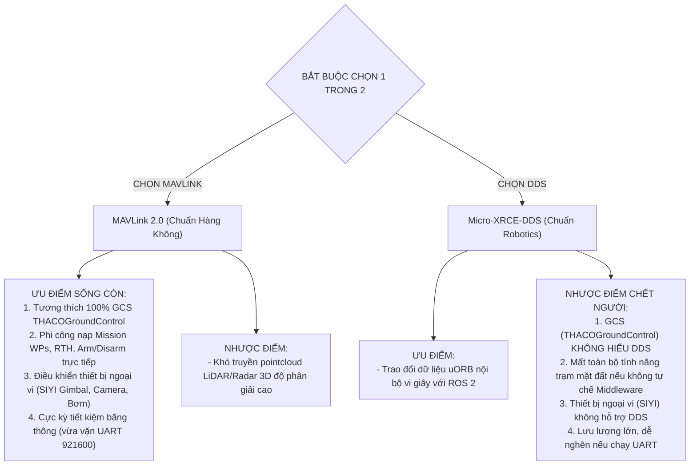

# Phân Tích Điểm Nghẽn Tần Số UART & Chiến Lược Lựa Chọn Duy Nhất: MAVLink vs Micro-XRCE-DDS

> **Dự án:** THACO Drone — Hệ sinh thái Máy bay Không người lái Nông nghiệp  
> **Chủ đề:** Giới hạn vật lý khi tăng Baudrate UART & Phân tích lựa chọn duy nhất giữa MAVLink và Micro-XRCE-DDS  
> **Tài liệu số:** `11_baudrate_limits_and_mavlink_vs_dds_selection_guide.md`  
> **Nguyên tắc:** Senior Embedded & Avionics Hardware Review — Không sửa code, phân tích bản chất phần cứng và lý thuyết thông tin.

---

## 1. Phân Tích Điểm Nghẽn Khi Nâng Baudrate Của FC Và Pi 5

### 1.1. Về mặt lý thuyết phần cứng: Có nâng lên 1.5M, 2M, 3M baud được không?
- **Được.** 
  - **Cube Orange Plus (STM32H753):** Bộ định thời USART của STM32H7 chạy từ nguồn clock APB/PLL lên tới $100\text{ MHz} - 200\text{ MHz}$. Về mặt thanh ghi bán dẫn, USART của Cube có thể tạo ra baudrate lên tới $12.5\text{ Mbps}$ hoặc $25\text{ Mbps}$.
  - **Raspberry Pi 5 (RP1 I/O Controller & PL011 UART):** Linux kernel cho phép cấu hình baudrate tùy biến (sử dụng cờ `BOTHER` trong `termios2`) đạt $1.5\text{ Mbps}$, $2.0\text{ Mbps}$, $3.0\text{ Mbps}$.

---

### 1.2. Về mặt thực tế trên Drone Nông Nghiệp: Liệu có ỔN ĐỊNH không?
> **Khẳng định từ kỹ sư phần cứng nhúng:** **KHÔNG ỔN ĐỊNH VÀ CHỨA ĐỰNG RỦI RO BAY RẤT LỚN NẾU CHẠY TRÊN $1.5\text{ Mbps}$ BẰNG TÍN HIỆU TTL ĐƠN.**

Có 3 rào cản vật lý khắc nghiệt trong môi trường bay thực địa:

#### 1. Méo dạng tín hiệu do điện dung ký sinh (Capacitive Loading & Signal Slew Rate)
- Đường truyền UART giữa Cube và Pi là **tín hiệu logic 3.3V đơn cực (Single-Ended TTL)**, không phải tín hiệu vi sai (Differential) như RS422 hay CAN-bus.
- Ở tốc độ $921.600\text{ bps}$, độ rộng của một bit (Bit Period) là:
  $$T_{\text{bit}} = \frac{1}{921.600} \approx 1.085\,\mu\text{s}$$
- Nhưng khi nâng lên $3.000.000\text{ bps}$ ($3\text{ Mbps}$), độ rộng bit chỉ còn:
  $$T_{\text{bit}} = \frac{1}{3.000.000} \approx 333\,\text{ns}$$
- Dây cáp từ Cube sang Pi (dù chỉ dài 15–20cm) luôn có điện dung ký sinh $C \approx 30 - 80\text{ pF}$. Kết hợp với nội trở ngõ ra của chân GPIO ($R \approx 50 - 100\,\Omega$), nó tạo thành một **mạch lọc thông thấp RC (Low-Pass Filter)**.
- **Hậu quả:** Cạnh lên và cạnh xuống của xung vuông 333ns bị vát tròn (Slew rate suy giảm), "mắt tín hiệu" (Eye Diagram) bị bóp nghẹt. Bộ thu UART lấy mẫu ở giữa chu kỳ bit sẽ đọc sai từ mức logic cao (1) thành mức thấp (0) $\rightarrow$ **Lỗi Framing Error và rớt gói tin liên tục**.

```
Xung chuẩn (Square Wave)   : ┌─┐ ┌─┐ ┌─┐
Tải ký sinh RC ở 3 Mbps   :  /\  /\  /\   (Méo dạng hoàn toàn -> Bit Error)
```

#### 2. Nhiễu điện từ cực mạnh từ động cơ và ESC (Severe Electromagnetic Interference - EMI)
- Drone nông nghiệp mang tải 20kg–50kg nước, sử dụng 4 đến 8 động cơ brushless công suất khổng lồ. Dòng điện qua ESC biến thiên liên tục từ $50\text{A}$ đến $200\text{A}$ ở tần số băm xung PWM $20\text{ kHz} - 40\text{ kHz}$.
- Tốc độ biến thiên dòng điện khổng lồ $\left(\frac{di}{dt}\right)$ sinh ra từ trường bức xạ cực mạnh xung quanh khung drone.
- Một xung nhiễu cảm ứng điện từ (Glitch) điển hình có độ rộng $50 - 100\text{ ns}$:
  - Ở $921.600\text{ bps}$ ($1085\text{ ns}$/bit): Xung nhiễu $50\text{ ns}$ chỉ chiếm $< 5\%$ độ rộng bit. Bộ lọc số phần cứng (Oversampling 16x) của STM32 dễ dàng triệt tiêu.
  - Ở $3.000.000\text{ bps}$ ($333\text{ ns}$/bit): Xung nhiễu $100\text{ ns}$ chiếm tới **$30\%$ độ rộng bit**. Nó làm lật trạng thái logic ngay tức khắc $\rightarrow$ **Gói tin bị sai mã CRC và bị hủy bỏ**.

#### 3. Tràn bộ đệm DMA & Độ trễ nhân Linux (Linux Kernel Interrupt Latency)
- Raspberry Pi 5 chạy hệ điều hành Linux (không phải Real-Time OS như FreeRTOS).
- Bộ đệm phần cứng phần cứng (Hardware FIFO) của cổng UART chỉ có **32 bytes**.
- Ở tốc độ $3\text{ Mbps}$ ($\approx 300\text{ KB/s}$), bộ đệm 32 bytes bị nạp đầy chỉ trong vòng:
  $$t_{\text{overflow}} = \frac{32 \times 10}{3.000.000} \approx 106\,\mu\text{s}$$
- Nếu Linux kernel bận xử lý ngắt mạng WiFi, quét thẻ nhớ hoặc giải mã camera frame mà trễ phục vụ ngắt UART chỉ **$0.15\text{ ms}$** $\rightarrow$ **Lỗi UART Overrun Error (OE)** lập tức kích hoạt, dữ liệu bị ghi đè và mất mát không thể phục hồi.

> **Kết luận mục 1:** Nếu nâng baudrate UART, mức tối đa an toàn trong thực tế bay nông nghiệp chỉ là **$1.500.000\text{ bps}$ ($1.5\text{ Mbps}$)** với điều kiện dây bọc giáp chống nhiễu có mass tin cậy và chiều dài $< 10\text{ cm}$. Việc cố nâng lên 2M hay 3M qua đường dây TTL trần là một **canh bạc mạo hiểm cho an toàn bay**.

---

## 2. Nếu Thực Sự Phải Chọn 1 Trong 2: MAVLink Hay Micro-XRCE-DDS?

Nếu đặt lên bàn cân bắt buộc phải **chọn duy nhất một giao thức** duy nhất kết nối giữa Cube Orange Plus và Companion Computer, ta phải phân tích sự đánh đổi sống còn:



---

### 2.1. So Sánh Bản Chất 2 Giao Thức

| Tiêu chí so sánh | MAVLink 2.0 | Micro-XRCE-DDS |
| :--- | :--- | :--- |
| **Bản chất** | **Giao thức điều khiển bay & trạm mặt đất (Avionics Command Protocol)** | **Hạ tầng truyền dữ liệu phân tán Robotics (Data Distribution Service)** |
| **Hệ sinh thái GCS** | **100% trạm mặt đất toàn cầu dùng MAVLink** (THACOGroundControl, QGroundControl). Hiển thị bản đồ, dung lượng pin, mức thuốc, nạp nhiệm vụ bay tự động. | **0% trạm mặt đất hỗ trợ DDS native**. Nếu chọn DDS, bạn phải tự lập trình lại một GCS từ con số 0 hoặc viết cầu nối dịch ngược sang MAVLink. |
| **Hệ sinh thái Thiết bị** | SIYI Gimbal, Camera, Air Unit, RTK Base/Rover đều giao tiếp bằng lệnh MAVLink chuẩn. | Không một thiết bị thương mại nào trên thị trường nông nghiệp giao tiếp bằng DDS. |
| **Lưu lượng dữ liệu** | Gói tin siêu nhẹ (Header 10 bytes), thiết kế tối ưu cho đường truyền vô tuyến hẹp (Radio Link). | Đóng gói theo chuẩn uORB/CDR, dữ liệu tuần tự có overhead, lưu lượng lớn gấp 5–10 lần MAVLink. |
| **Khả năng tự hành nâng cao** | Truyền bản đồ 3D hoặc pointcloud SLAM qua MAVLink rất chậm và vụng về. | Tương thích hoàn hảo với ROS 2 Nav2, SLAM, Point-LIO. |

---

### 2.2. Phán Quyết Kỹ Thuật (Architectural Verdict)

> **NẾU PHẢI CHỌN DUY NHẤT 1 GIAO THỨC CHO DỰ ÁN THACO DRONE:**
> ### 👉 **BẮT BUỘC PHẢI CHỌN MAVLINK 2.0!**

#### Tại sao không thể là Micro-XRCE-DDS?
1. **Dự án THACO Drone là máy bay nông nghiệp thương mại, không phải robot nghiên cứu trong phòng lab:**
   - Người nông dân và phi công điều khiển drone thông qua **trạm mặt đất THACOGroundControl**.
   - Họ cần: Nhìn thấy máy bay trên bản đồ vệ tinh, vẽ ranh giới ruộng, bấm nút cất cánh tự động, xem báo cáo lưu lượng phun thuốc, và bấm nút hạ cánh khẩn cấp.
   - **Tất cả các chức năng thương mại đó đều vận hành trên MAVLink.** Micro-XRCE-DDS hoàn toàn không có khả năng thay thế vai trò này của MAVLink.
2. **MAVLink vẫn hỗ trợ tránh vật cản đủ dùng cho nông nghiệp:**
   - Trong MAVLink 2.0, gói tin [`OBSTACLE_DISTANCE` (Message #330)](file:///home/lnh/THACO_Drone/Companion_Computer/src/cc-agent/mavlink/common/mavlink_msg_obstacle_distance.hpp) cung cấp mảng 72 điểm đo khoảng cách 360° từ Radar hoặc cảm biến quang học truyền thẳng vào hệ thống lái tự động PX4.
   - PX4 có sẵn module `obstacle_avoidance` tích hợp sẵn nhận dữ liệu từ MAVLink để tự dừng trước dây điện hoặc cây cối mà **chưa bắt buộc phải cài đặt ROS 2**.

---

## 3. Bản Đồ Quyết Định Chiến Lược Của Kỹ Sư Trưởng

| Tình huống dự án | Lựa chọn tối ưu nhất | Cách triển khai vật lý |
| :--- | :--- | :--- |
| **Chỉ được chọn 1 giao thức duy nhất** | **MAVLink 2.0** | Cổng UART TELEM2 @ 921600 bps. Vừa vặn, an toàn 100%, đủ tính năng thương mại. |
| **Muốn chạy thêm thuật toán ROS 2 phức tạp (SLAM, Camera AI 3D)** | **Giữ MAVLink + Mở thêm Micro-XRCE-DDS** | - MAVLink: Cổng UART TELEM2 @ 921600 bps (Lõi bay an toàn & GCS).<br>- Micro-XRCE-DDS: **Cáp USB Type-C** (Băng thông lớn $> 10\text{ MB/s}$, vi sai chống nhiễu). |
| **Nâng baudrate UART lên 2M - 3M** | **KHÔNG NÊN** | Giới hạn tối đa $1.5\text{ Mbps}$ nếu bắt buộc. Ưu tiên chuyển luồng nặng sang cáp USB Type-C thay vì cố ép xung UART TTL. |
