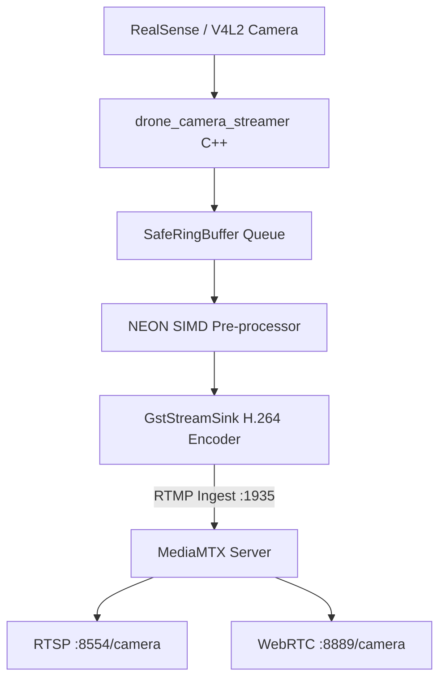
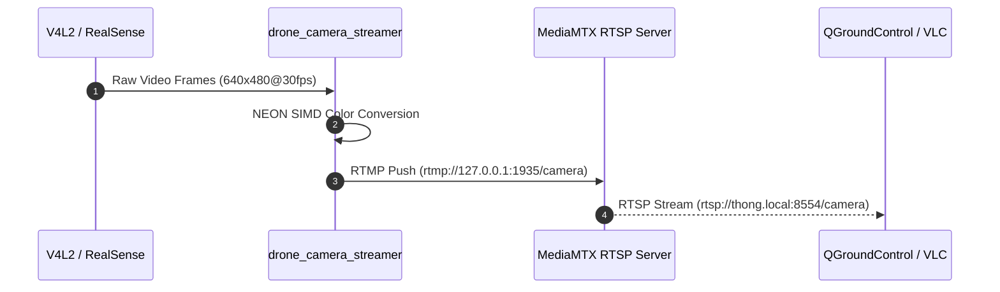

# Camera RealSense & RTSP Streamer Controller

[](README.md)
[](CMakeLists.txt)
[](Dockerfile)
[](LICENSE)

Dịch vụ C++ Native `drone_camera_streamer` kết hợp máy chủ MediaMTX cung cấp luồng video FPV độ trễ siêu thấp (low latency) từ camera Intel RealSense D435i / USB V4L2 ra các giao thức RTSP, WebRTC, và RTMP.

---

## Mục lục (Table of Contents)
- [Tính năng nổi bật](#tính-năng-nổi-bật)
- [Sơ đồ Kiến trúc & Luồng hoạt động](#sơ-đồ-kiến-trúc--luồng-hoạt-động)
- [Cài đặt & Biên dịch](#cài-đặt--biên-dịch)
- [Cấu hình camera.yaml & Biến môi trường](#cấu-hình-camerayaml--biến-môi-trường)
- [Hướng dẫn Sử dụng & Xem Video](#hướng-dẫn-sử-dụng--xem-video)
- [Kiểm thử Tự động](#kiểm-thử-tự-động)
- [Đóng góp (Contributing)](#đóng-góp-contributing)
- [Giấy phép (License)](#giấy-phép-license)

---

## Tính năng nổi bật
- **Kiến trúc All-In-One**: Tích hợp module thu nhận hình ảnh C++ và MediaMTX trong cùng một container, tối ưu giao tiếp nội bộ qua loopback RTMP `:1935`.
- **Tăng tốc phần cứng ARM NEON**: Bộ tiền xử lý `NeonProcessor` sử dụng tập lệnh SIMD NEON chuyển đổi không gian màu RGB/YUYV sang định dạng encoder cực nhanh trên Raspberry Pi 5 Cortex-A76.
- **Hỗ trợ đa nguồn camera**: Tự động chuyển đổi giữa Intel RealSense SDK (`librealsense2`) và chuẩn Linux V4L2 (`/dev/video0`), hỗ trợ chế độ Stub khi chạy trên môi trường test không có camera thật.
- **Đa giao thức phát sóng**:
  - RTSP: `rtsp://thong.local:8554/camera` (dành cho QGroundControl, VLC, Mission Planner).
  - WebRTC: `http://thong.local:8889/camera` (xem trực tiếp trên trình duyệt Web không cần cài plugin).

---

## Sơ đồ Kiến trúc & Luồng hoạt động

### Kiến trúc Phân hệ (System Architecture)


### Luồng Tuần tự (Sequence Diagram)
> Mã nguồn chi tiết PlantUML: xem tại [docs/sequence.puml](docs/sequence.puml) và [docs/system.puml](docs/system.puml).



---

## Cài đặt & Biên dịch (Installation & Build)

### 1. Biên dịch Native C++ (WSL2 / Linux Host)
```bash
mkdir -p build && cd build
cmake -DCMAKE_BUILD_TYPE=Release ..
make drone_camera_streamer test_camera_stream -j4
```

### 2. Build Docker ARM64 Container
```bash
make build-camera-rtsp
```

---

## Cấu hình camera.yaml & Biến môi trường

Cấu hình tại `src/camera-stream-controller/camera.yaml`:
```yaml
camera:
  type: "realsense" # hoặc "v4l2"
  device: "/dev/video0"
  width: 640
  height: 480
  fps: 30
stream:
  bitrate_kbps: 1500
  rtmp_url: "rtmp://127.0.0.1:1935/camera"
```

---

## Hướng dẫn Sử dụng & Xem Video (Usage)

### 1. Khởi động và Xem log
```bash
# Khởi động dịch vụ trên Pi
make start-camera-rtsp

# Xem log kiểm tra kết nối camera
make logs-camera-rtsp
```

### 2. Xem luồng video trên máy tính
```bash
# Bằng ffplay (Độ trễ thấp TCP)
ffplay -rtsp_transport tcp rtsp://thong.local:8554/camera

# Bằng trình duyệt Web (WebRTC)
# Mở trình duyệt truy cập: http://thong.local:8889/camera
```

---

## Kiểm thử Tự động (Tests)
Dự án tích hợp các bài kiểm thử cấu hình YAML, fallback stub và xử lý khung hình NEON:
```bash
cd build && ctest -R Camera -R Neon --output-on-failure
```

---

## Đóng góp (Contributing)
Mọi đề xuất đóng góp vui lòng tuân thủ quy chuẩn mã nguồn C++20 và quy tắc quản trị tài liệu tại [`.agents/rules/06-doc-sync-and-rule-governance.md`](../../.agents/rules/06-doc-sync-and-rule-governance.md).

---

## Giấy phép (License)
Dự án được phân phối dưới giấy phép [MIT License](https://opensource.org/licenses/MIT).

## GitHub / GHCR deployment contract

Source/config templates are pulled from GitHub; images are pulled from GHCR.
Set the actual lowercase `IMAGE_NAMESPACE` in private `.env`; choose a commit
SHA or development `IMAGE_TAG`. All internal runtime images target linux/arm64;
Pi Compose has no build definitions. See [deployment guide](../../deploy/README.md).

WSL: `make publish-camera-rtsp` after commit/push. Pi: `bash deploy/update.sh --service camera-stream-controller`.
