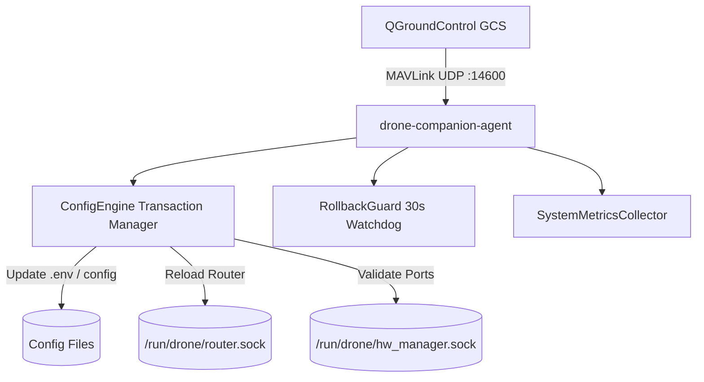
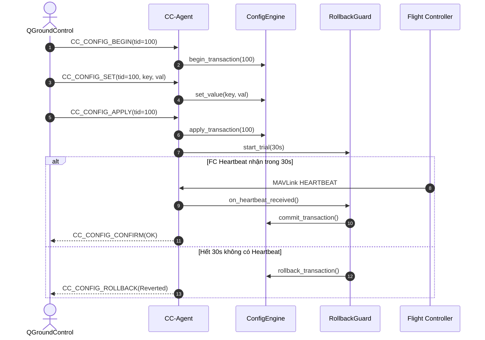

# Companion Control Plane Agent (Bộ não điều phối MAVLink & State)

[](README.md)
[](CMakeLists.txt)
[](Dockerfile)
[](LICENSE)

Dịch vụ C++ Native `drone-companion-agent` đóng vai trò là bộ não trung tâm điều khiển (Control Plane) của Companion Computer. Tiếp nhận các bản tin cấu hình từ QGroundControl qua giao thức MAVLink UDP `:14600` (Component ID `191`), quản lý giao dịch an toàn (Transactions), tự động hoàn tác cấu hình (Rollback Guard), và xuất bản dữ liệu Telemetry hệ thống.

---

## Mục lục (Table of Contents)
- [Tính năng chính](#tính-năng-chính)
- [Bảng tin MAVLink THACO Dialect](#bảng-tin-mavlink-thaco-dialect)
- [Sơ đồ Kiến trúc & Luồng hoạt động](#sơ-đồ-kiến-trúc--luồng-hoạt-động)
- [Cài đặt & Biên dịch](#cài-đặt--biên-dịch)
- [Hướng dẫn Vận hành & Cấu hình](#hướng-dẫn-vận-hành--cấu-hình)
- [Kiểm thử Tự động](#kiểm-thử-tự-động)
- [Đóng góp (Contributing)](#đóng-góp-contributing)
- [Giấy phép (License)](#giấy-phép-license)

---

## Tính năng chính
- **Cơ chế Giao dịch 2 Pha (2-Phase Commit)**: Mọi thao tác đổi cấu hình mạng, MAVLink, camera đều được thực hiện thông qua Transaction ID (TID), có lưu snapshot backup trước khi áp dụng.
- **Heartbeat Rollback Guard**: Sau khi áp dụng cấu hình mới (APPLY), một watchdog 30 giây được kích hoạt. Nếu mất kết nối Flight Controller (không nhận được Heartbeat), hệ thống sẽ tự động khôi phục cấu hình cũ để chống mất quyền điều khiển.
- **Giám sát Tài nguyên (Telemetry Provider)**: Tự động đo đạc tải CPU, RAM, nhiệt độ chip, dung lượng ổ đĩa từ `/proc` và `/sys` rồi đóng gói thành bản tin `CC_TELEMETRY_SYSTEM`.
- **Giao tiếp IPC Đa phân hệ**: Tương tác trực tiếp với `hardware-manager` và `mavlink-router-controller` qua Unix Domain Sockets.

---

## Bảng tin MAVLink THACO Dialect

| Tên Message MAVLink | Message ID | Hướng | Chức năng |
|---|---|---|---|
| `CC_CONFIG_BEGIN` | `42010` | GCS ➔ Agent | Bắt đầu phiên giao dịch cấu hình với mã TID |
| `CC_CONFIG_SET` | `42011` | GCS ➔ Agent | Đặt cặp key-value tạm thời (Staged) |
| `CC_CONFIG_APPLY` | `42012` | GCS ➔ Agent | Áp dụng cấu hình và bắt đầu thử nghiệm (Trial) |
| `CC_CONFIG_CONFIRM` | `42013` | GCS ➔ Agent | Cam kết lưu vĩnh viễn cấu hình (Commit) |
| `CC_CONFIG_ROLLBACK` | `42015` | GCS ➔ Agent | Hủy bỏ và hoàn tác cấu hình cũ |
| `CC_CONFIG_ACK` | `42016` | Agent ➔ GCS | Phản hồi trạng thái giao dịch |
| `CC_TELEMETRY_SYSTEM` | `42014` | Agent ➔ GCS | Phát định kỳ CPU, RAM, Disk, Temp, Uptime |

---

## Sơ đồ Kiến trúc & Luồng hoạt động

### Kiến trúc Phân hệ (System Architecture)


### Luồng Tuần tự Giao dịch (Sequence Diagram)
> Mã nguồn chi tiết PlantUML: xem tại [docs/sequence.puml](docs/sequence.puml) và [docs/system.puml](docs/system.puml).



---

## Cài đặt & Biên dịch (Installation & Build)

### 1. Biên dịch Native C++ (WSL2 / Linux Host)
```bash
mkdir -p build && cd build
cmake -DCMAKE_BUILD_TYPE=Release ..
make drone-companion-agent test_cc_agent -j4
```

### 2. Build Docker ARM64 Container
```bash
make build-cc-agent
```

---

## Hướng dẫn Vận hành & Cấu hình (Usage)

Khi chạy dạng container, `cc-agent` tự động lắng nghe cổng MAVLink UDP `:14600`:
```bash
# Xem log thời gian thực trên Raspberry Pi
make logs-cc-agent

# Khởi động lại agent
make restart-cc-agent
```

---

## Kiểm thử Tự động (Tests)
Dự án tích hợp 11 bài kiểm thử tự động toàn diện:
- `test_config_engine.cpp`: Kiểm tra logic transaction, commit, rollback, và nạp cấu hình `.env`.
- `test_rollback_guard.cpp`: Kiểm tra timeout watchdog 30s và khôi phục khi mất Heartbeat.
- `test_metrics_and_serial.cpp`: Kiểm tra đọc tài nguyên `/proc` và quét cổng an toàn.

```bash
cd build && ctest -R ConfigEngine -R RollbackGuard --output-on-failure
```

---

## Đóng góp (Contributing)
Mọi đề xuất đóng góp vui lòng tuân thủ quy chuẩn mã nguồn C++20 và quy tắc quản trị tài liệu tại [`.agents/rules/06-doc-sync-and-rule-governance.md`](../../.agents/rules/06-doc-sync-and-rule-governance.md).

---

## Giấy phép (License)
Dự án được phân phối dưới giấy phép [MIT License](https://opensource.org/licenses/MIT).

## GitHub / GHCR deployment contract

Source/config templates are pulled from GitHub; images are pulled from GHCR.
Set the actual lowercase `IMAGE_NAMESPACE` in private `.env`; choose a commit
SHA or development `IMAGE_TAG`. All internal runtime images target linux/arm64;
Pi Compose has no build definitions. See [deployment guide](../../deploy/README.md).

WSL: `make publish-cc-agent` after commit/push. Pi: `bash deploy/update.sh --service cc-agent`.

The binary is installed inside the image, never mounted from host `/usr/local/bin`.
Private `runtime/agent/telemetry.env` is writable; deployment `.env` is separate.
`cc-agent-state:/var/lib/cc-agent` persists transactions/configuration across updates.
Hardware mounts `/dev` and shared `/run/drone` are rw; `/sys`, `/proc` and camera config are ro.
