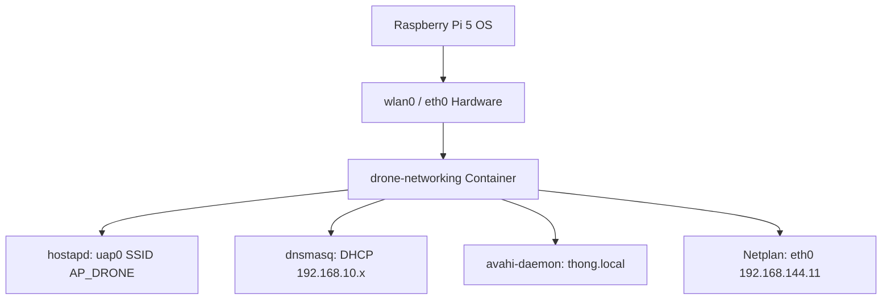
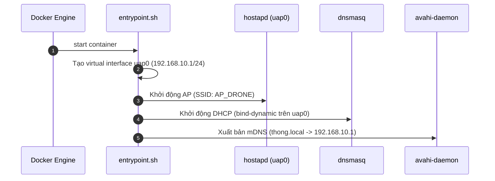

# Drone Networking Controller (AP-STA Concurrency & Ethernet DHCP)

[](README.md)
[](Dockerfile)
[](LICENSE)

Dịch vụ điều phối toàn bộ hạ tầng mạng cho Companion Computer: phát sóng WiFi Access Point (`AP_DRONE`), cấp phát DHCP qua `dnsmasq`, duy trì kết nối Station Internet qua `wlan0`, phân giải tên miền mDNS `thong.local`, và cấu hình IP tĩnh mạng dây Ethernet cho thiết bị ngoại vi (SIYI Air Unit).

---

## Mục lục (Table of Contents)
- [Tính năng chính](#tính-năng-chính)
- [Sơ đồ Kiến trúc & Luồng hoạt động](#sơ-đồ-kiến-trúc--luồng-hoạt-động)
- [Cài đặt & Biên dịch](#cài-đặt--biên-dịch)
- [Cấu hình Mạng & File Cấu hình](#cấu-hình-mạng--file-cấu-hình)
- [Hướng dẫn Vận hành](#hướng-dẫn-vận-hành)
- [Đóng góp (Contributing)](#đóng-góp-contributing)
- [Giấy phép (License)](#giấy-phép-license)

---

## Tính năng chính
- **AP-STA Concurrency**: Sử dụng chip Wi-Fi tích hợp trên Raspberry Pi 5 để vừa duy trì kết nối Wi-Fi trạm (`wlan0`), vừa phát Access Point độc lập (`uap0`).
- **bind-dynamic DHCP Server**: Cấu hình `dnsmasq` liên kết động chống xung đột Port 53 với `systemd-resolved` trên host.
- **Tự động chuyển kênh thông minh**: Quét kênh Wi-Fi của trạm kết nối để tự động gán tần số và chế độ `hw_mode` (2.4GHz / 5GHz) phù hợp, chống suy hao tín hiệu.
- **mDNS Host Discovery**: Xuất bản `thong.local` trỏ về IP tĩnh gateway `192.168.10.1`, cho phép GCS và SSH kết nối không phụ thuộc IP DHCP.

---

## Sơ đồ Kiến trúc & Luồng hoạt động

### Kiến trúc Phân hệ (System Architecture)


### Luồng Tuần tự (Sequence Diagram)
> Mã nguồn chi tiết PlantUML: xem tại [docs/sequence.puml](docs/sequence.puml) và [docs/system.puml](docs/system.puml).



---

## Cài đặt & Biên dịch (Installation & Build)

### 1. Build Docker ARM64 Container
```bash
make build-networking
```

### 2. Triển khai lên Raspberry Pi
```bash
make deploy-networking
```

---

## Cấu hình Mạng & File Cấu hình (Configuration)

- `runtime/networking/wifi.json`: Cấu hình danh tính mạng WiFi Hotspot (`AP_DRONE`), mật khẩu và cấu hình trạm Station để tự kết nối.
- `src/drone-networking/wifi.example.json`: File mẫu để sao chép ra `wifi.json` khi khởi tạo môi trường mới.
- `src/drone-networking/hostapd.conf`: Cấu hình SSID, mật khẩu và bảo mật WPA2 cho hostapd daemon.
- `src/drone-networking/dnsmasq.conf`: Cấu hình dải IP cấp phát `192.168.10.100 - 192.168.10.150` và bản ghi DNS tĩnh.
- `src/drone-networking/50-drone.yaml`: Netplan template thiết lập IP mạng dây Ethernet `192.168.144.11` cho SIYI link.

---

## Hướng dẫn Vận hành (Usage)

```bash
# Xem trạng thái mạng
make logs-networking

# Khởi động lại dịch vụ mạng
make restart-networking

# Nạp cấu hình Netplan mới lên Pi
make apply-netplan
```

---

## Đóng góp (Contributing)
Mọi đề xuất đóng góp vui lòng tuân thủ quy tắc quản trị tài liệu tại [`.agents/rules/06-doc-sync-and-rule-governance.md`](../../.agents/rules/06-doc-sync-and-rule-governance.md).

---

## Giấy phép (License)
Dự án được phân phối dưới giấy phép [MIT License](https://opensource.org/licenses/MIT).

## GitHub / GHCR deployment contract

Source/config templates are pulled from GitHub; images are pulled from GHCR.
Set the actual lowercase `IMAGE_NAMESPACE` in private `.env`; choose a commit
SHA or development `IMAGE_TAG`. All internal runtime images target linux/arm64;
Pi Compose has no build definitions. See [deployment guide](../../deploy/README.md).

WSL: `make publish-networking` after commit/push. Pi: `bash deploy/update.sh --service drone-networking`.

The private networking directory is mounted rw for atomic JSON updates.
Git tracks `wifi.example.json`, never the live credential file. Host netplan/UART
provisioning remains separate from application update.
