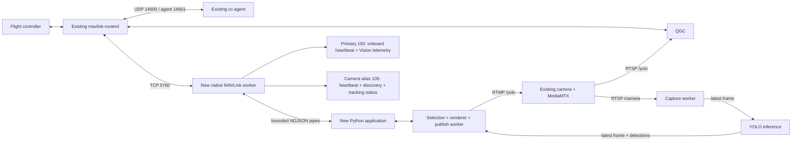

# drone-vision-new

[](native/CMakeLists.txt)
[](Dockerfile)
[](../../LICENSE)

Isolated Vision application with its own MAVLink TCP client. It uses the old
router's existing `127.0.0.1:5760` server and the old camera's MediaMTX. No old
service needs a rebuild or replacement. Stop old `drone-vision` before publishing
to `/yolo`; MediaMTX already sets `overridePublisher: false` for that path.

Contents: [architecture](#architecture), [configuration](#configuration),
[build](#build), [tests](#tests), [Pi operation](#pi-operation),
[tracking limits](#tracking-limits), [contributing](#contributing).
See [baseline audit](docs/audit.md), [original validation](docs/validation.md),
and [camera alias audit and validation](docs/camera-alias-validation.md).

## Architecture



Capture, inference, publication, and native MAVLink socket I/O run independently.
Python has an additional nonblocking IPC worker. Inference enqueues telemetry;
it never calls socket/pipe I/O. Frames use one-slot mailboxes. Python requests are
bounded to 32 plus separate latest telemetry and selection snapshots. Native TX holds at most 32 packets;
native events and Python event history hold at most 64 entries.

The native helper uses the **unchanged generated C headers** in
`src/cc-agent/mavlink/thaco_common`. No Python dialect, XML duplication, manual
MAVLink framing, CRC constants, or cc-agent changes are needed. Encoding uses
generated status-aware packers; the per-connection parser handles TCP fragmentation
and coalescing. Separate onboard and camera heartbeats register both identities
on the same connection and repeat approximately every second. Each component
has one encoder/sequence counter shared by its heartbeat and other messages.
Reconnect uses 100 ms–5 s exponential backoff, resets incomplete parser state,
drops unsent packets, and clears selection. TCP source ports are OS-assigned.

Primary 192 emits Vision telemetry. The camera alias emits heartbeat, camera
information/ACK responses, and requested tracking status. No automatic stream
information is emitted, preserving manual RTSP selection.
The IPC `get` operation is for read-only diagnostics; it does not send transaction
begin/set/apply/confirm/rollback messages or flight commands.

## Configuration

Defaults are packaged in [`config/drone.yaml`](config/drone.yaml).

| Setting | Default | Meaning |
|---|---|---|
| `mavlink.router_host` / `MAVLINK_ROUTER_HOST` | `127.0.0.1` | Numeric IPv4 TCP destination |
| `mavlink.router_port` / `MAVLINK_ROUTER_PORT` | `5760` | Existing router TCP server |
| `mavlink.system_id` / `MAVLINK_SYSTEM_ID` | `1` | Same vehicle system |
| `mavlink.component_id` / `MAVLINK_COMPONENT_ID` | `192` | `MAV_COMP_ID_ONBOARD_COMPUTER2`; repository-unused identity |
| `mavlink.camera_component_id` / `MAVLINK_CAMERA_COMPONENT_ID` | `105` | Integer 100..105, distinct from primary; repository-unused default |
| `mavlink.tracking_status_max_hz` / `MAVLINK_TRACKING_STATUS_MAX_HZ` | `2` | Maximum periodic status rate; finite positive value, at most 10 Hz |
| `mavlink.tracking_status_stale_seconds` | `2` | Report idle if selection snapshots stop arriving |
| `selection.ttl_seconds` | `5` | Expire click selection |
| `yolo.input_url` | `rtsp://127.0.0.1:8554/camera` | Existing raw stream |
| `yolo.output_url` | `rtmp://127.0.0.1:1935/yolo` | Existing MediaMTX publishing path |
| `yolo.model` | `/app/models/yolo26n.pt` | Model packaged in the image |
| `yolo.width`, `height`, `fps` | `640`, `360`, `20` | Capture/output dimensions and publishing rate |
| `yolo.imgsz`, `inference_fps`, `threads` | `320`, `5`, `2` | Inference settings |
| `yolo.stale_seconds` | `2` | Drop old captured/annotated frames |
| `VISION_CONFIG` | `/app/config/drone.yaml` | Optional operator configuration override |

IDs and ports are validated; component 191 is reserved. The deployed network must
also have no other active `1/192` participant. The repository cannot establish live
Pi identity uniqueness. Verify that the chosen camera ID is also free on the live
FC/SIYI network. QGC MockLink allocates 100 and 101; 105 was selected after repository
and configuration inspection. There is no new UDP bind or required UDP 14602 listener.
The existing `/run/drone` directory is mounted read-only for camera standby status.
No source, entrypoint, model, or default configuration is bind-mounted.
The unchanged standalone Compose file does not forward the new camera environment
variables. To override them through Compose, supply them in an operator-owned
Compose override; setting a shell variable alone is insufficient.

## Build

Run from repository root on the development host. Build **only this image**:

```bash
docker buildx build --builder drone-builder --platform linux/arm64 --load \
  --build-arg SOURCE_REVISION="$(git rev-parse HEAD)-dirty" \
  -f src/drone-vision-new/Dockerfile \
  -t ghcr.io/thongtruong24/drone-vision-new:local-test .
docker image inspect ghcr.io/thongtruong24/drone-vision-new:local-test \
  --format '{{.Os}}/{{.Architecture}}'
docker run --rm --platform linux/arm64 --network none \
  ghcr.io/thongtruong24/drone-vision-new:local-test --check
```

The builder cross-compiles only the new C++ bridge to AArch64. Runtime dependencies
come from the pinned existing Vision image digest in the Dockerfile; its inherited
application files are removed and replaced by this module. This dependency is a
build input, not another Pi service/image to pull manually. The final image contains
Python application code, native helper, generated headers under
`/usr/local/include/mavlink`, default YAML, Torch/Ultralytics/OpenCV/GStreamer,
and the 5.54 MB model. Inspect the chosen build to check its image size.
No old image is built. Registry publication is a separate operator action.

The module itself has no ROS requirement. Model and generated headers are build
inputs from the development checkout; the Pi needs only the final runtime image
and the standalone Compose file.

## Tests

```bash
cmake -S src/drone-vision-new/native -B /tmp/vision-new-build -DBUILD_TESTING=ON
cmake --build /tmp/vision-new-build -j4
ctest --test-dir /tmp/vision-new-build -L unit --output-on-failure
ctest --test-dir /tmp/vision-new-build -L tcp --output-on-failure
PYTHONDONTWRITEBYTECODE=1 python3 -m unittest discover \
  -s src/drone-vision-new/tests -p 'test_*.py' -v
PYTHONDONTWRITEBYTECODE=1 python3 src/drone-vision-new/tests/tcp_ipc_integration.py /tmp/vision-new-build
```

True unit tests do not use sockets. TCP tests use ephemeral local test servers.
Real-router tests are separate and require the actual daemon from the upstream
source URL used by the unchanged router Dockerfile. Record its Git revision and
MAVLink submodule revision. This validation used router
`2362c620f483cef1edd574fb962a373a288e4b9e`, submodule
`052b8579f8aeb941f34cc9896af22cf1f38939b9`.

Build the **test-only unchanged native cc-agent executable**, not its Docker image:

```bash
cmake -S src/cc-agent -B /tmp/baseline-agent -DBUILD_TESTING=OFF
cmake --build /tmp/baseline-agent -j4
python3 src/drone-vision-new/tests/run_real_integration.py \
  --router-binary /absolute/path/to/mavlink-routerd \
  --build-dir /tmp/vision-new-build --mode router
python3 src/drone-vision-new/tests/run_real_integration.py \
  --router-binary /absolute/path/to/mavlink-routerd \
  --agent-binary /tmp/baseline-agent/drone-companion-agent \
  --build-dir /tmp/vision-new-build --mode cc-agent
```

These tests use temporary configuration/state and remap router listeners to
ephemeral ports. The unchanged agent's local UDP 14601 must be free; the runner
refuses to overlap it. `--production-ports` opens exact 5760/14550/14541/14600
on an isolated development host. Do not run these fixtures alongside production
services. Only heartbeat and `CC_CONFIG_GET` traffic is used. Exact response fields
and absence of persistent configuration writes are asserted.

That older runner's UDP participant uses 14541; it does not prove packet delivery
through 14550. The new `tests/qgc_camera_protocol.py` fixture explicitly exercises
the real router's UDP 14550 and TCP 5760 with independently generated QGC `all`
headers. It checks both identities, both discovery mechanisms, primary 42013,
point/STOP ACKs, width-based selection, active/idle status, 2 Hz intervals, and −1
disable reporting. See the [reproduction commands](docs/camera-alias-validation.md#reproduce).
`tests/arm_bridge.sh` repeats this fixture using the packaged ARM64 helper.

`tests/container_smoke.py` exercises the real packaged model and GStreamer pipeline
with a test-only MediaMTX binary and synthetic raw stream in an isolated container.
Its reduced test resolution and longer stale allowance support slow QEMU execution;
they do not change packaged production defaults. It also verifies raw `/camera`
remains readable and actual green/yellow renderer pixels while the router is absent.

## Pi operation

Prerequisite: the old router, cc-agent, camera/MediaMTX, and networking stack are
already running. MAVROS may remain enabled. Use only the standalone Compose file;
do not run the existing generic updater for this transition.

After an operator publishes the chosen new image tag, run in the existing stack
directory (replace `<tag>`):

```bash
export VISION_NEW_IMAGE='ghcr.io/thongtruong24/drone-vision-new:<tag>'
docker pull "$VISION_NEW_IMAGE"
docker compose --profile vision stop drone-vision
docker compose -f deploy/drone-vision-new/compose.yaml up -d --no-build --pull never
docker compose -f deploy/drone-vision-new/compose.yaml logs --tail 50
ss -ltnp 'sport = :5760'
ss -lunp
```

The new deployment contains only `drone-vision-new`, with no cross-project
`depends_on`, `build:`, source checkout requirement, or old service definitions.
The Compose file can be copied alone to a separate Pi directory; supply its
absolute path to `-f`. Raw `/camera` stays available throughout the switch.

Rollback:

```bash
docker compose -f deploy/drone-vision-new/compose.yaml down
docker compose --profile vision start drone-vision
```

## Tracking limits

QGC needs an active Vehicle with this system ID and a completed initial connection.
Set manual RTSP to `rtsp://<Pi>:8554/yolo`, select **AgriDrone Vision Selector**,
enable its tracking control, and click the video in full view. QGC discovers the
alias through its 100..105 camera heartbeat range, requests CAMERA_INFORMATION
using 512 or 521, and obtains point-tracking capability. An FC-less router alone
does not create a QGC Vehicle.

The alias advertises ONLY `CAMERA_CAP_FLAGS_HAS_TRACKING_POINT` (512). It does not
advertise rectangle tracking, capture, storage, zoom, focus, recording, or stream
discovery. CAMERA_INFORMATION uses vendor THACO, model AgriDrone Vision Selector,
unknown optics/firmware, current frame dimensions when available, and no definition
URI or associated gimbal. Unsupported commands receive UNSUPPORTED.

TRACK_POINT 2004 and STOP_TRACKING 2010 belong to the alias, not primary 192. Targets
must address the configured system/alias or use target 0's broadcast semantics.
Wrong explicit systems/components are ignored. Finite normalized x/y/radius values
must be in [0,1]; invalid coordinates receive DENIED. ACKs originate from the alias
and target the original sender.

Selection ranks boxes by point-to-rectangle distance, then center distance, then
confidence. Radius uses frame WIDTH: `radius_px = radius * width`. Zero means one
pixel as specified by the dialect. This fixes the former diagonal normalization.
Normal boxes are green (thickness 2); selected boxes are yellow (thickness 4), with
`[SELECTED]` in the label.

The publisher re-evaluates selection even when reusing a cached inference frame.
STOP clears state immediately and removes the highlight on the next published
frame without another YOLO run. Selection expires after five seconds by default.
No current matching detection produces idle feedback; the pending click can be
re-evaluated within its TTL. No stable detection/object identity is fabricated.

SET_MESSAGE_INTERVAL 511 for message 275 accepts positive microseconds, 0 for the
default capped interval, and −1 to disable. QGC's 500000 µs request gives 2 Hz.
Periodic reporting is disabled initially; reconnect preserves an enabled interval
with idle feedback. Repeated interval requests cannot bypass the cap; there are
no catch-up bursts. REQUEST_MESSAGE can request
a single status sample. Selection IPC is latest-only and never blocks inference.

CAMERA_TRACKING_IMAGE_STATUS reports ACTIVE/POINT only for a fresh current bbox;
point coordinates are its normalized center and radius encloses it using width
normalization. Point-mode rectangle fields are NaN. Target-data flags identify
status coordinates and rendered feedback. STOP, expiry, stale publication, and
lost detections report IDLE/NONE with unknown coordinates. Command generations
prevent old snapshots reactivating selection after STOP or a newer click.

**VIDEO_STREAM_INFORMATION is deliberately absent.** Video remains manual RTSP;
camera selection controls the MAVLink recipient independently. This avoids automatic
stream information overwriting the manual URL. QGC's unrelated CC telemetry
field/config/source-latch issues remain outside this module.

## Contributing

Keep native socket tests, real-router fixtures, and network-free unit tests separate.
Use only existing generated dialect headers. Maintain this README and
[`docs/system.puml`](docs/system.puml), [`docs/sequence.puml`](docs/sequence.puml).
Project source follows the repository [MIT license](../../LICENSE); dependency
licenses remain with their packages.
