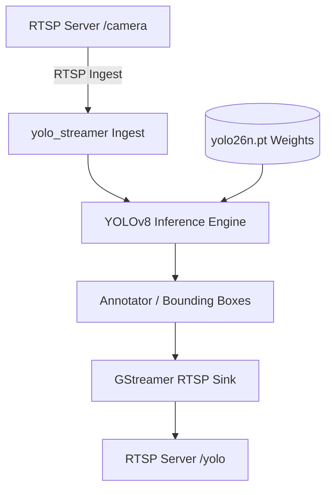
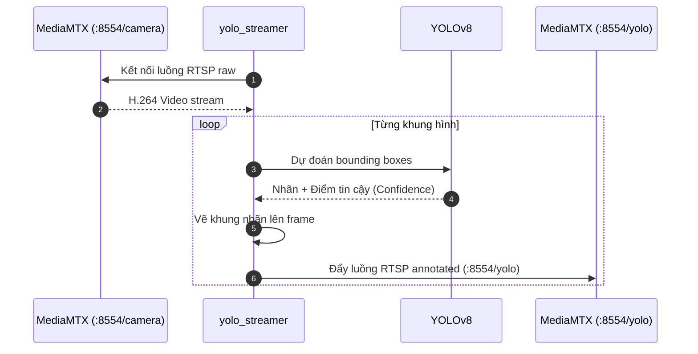

# AI Vision Processor (YOLO / Computer Vision Pipeline)

[](README.md)
[](Dockerfile)
[](LICENSE)

Phân hệ xử lý thị giác máy tính và nhận diện mục tiêu AI thời gian thực trên Raspberry Pi 5. Thu nhận luồng video RTSP gốc từ `camera-stream-controller` (`rtsp://127.0.0.1:8554/camera`), chạy mô hình YOLOv8 phát hiện vật thể, gắn nhãn (bounding box & confidence), và phát lại luồng video đã chú thích lên `rtsp://<pi>:8554/yolo`.

---

## Mục lục (Table of Contents)
- [Tính năng chính](#tính-năng-chính)
- [Sơ đồ Kiến trúc & Luồng hoạt động](#sơ-đồ-kiến-trúc--luồng-hoạt-động)
- [Cài đặt & Biên dịch](#cài-đặt--biên-dịch)
- [Hướng dẫn Sử dụng](#hướng-dẫn-sử-dụng)
- [Đóng góp (Contributing)](#đóng-góp-contributing)
- [Giấy phép (License)](#giấy-phép-license)

---

## Tính năng chính
- **Không xâm lấn luồng FPV gốc**: Luồng `/camera` hoàn toàn độc lập; nếu AI Vision gặp sự cố hoặc quá tải CPU, luồng camera FPV điều khiển máy bay vẫn hoạt động trơn tru.
- **Tối ưu suy luận trên ARM64**: Tối ưu hóa mô hình mạng nơ-ron nhẹ (YOLOv8 nano) cho vi xử lý Cortex-A76 trên Raspberry Pi 5.
- **Compose Profile Cô Lập**: Chạy trong profile `vision`, chỉ được bật khi người vận hành kích hoạt hoặc phục vụ bài toán cụ thể.

---

## Sơ đồ Kiến trúc & Luồng hoạt động

### Kiến trúc Phân hệ (System Architecture)


### Luồng Tuần tự (Sequence Diagram)
> Mã nguồn chi tiết PlantUML: xem tại [docs/sequence.puml](docs/sequence.puml) và [docs/system.puml](docs/system.puml).



---

## Cài đặt & Biên dịch (Installation & Build)

```bash
# Build Docker ARM64
make build-vision

# Triển khai lên Raspberry Pi
make deploy-vision
```

---

## Hướng dẫn Sử dụng (Usage)

```bash
# Bật dịch vụ Vision trên Pi
make start-vision

# Xem log suy luận
make logs-vision

# Xem video phát hiện vật thể từ máy tính
ffplay -rtsp_transport tcp rtsp://thong.local:8554/yolo

# Tắt dịch vụ Vision khi không dùng
make stop-vision
```

---

## Đóng góp (Contributing)
Mọi đề xuất đóng góp vui lòng tuân thủ quy tắc quản trị tài liệu tại [`.agents/rules/06-doc-sync-and-rule-governance.md`](../../.agents/rules/06-doc-sync-and-rule-governance.md).

---

## Giấy phép (License)
Dự án được phân phối dưới giấy phép [MIT License](https://opensource.org/licenses/MIT).

## GitHub / GHCR deployment contract

Source/config templates are pulled from GitHub; images are pulled from GHCR.
Set the actual lowercase `IMAGE_NAMESPACE` in private `.env`; choose a commit
SHA or development `IMAGE_TAG`. All internal runtime images target linux/arm64;
Pi Compose has no build definitions. See [deployment guide](../../deploy/README.md).

WSL: `make publish-vision` after commit/push. Pi: `bash deploy/update.sh --service drone-vision`.

`publish-vision` first publishes `drone-vision-base:FULL_GIT_SHA`, then passes its
GHCR reference as `VISION_BASE_IMAGE`. Apt OpenCV/GStreamer stays in use. The model
`yolo26n.pt` is tracked and mounted ro; private YAML/model overrides are supported.
