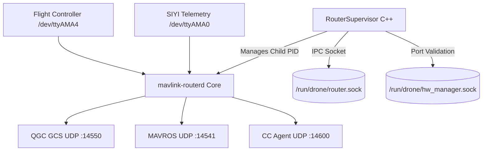
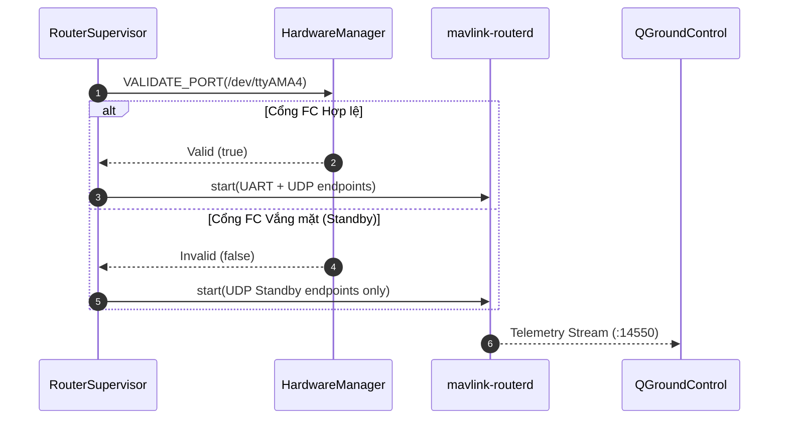

# MAVLink Router Controller (Data Plane Supervisor)

[](README.md)
[](CMakeLists.txt)
[](Dockerfile)
[](LICENSE)

Dịch vụ giám sát và điều phối luồng MAVLink tập trung cho Drone Edge, bọc ngoài tiến trình `mavlink-routerd`. Đảm bảo hệ thống hoạt động ổn định nhờ chế độ **Graceful Standby Mode** và hỗ trợ cấu hình động qua Unix Domain Socket (`/run/drone/router.sock`).

---

## Mục lục (Table of Contents)
- [Tính năng nổi bật](#tính-năng-nổi-bật)
- [Sơ đồ Kiến trúc & Luồng hoạt động](#sơ-đồ-kiến-trúc--luồng-hoạt-động)
- [Cài đặt & Biên dịch](#cài-đặt--biên-dịch)
- [Cấu hình & Biến môi trường](#cấu-hình--biến-môi-trường)
- [Giao thức IPC & Lệnh điều khiển](#giao-thức-ipc--lệnh-điều-khiển)
- [Kiểm thử Tự động](#kiểm-thử-tự-động)
- [Đóng góp (Contributing)](#đóng-góp-contributing)
- [Giấy phép (License)](#giấy-phép-license)

---

## Tính năng nổi bật
- **Graceful Standby Mode**: Tự động kiểm tra sự tồn tại của UART `/dev/ttyAMA4` (qua `hardware-manager`). Nếu thiếu FC, router tự động chạy chế độ UDP Standby mở sẵn cổng `:14550`, `:14600`, `:14541`, không bao giờ bị crash.
- **Reload cấu hình động không downtime**: Nhận lệnh `APPLY_CONFIG` qua IPC socket `/run/drone/router.sock` để tái nạp cấu hình baudrate/IP mà không cần restart container.
- **Phân phối đa đích (Multiplexing)**: Phân phối song song tới QGroundControl (`UDP :14550`), MAVROS ROS 2 (`UDP :14541`), Companion Agent (`UDP :14600`), và TCP Proxy (`TCP :5760`).
- **Chống vòng lặp Telemetry**: Tuân thủ nghiêm ngặt cấm cấu hình broadcast `14550` khi router chạy `network_mode: host`.

---

## Sơ đồ Kiến trúc & Luồng hoạt động

### Kiến trúc Phân hệ (System Architecture)


### Luồng Hoạt động (Sequence Diagram)
> Mã nguồn chi tiết PlantUML: xem tại [docs/sequence.puml](docs/sequence.puml) và [docs/system.puml](docs/system.puml).



---

## Cài đặt & Biên dịch (Installation & Build)

### 1. Biên dịch Native C++ (WSL2 / Linux Host)
```bash
mkdir -p build && cd build
cmake -DCMAKE_BUILD_TYPE=Release ..
make mavlink-router-controller test_mavlink_router -j4
```

### 2. Build Docker ARM64 Container
```bash
# Từ thư mục gốc dự án
make build-mavlink
# hoặc
docker buildx build --platform linux/arm64 -t mavlink-router-controller:latest src/mavlink-router-controller
```

---

## Cấu hình & Biến môi trường

| Biến môi trường | Mặc định | Ý nghĩa |
|---|---|---|
| `DRONE_SERIAL_PORT` | `/dev/ttyAMA4` | Cổng UART nối Flight Controller (Cube Orange Plus) |
| `DRONE_BAUD_RATE` | `921600` | Tốc độ baud FC |
| `SIYI_ENABLED` | `true` | Bật/tắt cổng telemetry SIYI Air Unit |
| `SIYI_SERIAL_PORT` | `/dev/ttyAMA0` | Cổng UART SIYI Air Unit |
| `SIYI_BAUD` | `115200` | Tốc độ baud SIYI |
| `GCS_IP` | *(rỗng)* | Địa chỉ IP tĩnh của máy trạm GCS (nếu không auto-learn) |

---

## Giao thức IPC & Lệnh điều khiển (Usage)

Lắng nghe tại `/run/drone/router.sock`:

### 1. Kiểm tra trạng thái Router
```bash
echo '{"cmd":"HEALTH","id":"chk-1"}' | nc -U /run/drone/router.sock
# Response: {"id":"chk-1","router_running":true,"service":"mavlink-router-controller","status":"OK"}
```

### 2. Tái cấu hình động (Apply Config)
```bash
echo '{"cmd":"APPLY_CONFIG","id":"cfg-1","fc_baud":921600,"gcs_ip":"192.168.10.50"}' | nc -U /run/drone/router.sock
# Response: {"id":"cfg-1","message":"Router configuration applied and process reloaded","status":"OK"}
```

---

## Kiểm thử Tự động (Tests)
Dự án tích hợp 6 bài test GoogleTest tự động (kiểm tra tạo config standby, lệnh IPC, quản lý tiến trình con):
```bash
cd build && ctest -R Router --output-on-failure
```

---

## Đóng góp (Contributing)
Mọi đề xuất đóng góp vui lòng tuân thủ quy chuẩn mã nguồn C++20 và quy tắc quản trị tài liệu tại [`.agents/rules/06-doc-sync-and-rule-governance.md`](../../.agents/rules/06-doc-sync-and-rule-governance.md).

---

## Giấy phép (License)
Dự án được phân phối dưới giấy phép [MIT License](https://opensource.org/licenses/MIT).

## GitHub / GHCR deployment contract

Source/config templates are pulled from GitHub; images are pulled from GHCR.
Set the actual lowercase `IMAGE_NAMESPACE` in private `.env`; choose a commit
SHA or development `IMAGE_TAG`. All internal runtime images target linux/arm64;
Pi Compose has no build definitions. See [deployment guide](../../deploy/README.md).

WSL: `make publish-mavlink` after commit/push. Pi: `bash deploy/update.sh --service mavlink-router-controller`.
