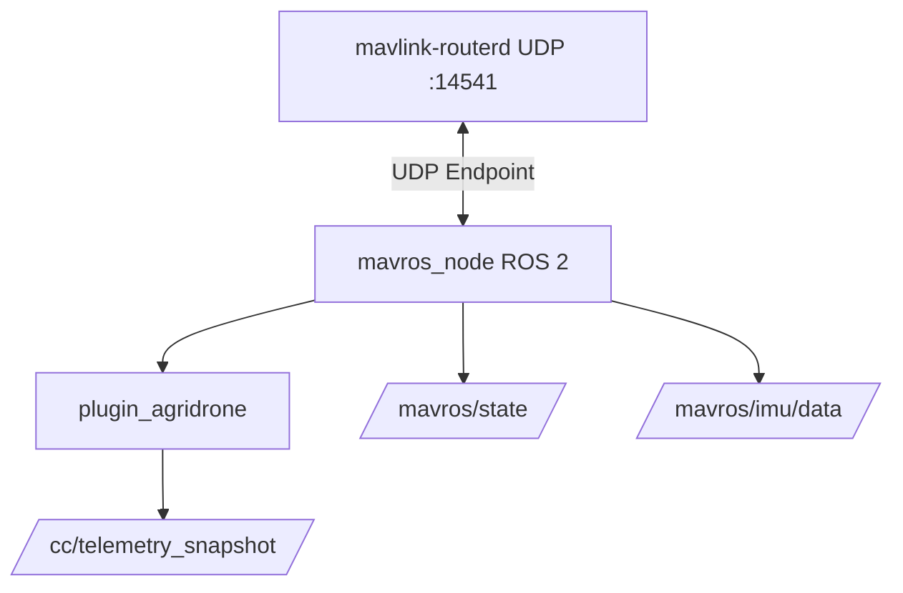
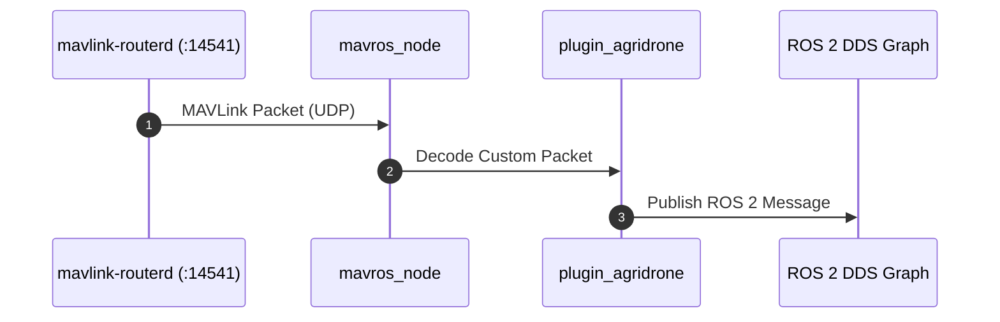

# MAVROS ROS 2 & Telemetry Bridge

[](README.md)
[](Dockerfile)
[](Dockerfile)
[](LICENSE)

Cầu nối giao tiếp MAVLink sang hệ sinh thái ROS 2 Jazzy, tích hợp plugin giải mã Telemetry độc quyền `plugin_agridrone` cho máy bay nông nghiệp THACO.

---

## Mục lục (Table of Contents)
- [Tính năng chính](#tính-năng-chính)
- [Sơ đồ Kiến trúc & Luồng hoạt động](#sơ-đồ-kiến-trúc--luồng-hoạt-động)
- [Cài đặt & Biên dịch](#cài-đặt--biên-dịch)
- [Hướng dẫn Sử dụng](#hướng-dẫn-sử-dụng)
- [Đóng góp (Contributing)](#đóng-góp-contributing)
- [Giấy phép (License)](#giấy-phép-license)

---

## Tính năng chính
- **Cầu nối ROS 2 Jazzy**: Chuyển đổi hai chiều giữa các gói tin MAVLink và ROS 2 topics/services.
- **Dedicated Router Endpoint**: Kết nối tới `mavlink-router-controller` qua endpoint UDP cục bộ độc lập `127.0.0.1:14541`, tuyệt đối không can thiệp cổng FC UART hay socket proxy.
- **Agridrone Plugin**: Hỗ trợ xuất bản các topic trạng thái nông nghiệp và telemetry chuyên dụng.

---

## Sơ đồ Kiến trúc & Luồng hoạt động

### Kiến trúc Phân hệ (System Architecture)


### Luồng Tuần tự (Sequence Diagram)
> Mã nguồn chi tiết PlantUML: xem tại [docs/sequence.puml](docs/sequence.puml) và [docs/system.puml](docs/system.puml).



---

## Cài đặt & Biên dịch (Installation & Build)

```bash
# Build Docker ARM64
make build-mavros

# Triển khai lên Raspberry Pi
make deploy-mavros
```

---

## Hướng dẫn Sử dụng (Usage)

```bash
# Khởi động container MAVROS
make start-mavros

# Xem log MAVROS
make logs-mavros

# Dừng container khi không dùng
make stop-mavros
```

---

## Đóng góp (Contributing)
Mọi đề xuất đóng góp vui lòng tuân thủ quy tắc quản trị tài liệu tại [`.agents/rules/06-doc-sync-and-rule-governance.md`](../../.agents/rules/06-doc-sync-and-rule-governance.md).

---

## Giấy phép (License)
Dự án được phân phối dưới giấy phép [MIT License](https://opensource.org/licenses/MIT).

## GitHub / GHCR deployment contract

Source/config templates are pulled from GitHub; images are pulled from GHCR.
Set the actual lowercase `IMAGE_NAMESPACE` in private `.env`; choose a commit
SHA or development `IMAGE_TAG`. All internal runtime images target linux/arm64;
Pi Compose has no build definitions. See [deployment guide](../../deploy/README.md).

WSL: `make publish-mavros` after commit/push. Pi: `bash deploy/update.sh --service mavros`.

Compose service: `mavros`; GHCR image: `drone-mavros`; build context: `src/mavros`.
ROS Jazzy workspace/plugins are built inside the ARM64 image, never on Pi.
