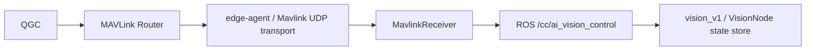

# cc_mavlink

[](CMakeLists.txt)
[](CMakeLists.txt)
[](../../../platforms/linux/edge_agent/Dockerfile)
[](package.xml)

ROS 2 Jazzy MAVLink module hosted by `edge_agent`. The existing loopback UDP
transport receives Router traffic, dispatches it through `MavlinkReceiver`,
serves PARAM_EXT, and sends telemetry streams and command acknowledgments.

## Table of contents

- [Architecture and AI control](#architecture-and-ai-control)
- [Build and test](#build-and-test)
- [Operation and configuration](#operation-and-configuration)
- [Contributing](#contributing)
- [License](#license)

## Architecture and AI control



`MAVLINK_MSG_ID_CC_AI_VISION_CONTROL` (42015) is handled in
[`mavlink_receiver.cpp`](mavlink_receiver.cpp) using the existing generated
`mavlink_msg_cc_ai_vision_control_decode` API from `src/lib/mavlink/thaco`.
It publishes `cc_msgs/msg/AiVisionControl`:

| Field | Meaning |
|---|---|
| `timestamp` | Local receive time in monotonic microseconds, as for VehicleStatus |
| `bounding_box` | Nonzero MAVLink byte becomes true |
| `tracking` | True only when bounding_box and the tracking byte are nonzero |
| `following` | True only when bounding_box and the following byte are nonzero |

Publisher QoS is `RELIABLE + TRANSIENT_LOCAL`, `KEEP_LAST`, depth 1. A subscriber
joining while the publisher remains alive receives the most recent state.
This message does not produce `VehicleCommand` or `COMMAND_ACK`. The Vision
subscriber controls overlays/selection; it does not parse MAVLink or issue flight commands.
HEARTBEAT, other COMMAND_LONG, PARAM_EXT, and telemetry handlers retain their routes.
The legacy `CC_TELEMETRY_LINKS` receiver and stream are compiled only when the
generated dialect defines that message. The current dialect exposes
`CC_SERIAL_LINK`; its stream stays active. Generated headers are not modified.

See [`docs/system.puml`](docs/system.puml) and [`docs/sequence.puml`](docs/sequence.puml).

### Camera track point event

`COMMAND_LONG / MAV_CMD_CAMERA_TRACK_POINT` (2004) uses the existing component
filter (191 or broadcast 0). `handle_message_command_long` maps params 1, 2, 3
to `AiVisionTrackPoint.x`, `.y`, `.radius`, adds a monotonic receive timestamp,
and publishes `/cc/ai_vision_track_point`. This ROS event uses `RELIABLE`,
`VOLATILE`, `KEEP_LAST`, depth 1. Old clicks are not retained for late subscribers.
The handler returns before the generic `/cc/vehicle_command` route, so no
COMMAND_ACK is produced for selection. Validation and target selection belong
to VisionNode, which uses its control flags and fresh detection metadata. No
camera component, capabilities exchange, or additional socket is involved.

## Build and test

With ROS 2 Jazzy and repository build dependencies installed:

```bash
source /opt/ros/jazzy/setup.bash
colcon build --base-paths msg src/modules/mavlink --packages-up-to cc_mavlink \
  --cmake-args -DCMAKE_BUILD_TYPE=Release -DBUILD_TESTING=ON
source install/setup.bash
colcon test --base-paths msg src/modules/mavlink --packages-select cc_mavlink
colcon test-result --verbose
```

`make build-native` builds the complete workspace. `make build-agent` builds
the ARM64 edge-agent Docker image. Receiver tests cover normalization, forced
disable, timestamp, no immediate ACK, retained latest state, and publisher QoS.

## Operation and configuration

The agent owns the MAVLink transport. Node parameters default to
`router_ip=127.0.0.1`, `router_port=14600`, `local_port=14601`; component ID is
191 and system ID is 1. Vision subscribes through ROS on `/cc/ai_vision_control`
with matching reliable/transient-local QoS. Both containers must share the
configured ROS domain and DDS discovery settings. No additional UDP endpoint
or Docker mount is required for this control topic.

## Contributing

Keep MAVLink ownership in `cc_mavlink/edge-agent` and preserve the generated
dialect headers. Run the MAVLink test suite after receiver changes.

## License

BSD-3-Clause; see [`package.xml`](package.xml).
