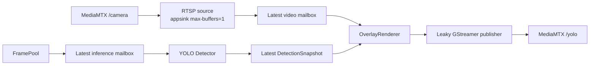

# Vision v1 — Decoupled Video and YOLO Pipeline

[](Dockerfile)
[](package.xml)
[](Dockerfile)
[](package.xml)

`vision_v1` publishes annotated video without putting YOLO inference on the video critical path. Video is decoded from MediaMTX `/camera`; inference continues to consume the camera FramePool.

## Table of contents

- [Architecture](#architecture)
- [Configuration](#configuration)
- [Build and test](#build-and-test)
- [Operation](#operation)
- [Contributing](#contributing)
- [License](#license)

## Architecture



There are no unbounded frame queues. The RTSP source, inference source, and detection store each retain only the latest value. A slow detector can reduce detection refresh rate but cannot block the video worker.

Detailed diagrams are in [`docs/system.puml`](docs/system.puml) and [`docs/sequence.puml`](docs/sequence.puml).

## Configuration

Production parameters are defined only in [`config/vision_v1.yaml`](config/vision_v1.yaml).

| Parameter | Default | Purpose |
|---|---:|---|
| `input_url` | `rtsp://127.0.0.1:8554/camera` | Independent video input |
| `source` | `/camera/frame_ready` | FramePool descriptor topic for inference |
| `inference_fps` | `5` | Maximum YOLO start rate |
| `fps` | `30` | Maximum annotated video output rate |
| `detection_max_age` | `0.5` | Seconds before a snapshot is no longer rendered |
| `reconnect_seconds` | `1.0` | RTSP reconnect delay |
| `output_url` | `rtmp://127.0.0.1:1935/yolo` | MediaMTX ingest endpoint |
| `pool_dir` | `/run/frame_pool` | Shared FramePool mount |

Startup rejects `/yolo` as input and `/camera` as output to prevent a MediaMTX feedback loop.

## Build and test

```bash
make build-native
make build-vision-v1
```

Focused Python tests:

```bash
PYTHONPATH=src/modules/vision_v1:src/lib/frame_pool \
  python3 -m pytest -q src/modules/vision_v1/tests
```

## Operation

Only one vision implementation may own ROS node `vision` and MediaMTX path `/yolo`.

```bash
make start-vision-v1   # stops edge-vision first
make logs-vision-v1
make restart-vision-v1
make stop-vision-v1
```

Runtime logs report independent video input/output FPS, inference completion FPS, dropped latest-mailbox frames, and snapshot age. The configured 30 FPS is a target and must be benchmarked on the Raspberry Pi 5.

## Contributing

Preserve latest-value semantics, bounded memory, clean worker shutdown, `/camera` independence, and the existing `FrameReady`/`VisionStatus` ABI. Run the decoupling and reconnect tests before deployment.

## License

Proprietary; see [`package.xml`](package.xml).
