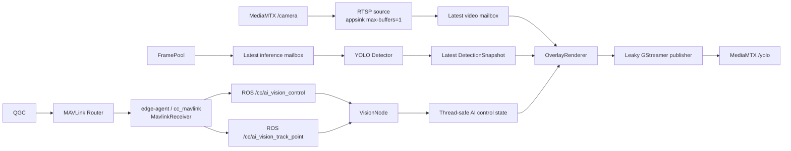

# Vision v1 — Decoupled Video and YOLO Pipeline

[](Dockerfile)
[](package.xml)
[](Dockerfile)
[](package.xml)

`vision_v1` publishes annotated video without putting YOLO inference on the video critical path. Video is decoded from MediaMTX `/camera`; inference continues to consume the camera FramePool.

## Table of contents

- [Architecture](#architecture)
- [Configuration](#configuration)
- [Build and test](#build-and-test)
- [Operation](#operation)
- [Contributing](#contributing)
- [License](#license)

## Architecture



There are no unbounded frame queues. The RTSP source, inference source, and detection store each retain only the latest value. A slow detector can reduce detection refresh rate but cannot block the video worker.

Detailed diagrams are in [`docs/system.puml`](docs/system.puml) and [`docs/sequence.puml`](docs/sequence.puml).

### AI vision control state

`cc_mavlink` decodes generated MAVLink `CC_AI_VISION_CONTROL` (42015) and
publishes `cc_msgs/msg/AiVisionControl` on `/cc/ai_vision_control`. Publisher and
VisionNode subscription use `RELIABLE`, `TRANSIENT_LOCAL`, `KEEP_LAST`, depth 1;
a later VisionNode receives the latest state while the publisher remains alive.
The interface contains `uint64 timestamp` (local receive time in monotonic
microseconds) and boolean `bounding_box`, `tracking`, `following`.

All three flags default to `false` until a message arrives. The receiver
normalizes nonzero MAVLink bytes to `true` and clears `tracking`/`following` when
`bounding_box` is zero. `VisionNode._on_ai_vision_control` stores the complete
state atomically; readers use `node.ai_vision_control.latest()` to obtain an
immutable snapshot containing the flags and `selected_track_id`. Vision owns no MAVLink
decoder or UDP transport, and its Dockerfile does not include MAVLink headers.

| Effective control | Overlay and selection |
|---|---|
| `bounding_box=false` | No boxes or labels; clear selected ID and disable selection |
| `bounding_box=true`, `tracking=false` | Render all detections normally; selected ID is None |
| `bounding_box=true`, `tracking=true` | Render detections and allow target selection; selected ID is yellow, thicker, and labeled `SELECTED #id` |

`following` is retained as state only and does not change tracking, overlay, or
flight behavior. Bounding box controls never stop video or inference workers.

### Track point selection and persistence

`MavlinkReceiver` routes `COMMAND_LONG / MAV_CMD_CAMERA_TRACK_POINT` (2004),
targeted to companion component 191 or broadcast 0, into
`cc_msgs/msg/AiVisionTrackPoint` on `/cc/ai_vision_track_point`. The event contains
`uint64 timestamp` and `float32 x`, `y`, `radius` from params 1, 2, 3. Both endpoints
use `RELIABLE`, `VOLATILE`, `KEEP_LAST`, depth 1: clicks are not replayed at startup.
No generic VehicleCommand or COMMAND_ACK is generated for this command.

`VisionNode._on_ai_vision_track_point` validates the normalized click and tries
its latest fresh snapshot. Any point inside a finite, nondegenerate tracked bbox
(inclusive edges) is eligible; radius remains validated for ABI compatibility but
does not restrict containment. Overlaps use nearest center in normalized image
coordinates, then smaller track ID, independently of detection list order.

A match toggles the ID: clicking the selected ID deselects it, while clicking a
different ID selects that ID. If no eligible bbox exists (including missing or
stale metadata), the newest click replaces the previous pending event for exactly
1.0 second using a local monotonic deadline. Each newly completed inference
snapshot retries that event. A successful match consumes it once, including a
pending deselect; timeout preserves the existing target. Invalid clicks do not
replace a valid pending event. There is no sleep or ROS callback wait.

The inference worker calls Ultralytics 8.4.14
`model.track(frame, persist=True, tracker="bytetrack.yaml", ...)` and stores
`boxes.id` as `Detection.track_id: Optional[int]`. Tracker metadata continues to
refresh even while selection/boxes are disabled, preserving the independent
inference pipeline. A detection without an ID still renders normally but cannot
be selected. Docker installs the tracker dependencies `scipy==1.15.3` and
`lap==0.5.12` explicitly because runtime dependency auto-install is disabled.

Selection is retained only by track ID, never by detection position in a list.
If the selected ID disappears, no other object is highlighted; the ID remains
selected and is highlighted when it returns. Only disabling tracking/bounding box
or clicking the selected ID clears selection. Geometry is computed outside the
state lock, with a
control revision and event identity check preventing a concurrent disable,
newer click, or duplicate snapshot processing from restoring/toggling an old
selection. OFF clears both selected ID and pending event, even across OFF/ON.
Repeated control messages and changes to following preserve both. Pending expiry
is checked on state reads, snapshot delivery, and the ROS status timer. Selected
borders use BGR `(0, 255, 255)`, thickness 3 and `SELECTED #id`; normal borders use
`(0, 255, 0)`, thickness 2. Selected detections draw last to prevent overlap from
painting their border green. Video reads one immutable control snapshot per frame,
without holding
a lock during rendering or GStreamer push. YOLO runs only on the inference worker.

## Configuration

Production parameters are defined only in [`config/vision_v1.yaml`](config/vision_v1.yaml).

| Parameter | Default | Purpose |
|---|---:|---|
| `input_url` | `rtsp://127.0.0.1:8554/camera` | Independent video input |
| `source` | `/camera/frame_ready` | FramePool descriptor topic for inference |
| `inference_fps` | `5` | Maximum YOLO start rate |
| `fps` | `30` | Maximum annotated video output rate |
| `bitrate_kbps` | `2000` | H.264 target bitrate, startup-only |
| `encoder_preset` | `ultrafast` | Startup-only: `ultrafast`, `superfast`, or `veryfast` |
| `key_int_max` | `30` | Startup-only positive integer: maximum keyframe distance in encoded frames |
| `width`, `height` | `640`, `480` | Maximum output bounds, derived from actual RTSP aspect ratio |
| `detection_max_age` | `0.5` | Seconds before a snapshot is no longer rendered |
| `reconnect_seconds` | `1.0` | RTSP reconnect delay |
| `output_url` | `rtmp://127.0.0.1:1935/yolo` | MediaMTX ingest endpoint |
| `pool_dir` | `/run/frame_pool` | Shared FramePool mount |

Decoded RTSP dimensions determine output geometry: `1280x720` and `1920x1080`
fit to `640x360`; `640x480` stays `640x480`; smaller sources are never upscaled.
The whole frame is resized without crop or letterbox. Exact source aspect ratio
is retained using integer multiples, with width divisible by four for BGR row
alignment and even height for I420. A ratio that cannot fit those constraints
within the bounds is logged and rejected instead of stretched. RTSP decoding
honors negotiated row stride. Source size changes rebuild the publisher before
pushing the new frame; appsrc caps match the actual output, with square pixels.

The video worker schedules its next deadline from the start of processing,
not from push completion. A late frame rebases the deadline to its own start
plus one interval; missed slots never trigger catch-up bursts. Early frames are
consumed and counted as rate-limited, and the next iteration reads the latest
mailbox value without sleeping. Changing `fps` resets the scheduling deadline.
An input at 20 FPS with 20 ms processing and a 30 FPS limit therefore remains
eligible at 20 FPS. The configured rate is a maximum, not guaranteed throughput.

The publisher retains `tune=zerolatency`, `threads=1`, `bframes=0`, baseline
profile, and `byte-stream=false`. Appsrc uses `block=false`, `max-buffers=2`,
`max-bytes=0`, and downstream leaking; the following queue also retains at most
two pending buffers and drops old buffers. No longer frame queue is introduced.
Frames must be uint8 BGR with valid aligned dimensions matching the active caps;
changing dimensions rebuilds the pipeline instead of stretching the frame.
Video resizing continues to use `INTER_LINEAR`.

Bitrate, preset and GOP are read-only ROS parameters: change the YAML or startup
ROS parameter overrides and restart **vision_v1** to apply them. Invalid presets
and nonpositive GOP values are rejected before loading the detector. GOP stays
independent of runtime `fps` changes; 30 encoded frames can exceed one second
when actual output FPS is below 30.

After measuring the default on Raspberry Pi, benchmark `fps: 20`,
`bitrate_kbps: 2000`, `encoder_preset: superfast`, and `key_int_max: 30` at the
same output bounds and inference workload. Compare quality, accepted and encoded
FPS, CPU/thermal load and end-to-end latency before choosing the heavier preset.
This is an experimental configuration; the default remains 30 FPS/ultrafast.

FramePool inference may remain `640x480`: it resizes the same full camera image,
so overlay maps each axis using `DetectionSnapshot.source_width/source_height`.
Changing inference preprocessing to crop/letterbox would require a new geometry
contract. Video never waits for inference or a pending click. Metrics log RTSP
input, effective output and inference dimensions; `VisionStatus.input_width` and
`input_height` describe the decoded RTSP input (zero until a frame is processed).

Startup rejects `/yolo` as input and `/camera` as output to prevent a MediaMTX feedback loop.

## Build and test

```bash
make build-native
make build-vision-v1
```

Focused Python tests:

```bash
PYTHONPATH=src/modules/vision_v1:src/lib/frame_pool \
  python3 -m pytest -q src/modules/vision_v1/tests
```

Local tests include real H.264/FLV encode/decode when GStreamer plugins are
available. Optional clean-staging Compose smoke (uses the installed v1 image):

```bash
VISION_DOCKER_TEST=1 PYTHONPATH=src/modules/vision_v1:src/lib/frame_pool \
  python3 -m pytest -q src/modules/vision_v1/tests/test_compose_runtime.py
```

The ROS control subscription test runs with ROS 2 Jazzy and the newly built
`cc_msgs` sourced; it is skipped when `rclpy` is unavailable. It disables video
and inference workers and checks live updates, default state, subscription QoS,
and late subscription delivery through the real ROS topic.

## Operation

Production Compose mounts `vision_v1.yaml` as one read-only file and camera
profiles as a sibling `/app/config/cameras` mount. `/app/config` is not a
read-only parent bind mount. Entrypoints belong to their images, including the
camera dependency; host executable bits cannot override image permissions.
Targeted camera/v1 deploys ship camera profiles automatically. Camera profiles
and module parameters are passed inside ROS argument groups, with module
parameters taking precedence. No host `mkdir`/`chmod` repair is required.

After changes, rebuild both ARM64 images with `make build-vision-v1` and
`make build-camera`, deploy through `deploy/ship/deploy.sh`, and recreate the
camera and v1 containers to apply mounts and image scripts. Camera recreation
briefly interrupts `/camera`; use a maintenance window. Stop legacy vision before
starting v1. On the Pi verify `/camera` and `/yolo` readiness, aspect ratio, clicks
at bbox corners, pending timeout/toggle, ID continuity, and independent FPS.


Only one vision implementation may own ROS node `vision` and MediaMTX path `/yolo`.

```bash
make start-vision-v1   # stops edge-vision first
make logs-vision-v1
make restart-vision-v1
make stop-vision-v1
```

Runtime logs, approximately once per second, report independent video input/output
FPS, inference completion FPS, dropped latest-mailbox frames, and snapshot age.
`video_out_fps` counts accepted pushes, not encoded or client-received frames.
`rate_skip` and `publish_fail` are counts since the previous log, while
`rate_skip_fps` is the corresponding skip rate. `resize_ms`, `overlay_ms`, and
`push_ms` are average milliseconds per processed frame in that logging window,
including failed push attempts; they are zero when no frame was processed.
Push time includes copying, lock waits, and pipeline rebuilds, but asynchronous
GStreamer encoding may continue after push returns. `drop_video` counts only
latest-mailbox overwrites, not appsink/appsrc/queue drops. Internal metrics keep
cumulative rate-limit/failure counters, processed-frame counts and stage seconds.
The existing `VisionStatus` ABI is unchanged.

## Contributing

Preserve latest-value semantics, bounded memory, clean worker shutdown, `/camera` independence, and the existing `FrameReady`/`VisionStatus` ABI. Run the decoupling and reconnect tests before deployment.

## License

Proprietary; see [`package.xml`](package.xml).
