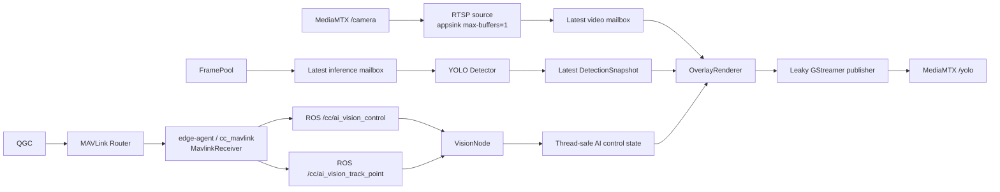

# Vision v1 — Decoupled Video and YOLO Pipeline

[](Dockerfile)
[](package.xml)
[](Dockerfile)
[](package.xml)

`vision_v1` publishes annotated video without putting YOLO inference on the video critical path. Video is decoded from MediaMTX `/camera`; inference continues to consume the camera FramePool.

## Table of contents

- [Architecture](#architecture)
- [Configuration](#configuration)
- [Build and test](#build-and-test)
- [Operation](#operation)
- [Contributing](#contributing)
- [License](#license)

## Architecture



There are no unbounded frame queues. The RTSP source, inference source, and detection store each retain only the latest value. A slow detector can reduce detection refresh rate but cannot block the video worker.

Detailed diagrams are in [`docs/system.puml`](docs/system.puml) and [`docs/sequence.puml`](docs/sequence.puml).

### AI vision control state

`cc_mavlink` decodes generated MAVLink `CC_AI_VISION_CONTROL` (42015) and
publishes `cc_msgs/msg/AiVisionControl` on `/cc/ai_vision_control`. Publisher and
VisionNode subscription use `RELIABLE`, `TRANSIENT_LOCAL`, `KEEP_LAST`, depth 1;
a later VisionNode receives the latest state while the publisher remains alive.
The interface contains `uint64 timestamp` (local receive time in monotonic
microseconds) and boolean `bounding_box`, `tracking`, `following`.

All three flags default to `false` until a message arrives. The receiver
normalizes nonzero MAVLink bytes to `true` and clears `tracking`/`following` when
`bounding_box` is zero. `VisionNode._on_ai_vision_control` stores the complete
state atomically; readers use `node.ai_vision_control.latest()` to obtain an
immutable snapshot containing the flags and `selected_track_id`. Vision owns no MAVLink
decoder or UDP transport, and its Dockerfile does not include MAVLink headers.

| Effective control | Overlay and selection |
|---|---|
| `bounding_box=false` | No boxes or labels; clear selected ID and disable selection |
| `bounding_box=true`, `tracking=false` | Render all detections normally; selected ID is None |
| `bounding_box=true`, `tracking=true` | Render detections and allow target selection; selected ID is orange, thicker, and labeled `SELECTED #id` |

`following` is retained as state only and does not change tracking, overlay, or
flight behavior. Bounding box controls never stop video or inference workers.

### Track point selection and persistence

`MavlinkReceiver` routes `COMMAND_LONG / MAV_CMD_CAMERA_TRACK_POINT` (2004),
targeted to companion component 191 or broadcast 0, into
`cc_msgs/msg/AiVisionTrackPoint` on `/cc/ai_vision_track_point`. The event contains
`uint64 timestamp` and `float32 x`, `y`, `radius` from params 1, 2, 3. Both endpoints
use `RELIABLE`, `VOLATILE`, `KEEP_LAST`, depth 1: clicks are not replayed at startup.
No generic VehicleCommand or COMMAND_ACK is generated for this command.

`VisionNode._on_ai_vision_track_point` ignores clicks unless bounding box and
effective tracking are both enabled. It reads the latest snapshot using the
configured `detection_max_age`. Finite normalized coordinates/radius in [0, 1]
are mapped to `(x * source_width, y * source_height)` and a radius of
`max(1.0, radius * source_width)` pixels. A candidate must contain the point
(inclusive edges), have its center within the radius, and have a non-None track
ID. The nearest center wins, with smaller track ID breaking distance ties.
Missing, empty, stale snapshots and unsuccessful clicks keep the selected ID.

The inference worker calls Ultralytics 8.4.14
`model.track(frame, persist=True, tracker="bytetrack.yaml", ...)` and stores
`boxes.id` as `Detection.track_id: Optional[int]`. Tracker metadata continues to
refresh even while selection/boxes are disabled, preserving the independent
inference pipeline. A detection without an ID still renders normally but cannot
be selected. Docker installs the tracker dependencies `scipy==1.15.3` and
`lap==0.5.12` explicitly because runtime dependency auto-install is disabled.

Selection is retained only by track ID, never by detection position in a list.
If the selected ID disappears, no other object is highlighted; the ID remains
selected and is highlighted when it returns. Only disabling tracking or bounding
box clears selection. Geometry is computed outside the state lock, with a
control revision check preventing a concurrent disable from restoring an old
selection. Video reads one immutable control snapshot per frame, without holding
a lock during rendering or GStreamer push. YOLO runs only on the inference worker.

## Configuration

Production parameters are defined only in [`config/vision_v1.yaml`](config/vision_v1.yaml).

| Parameter | Default | Purpose |
|---|---:|---|
| `input_url` | `rtsp://127.0.0.1:8554/camera` | Independent video input |
| `source` | `/camera/frame_ready` | FramePool descriptor topic for inference |
| `inference_fps` | `5` | Maximum YOLO start rate |
| `fps` | `30` | Maximum annotated video output rate |
| `detection_max_age` | `0.5` | Seconds before a snapshot is no longer rendered |
| `reconnect_seconds` | `1.0` | RTSP reconnect delay |
| `output_url` | `rtmp://127.0.0.1:1935/yolo` | MediaMTX ingest endpoint |
| `pool_dir` | `/run/frame_pool` | Shared FramePool mount |

Startup rejects `/yolo` as input and `/camera` as output to prevent a MediaMTX feedback loop.

## Build and test

```bash
make build-native
make build-vision-v1
```

Focused Python tests:

```bash
PYTHONPATH=src/modules/vision_v1:src/lib/frame_pool \
  python3 -m pytest -q src/modules/vision_v1/tests
```

The ROS control subscription test runs with ROS 2 Jazzy and the newly built
`cc_msgs` sourced; it is skipped when `rclpy` is unavailable. It disables video
and inference workers and checks live updates, default state, subscription QoS,
and late subscription delivery through the real ROS topic.

## Operation

Only one vision implementation may own ROS node `vision` and MediaMTX path `/yolo`.

```bash
make start-vision-v1   # stops edge-vision first
make logs-vision-v1
make restart-vision-v1
make stop-vision-v1
```

Runtime logs report independent video input/output FPS, inference completion FPS, dropped latest-mailbox frames, and snapshot age. The configured 30 FPS is a target and must be benchmarked on the Raspberry Pi 5.

## Contributing

Preserve latest-value semantics, bounded memory, clean worker shutdown, `/camera` independence, and the existing `FrameReady`/`VisionStatus` ABI. Run the decoupling and reconnect tests before deployment.

## License

Proprietary; see [`package.xml`](package.xml).
